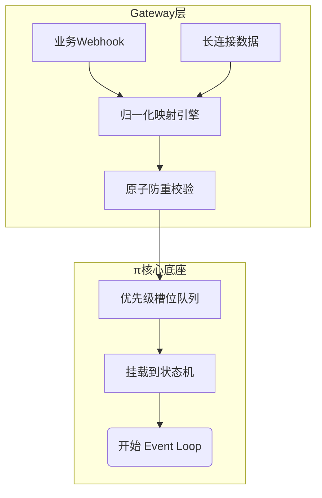
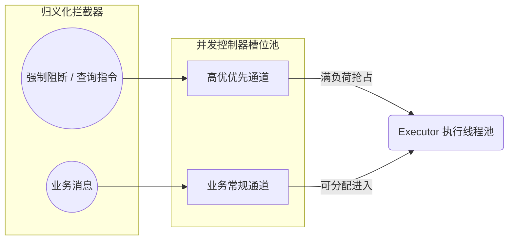

## 10.2 入口、排队与并发控制

本节聚焦 Agent 循环中最前沿的外围保护层：入口治理。大模型调用昂贵且极易受到长尾延迟攻击，因此把渠道事件归一化处理、基于事件幂等性消除重放副作用，并利用多级队列实现反压和抢占控制，是系统不发生雪崩的第一道防线。本节将从底层机制出发，揭示这些看似普通的策略是如何映射到底层 π 框架的状态机操作之中的。

> [!NOTE]
> 本节讨论的归一化、去重窗口和分层队列属于入口治理的高级工程模式。本书聚焦底层验证：字段名若与线上版本不一致，开发者应始终以结构化日志及 `status --deep` 命令暴露的真实运行图为准。

### 10.2.1 协议归一化：渠道异构数据到状态机内部语言

任何 Agent 框架若允许把原始通信渠道（如 Slack、微信、HTTP 请求包）直接传入到推理上下文，都难免遭遇巨大的逻辑混乱。渠道存在特定概念栈（提及、多端同步、撤回、重抛弃事件等），它们与 Agent 需要的干净“任务域”格格不入。

因此，归一化（Normalization）是第一道必经手术。网关系统不仅扮演透传角色，还要直接剥离异构的通信噪音，强行把它们转换为系统状态机认识的唯一方言：`NormalizedEvent`，最终落袋为一个个包含预算与会话绑定的调度任务。在这个过程中，下列核心属性被确立下来：

- `task_id`：整个 π 执行底座在这一层内唯一的追踪 ID，所有的重试或分包都挂载于此。
- `event_key`：唯一的防重放键（去重键，参见机制说明 10.2.2 小节）。
- `session_key`：上下文沙盒锁定键，确保连续的请求不会跨图层污染。
- `intent`：意图标定（路由面或业务面）。系统将根据此字段调度槽位优先级。
- `budget`：强约束预算。这并非简单的 timeout 时间，而是囊括了 `maxWaitSeconds`、`maxModelCalls` 甚至是限制深度的 `maxToolRecursions`，这使得超支的任务能够被底层执行器无情砍断。

经历网关归一化的操作后，抛送给底层队列的结构应当是如此纯净：

```json
{
  "task_id": "tk_8f4b2a9c",
  "event_key": "telegram:msg_9812:v1",
  "session_key": "user_456:proj_789",
  "intent": "business_query",
  "budget": {
    "maxWaitSeconds": 30,
    "maxModelCalls": 5,
    "maxToolRecursions": 10
  },
  "payload": {
    "text": "整理并汇总之星项目的本周进度。"
  }
}
```



图 10-1：入口从异构通道事件到中心化状态机任务的漏斗效应

此架构的一条硬性验收准则是：在线上任何一条杂乱渠道产生的交互，均应被解析成可被结构化追溯和解析的单一归一化产物，且它能单独重放而不依赖于原生的外部通道环境。

### 10.2.2 物理级幂等：利用“写屏障”阻断灾难重放

在传统的 Web 开发理念中，只有当客户端发起了带有 POST 或者 PUT 的修改请求，此时后端才需要谨慎处理幂等性。然而，这一假设在 Agent 架构内部被彻底推翻：即使一段人类诉求看起来只是在“查询”，它也可能会使 Agent 自发地为了满足查询而调用外部高危的变更工具（如：为了搜寻内部测试数据结论，自发操作测试机环境；为了计算汇率，调用了额度很贵的付费 API）。

正因如此，Agent 侧的重复投递必须利用“去重窗口加底层提交点”实现物理级防并发，并把策略实现在底层的工具分发之前，而不是模型之上。对于 `event_key` （事件标识）的处理方式如下：

- 粗粒度的请求防抖（去重窗口）：防止通道端因网络抖动，短时间内（如几十秒钟）发送相同 `event_key`，拦截它，并向调用端透传之前暂存的状态结果即可。
- 细粒度的底层提交点（副作用写屏障）：当 Agent 底座明确感知到自身将使用“带有改变性质的物理工具”时，立刻会在高速缓存区（例如 Redis 或基于 KV 的分片表）中标记一道写屏障。一旦成功穿越过屏障，此后整个业务任务若再从入口失败重新流转，都会被该屏障卡住直接中断，只能依靠对账而不是无上限无差别的继续从头推理。

操作示例：这可以在 Redis 里依靠最经典的原子指令锁去实现。如果写屏障标志被返回已存在，底座将不再向工具分配执行资源。

```bash
redis-cli SET oc_commit:${EVENT_KEY}:tool_${UUID} 1 NX EX 86400
```

提示：构建 `event_key` 时，除了拼接渠道唯一标以外，千万不可遗忘“平台自身协议版本号”的追加。这将在以后升级归一化映射引擎时，彻底隔离新旧版映射带来的潜在重复故障。

### 10.2.3 并发槽位与分层反压（Backpressure）机制

相较于一个 HTTP 服务通常几百毫秒便能释放 Worker 句柄，一个智能体的思考加挂载长调用耗时极轻便能突破 30 甚至上百秒；更可怕的是，在此周期内由于不断的来回打点，它是在并行的同时消耗多种层级的配额池：外部模型供应厂商的请求频率、网络带宽端口限制、进程可用的长驻 Context 内存池。简单的基于 `max_connections` 并发阻断在智能体面前像废纸一样。

系统必须使用基于预算容量的“反压（Backpressure）”系统来保障不雪崩。当外部负荷高压时，应主动且快速向客户端反馈拒绝而绝非让连接永久悬挂，将系统容量划定具体的配对槽位：

- 全局队列反压：排队深度过大时，立刻断腕止损，直接给出拒绝提示（HTTP 429 协议等）。
- 并行会话争用隔离：限制向单一 `session_key` 的图状态下并行追加状态更新。如果有两个同样操作企图更改同一个任务流的图状态，将利用队列让他们强行降级为序列串行。
- 多路资源定额控制：细分管理模型与高优插件调用的许可令牌。

此时，超时不仅意味着错误，在底座调度中也是一种系统自救策略。

```text
// 伪队列反压驱逐处理流
if now() - entry.EnqueuedAt > budget.MaxWaitSeconds {
    entry.Cancel() // 从等待队列中除名
    eventBus.Emit(CancelEvent, {reason: "exceeded_max_wait"}) // 广播事件释放占用的槽位标记
}
```

验收系统的反压功能底线是，在超高十倍峰值的压测海量涌入下系统不会报 OOM 死亡。排队的尾部必定因为超过 `MaxWait` 时间被系统自身无情抛弃并快速返回超时错误，而不是产生僵尸进程占据槽位。

### 10.2.4 业务车道隔离：控制面的防淹没机制

当大量业务长任务占据槽位从而阻塞正常运转时，如果此时你的操作管理员想利用命令查看排队信息或者下达一条紧急中断的杀灭指令（Stop Instruction），该指令将会很悲惨地被长尾任务挤出从而迟迟得不到响应，造成彻底失去控制权的尴尬。在排队调度进入状态执行之前，建议建立车道隔离概念。

必须建立高优先级抢占队列（控制面），用以隔离普通的聊天业务生成队列（业务面）。

- **控制层面信道**：系统查询、运行阻断、强行干预、紧急降级等指令。它们会被立刻调高槽位权重去夺走物理分配资源。
- **业务生成信道**：寻常的上下文理解、工具探索和执行生成任务。可接受排队缓存和延时下钻。



图 10-2：不同性质消息对应的排队与隔离消费控制

例如，基于令牌桶分配和权重算法的优先级描述形式（示意化展现）：

```json
{
  "scheduler": {
    "controlChannel": {
      "reservedSlots": 2, 
      "priorityLevel": 99,
      "timeoutThresholdMs": 5000 
    },
    "businessChannel": {
      "dynamicSlotsLimit": 18,
      "priorityLevel": 1,
      "timeoutThresholdMs": 60000 
    }
  }
}
```

### 10.2.5 基于日志底座的链路排障分析

没有可以客观定位日志分析的流水线，所谓排队、并发控制就是伪概念。工程师应围绕系统深度的透传 Trace 以及上述所讲解的事件变迁，收集以下基础事实并搭建可诊断监控大盘：

- **饱和度维度**：目前积单总数有多少、不同分层控制队列占用占比状况如何、入口的拒绝（Rate Limit / 429）阈值频率。
- **迟滞等待维度**：排队等了多久系统才拉起任务、初次挂载工具用了多久、整体请求贯通总延时。

操作示例：运用 jq 和 shell 这类朴素而有力的流日志读取，过滤具有极高信息密度的归一化信息及生命节点状况，进而能够直观判定瓶颈到底由于入口分配引起，还是受下游供应商拖累导致的。

```bash
cat runtime.log | jq -c 'select(.trace_id=="t-78ab-09f1") | {timestamp, stage, event_op, cost_time_ms, err_desc}'
```

操作示例：拉取 Prometheus 或其他注册服务的即时分量监控信息，探查槽位积压现状：

```bash
curl -s http://127.0.0.1:9090/metrics | grep -E 'queue_length_active|rate_limit_drops|wait_duration_secs'
```

一切从通道投递进来的信号，在这一步终于被洗成统一、纯净带限流配额的管理包裹后，系统接下来的职责便转移到了向 LLM 对齐其需要消化的核心知识库层面。
