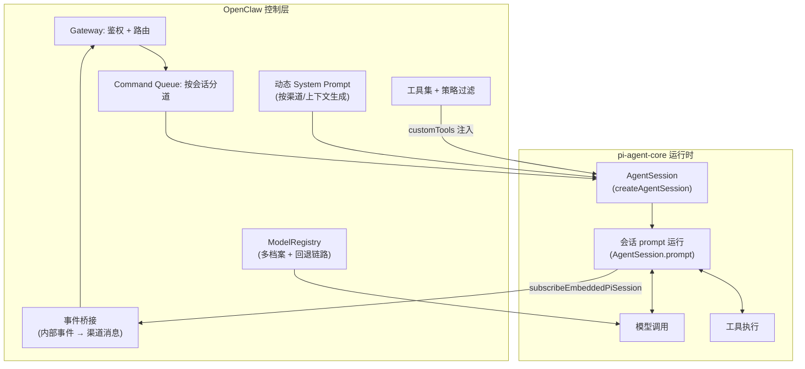
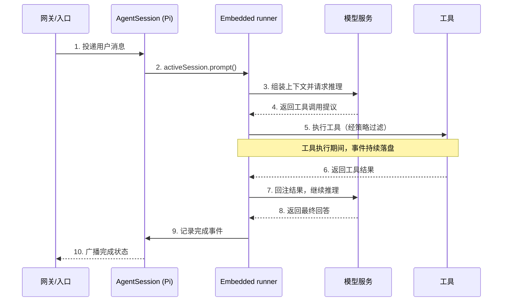

## 10.2 π 运行底座与嵌入式集成

开发者初次接触智能体框架时，最容易犯的错误是把智能体等同于“一个带记忆的死循环大模型调用”。例如一段 Python `while True` 循环，一旦模型开始思考、调用耗时几分钟的工具接口，这个线程就被死死霸占；如果在此过程中网络闪断或者节点重启，这几分钟产生的几万个 Token 与中间思考便随风飘散。

为了支持企业级业务中动辄横跨十几小时、需要多人介入的业务流水线，OpenClaw 没有使用同步阻塞式的开发范式，而是将底层推理引擎直接建立在 **[π (pi) 开源项目](https://github.com/badlogic/pi-mono/)** 的极简执行骨架之上，通过嵌入式集成（Embedded Integration）的方式复用其核心运行时。

### 10.2.1 引擎与外壳：Pi 与 OpenClaw 的定位

如果说 OpenClaw 是一个连接了各大聊天软件（如 WhatsApp、Telegram 等）、能 24 小时在线处理杂务的“全能管家外壳（Wrapper）”，那么 **Pi 就是真正赋予这个管家“思考、写代码和执行能力”的底层大脑（Engine）**。

Pi（`pi-coding-agent` / `pi-mono`）由知名开源开发者 Mario Zechner（网络 ID 为 badlogic）创建。它的诞生初衷，是为了反抗市面上日益“臃肿”的 AI 智能体框架。作为一个专注于 AI 智能体的单体仓库（Monorepo），它在物理实现上清晰地划分了运行时层（如 `pi-agent-core` 处理状态流转、`pi-ai` 统一多模型调用接口）、基础设施层（如终端渲染库 `pi-tui`）以及应用层（如交互式的 `pi-coding-agent` 或 Slack 机器人 `pi-mom`）。

其架构理念深深影响了 OpenClaw，体现为以下几个极简特性：

- **极简内核与高度可扩展**：Pi 的引擎内核拒绝臃肿，默认只提供 Read、Write、Edit、Bash 四大底层高权限工具，并保持极短的系统提示词。若需更高级的能力或定制工具，它依靠一种插件化架构，通过配置文件从 npm 或 Git 动态解析并加载扩展包。
- **透明的记忆系统**：它不依赖黑盒的本地向量数据库，而是完全通过读取工程目录下的 `AGENTS.md` 或 `TODO.md` 等可见的纯文本文件来理解系统设定和项目架构。
- **完全自主执行模式**：Pi 默认开启全自动模式。不同于传统框架在执行命令前总要求人工确认，Pi 在循环中不断读取、思考、执行，直到模型认为任务完成。这一“不被打断”的哲学，正是 OpenClaw 能实现真正的异步后台挂机自动化的基础保证。

### 10.2.2 嵌入式集成：OpenClaw 如何接管 Pi

OpenClaw 并非以子进程方式启动 pi，而是通过 `runEmbeddedPiAgent()` 函数将 pi SDK 直接嵌入自身进程。这种嵌入式集成使 OpenClaw 获得了对会话生命周期和事件流的完全控制权，同时保留了 pi-agent-core 的推理循环能力。

集成的关键接口包括以下四层：

- **会话管理**：通过 `createAgentSession()` 实例化 pi 的 `AgentSession`，OpenClaw 全权控制会话的创建、恢复与销毁生命周期。
- **工具注入**：OpenClaw 在 pi 运行时中组合 pi base tools、OpenClaw 对读写/执行类工具的替换、渠道工具与 OpenClaw 自身工具，并把策略过滤后的活动工具名交给会话。`customTools` 承载 OpenClaw 管理的扩展工具，不等于简单覆盖全部 pi 工具集；所有工具调用仍需经过 OpenClaw 的策略过滤与沙箱约束（详见 [5.2 工具策略](../05_tools_skills/5.2_tool_policy.md)）。由于 `pi-agent-core` 与 `pi-coding-agent` 对工具签名的定义存在差异，OpenClaw 在两者之间维护了一层专用适配器。
- **事件订阅**：通过 `subscribeEmbeddedPiSession()` 订阅 pi 会话的内部事件流——包括流式文本输出、工具调用与返回、智能体生命周期事件（启动/完成/错误）。OpenClaw 将这些内部事件桥接到外部渠道的消息推送。
- **模型注册表**：OpenClaw 注入自定义的 `ModelRegistry`，实现供应商无关的模型选择。该注册表支持多认证档案（Auth Profile）管理、基于优先级的档案轮转，以及跨供应商的模型回退链路（详见 [10.6 流式输出与重试](10.6_streaming_retry.md)）。

图 10-3：OpenClaw 嵌入式集成 pi 运行时的架构关系

### 10.2.3 事件驱动与 Agent Loop

Pi 的核心执行模型基于三个组件：**事件（Event）**、**状态（State）** 与 **会话级 Agent Loop**。

在 pi 框架中，执行过程可以用事件、状态与会话调用来理解：外部输入、模型输出、工具请求、超时或失败都会被归一化为可记录、可追踪的运行事件。不同版本内部事件名会演进，书中不应把 `InputEvent`、`ToolCallRequestedEvent`、`TimeoutEvent` 这类名称写成稳定 API；更可靠的验收对象是结构化日志、traceId 与会话 transcript 是否能还原单次链路。

执行过程由 OpenClaw 的 `runEmbeddedPiAgent()` / `runEmbeddedAttemptWithBackend()` 创建会话并调用 `activeSession.prompt()` 触发，再通过 `subscribeEmbeddedPiSession()` 订阅输出事件。一次运行会读取当前会话状态，向模型发起调用、处理工具请求、订阅输出事件并把结果桥接回 OpenClaw 的流式响应。这里不应把“Tick”或某个 `agentLoop` 名称理解为稳定公开 API；更可靠的边界是会话调用、事件订阅与结构化日志。

图 10-4：基于嵌入式会话调用的单次推理流转时序

### 10.2.4 系统提示词的动态生成

与 pi 原生使用静态系统提示词不同，OpenClaw 的嵌入式集成为每次会话动态生成 System Prompt。生成逻辑会综合考虑当前渠道类型（Telegram 群组与 WhatsApp 私聊的行为规范不同）、目标智能体的角色配置（`agents.md`）、以及运行时加载的技能描述。这意味着同一个 pi 运行时实例在不同渠道、不同场景下可以表现出完全不同的人格与能力边界。

动态 System Prompt 的装配细节将在 [10.4 提示词装配](10.4_prompt_assembly.md) 中展开。

### 10.2.5 运行时鲁棒性：流式解析与错误恢复

Pi 框架在演进过程中直面了诸多真实场景下的长尾问题，尤其是在大语言模型流式输出和工具调用的鲁棒性打磨上，为 OpenClaw 提供了不可或缺的工程参考：

- **流式工具参数容错**：在对接不同提供商时，模型输出的工具调用参数可能出现截断、尾部噪音或 provider 兼容差异。实现上应采用有界解析、校验与失败分级，而不是把某个内部解析函数名写成稳定接口。
- **可恢复错误的分类处理**：对于动辄运行数小时的自动化任务，将提供商端的网络闪断或短暂解析失败一律视为致命错误是不可接受的。更健壮的设计是先区分限流、过载、上下文溢出、网络错误与不可恢复解析错误，再决定重试、failover、回注可读错误或终止任务。

> [!WARNING]
> **高权限底层工具的安全约束边界**
>
> Pi 框架默认依赖的 Bash 与大范围文件读写功能，本质上是本地工作站的极高权限入口。当通过 npm 或 git 引入大量社区扩展包，或者把框架进一步包装为团队协同机器人时，供应链投毒和越权命令执行风险就会急剧倍增。面向企业级场景，必须在底层驱动平台之上，通过容器沙箱和最小权限访问控制来进行硬隔离。详见[第十一章](../11_reliability_security/README.md)。
