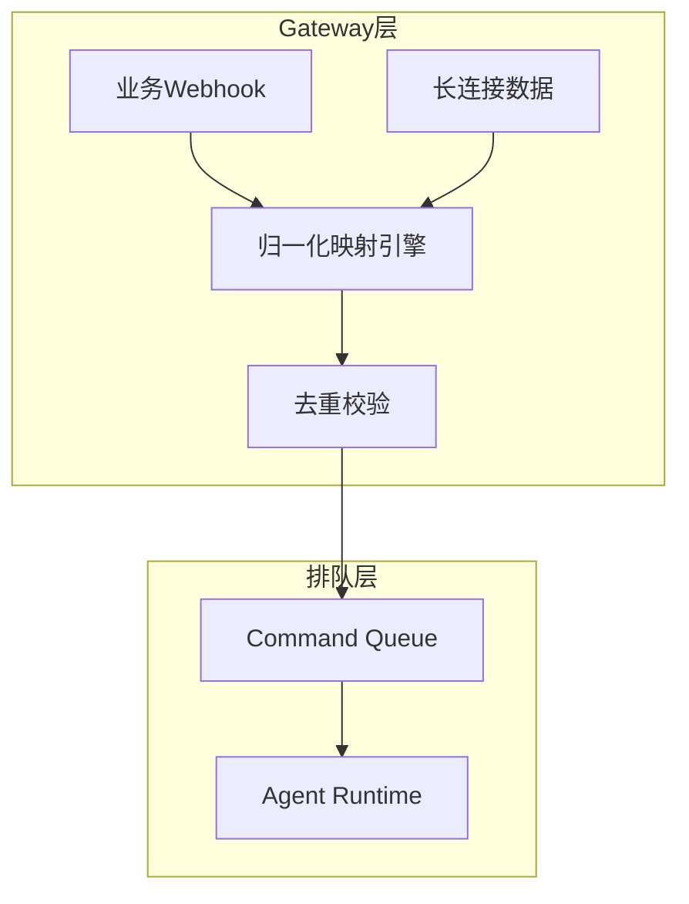
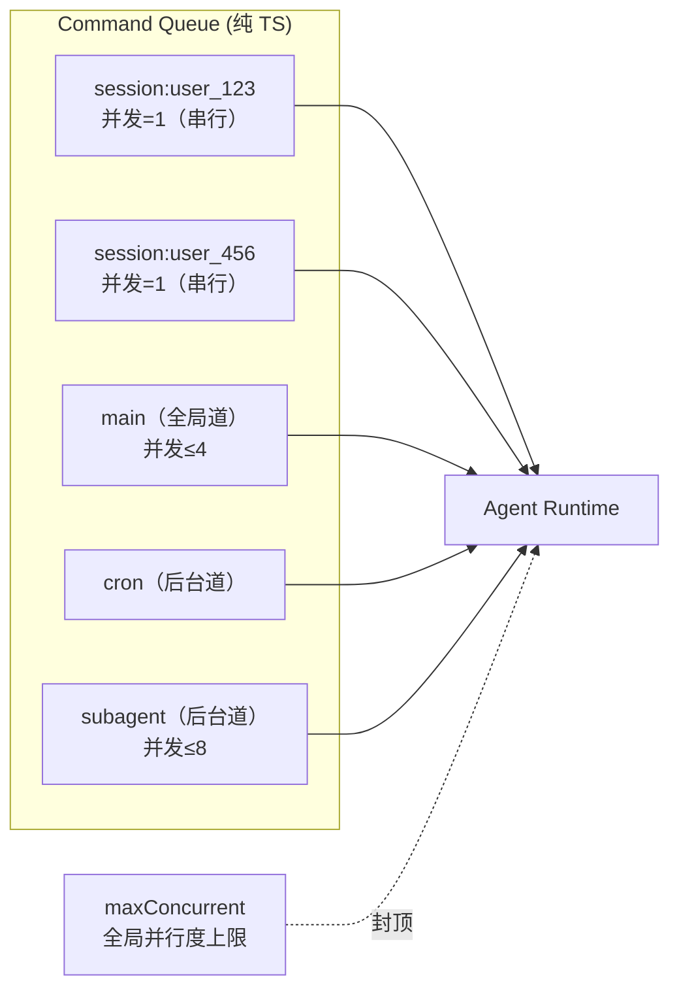

## 10.3 入口、排队与并发控制

本节聚焦 Agent 循环中最前沿的外围保护层：入口治理。大模型调用昂贵且极易受到长尾延迟攻击，因此把渠道事件归一化处理、利用分道队列实现并发控制与反压，是系统不发生雪崩的第一道防线。

### 10.3.1 协议归一化：渠道异构数据到统一事件

任何 Agent 框架若允许把原始通信渠道（如 Slack、微信、HTTP 请求包）直接传入推理上下文，都难免遭遇逻辑混乱。渠道存在特定概念栈（提及、多端同步、撤回等），与 Agent 需要的干净“任务域”格格不入。

归一化（Normalization）是第一道必经手术。网关系统不仅扮演透传角色，还要剥离异构的通信噪音，将其转换为系统内部认识的标准事件格式，最终落袋为一个包含会话绑定的调度任务。在这个过程中，下列核心属性被确立：

- **会话键（Session Key）**：上下文锁定标识，确保连续请求不会跨会话污染。
- **意图标定（Intent）**：路由面或业务面，系统将根据此字段调度优先级。
- **预算约束（Budget）**：囊括超时时间、最大模型调用次数等限制，使超支任务能被执行器终止。



图 10-5：入口从异构通道事件到归一化调度任务的漏斗效应

此架构的一条硬性验收准则是：在线上任何一条渠道产生的交互，均应被解析成可被结构化追溯的标准事件，且它能单独重放而不依赖于原生的外部通道环境。

### 10.3.2 幂等控制：阻断灾难性重放

在传统 Web 开发中，只有 POST 或 PUT 等修改请求才需要谨慎处理幂等性。然而在 Agent 架构内部，即使一段看似“查询”的请求，也可能使 Agent 自发调用高危变更工具（如操作测试环境、调用付费 API）。

因此，Agent 侧的重复投递必须在工具分发之前实现物理级防并发。常见的两层策略包括：

- **粗粒度请求去重（去重窗口）**：防止通道端因网络抖动短时间内发送相同事件标识，系统拦截重复投递并返回之前缓存的状态结果。
- **细粒度副作用屏障**：当 Agent 明确将执行带有变更性质的工具时，在缓存中标记写屏障。此后若同一任务从入口重新流转，会被屏障拦截而非无差别地重新推理。

### 10.3.3 Command Queue：纯 TypeScript 的分道排队

OpenClaw 的排队层是一个**纯 TypeScript 实现，不依赖 Redis 或其他外部中间件**，完全基于 Promise 实现并发控制。这种设计降低了部署复杂度，使单节点部署即可获得完整的排队能力。

队列采用**分道（Lane）** 架构，每条道独立维护 FIFO 排队和并发上限：

- **会话道（Session Lane）**：以 `session:<key>` 为标识，保证同一会话的多次请求严格串行执行。这是最重要的隔离机制——同一用户的连续消息不会互相踩踏。
- **全局道（Global Lane）**：进程级并发控制，默认 `main` 道的并发上限为 4。未显式配置的道默认并发上限为 1。
- **后台道（Background Lane）**：`cron` 和 `subagent` 等独立执行轨道，默认 `subagent` 道的并发上限为 8，确保定时任务和子智能体不会被业务流量饿死。

全局并行度由 `agents.defaults.maxConcurrent` 统一封顶，即便各道分别有余量，整体并行数不会超过此上限。



图 10-6：Command Queue 分道排队与全局并行度控制

### 10.3.4 反压与超时：让系统可控降级

当外部负荷高压时，系统应主动、快速向客户端反馈拒绝，而非让连接永久悬挂。OpenClaw 的反压机制体现在以下层面：

- **队列深度限制**：排队深度过大时，新请求立即收到拒绝响应，避免资源耗尽。
- **会话写锁**：同一会话同一时刻只有一个操作可以修改状态（session write lock），后续请求在队列中等待。
- **超时驱逐**：等待时间超过预算的任务被自动取消并释放槽位，广播取消事件。

超时不仅意味着错误，在排队调度中也是一种系统自救策略。验收系统的反压功能底线是：在十倍峰值压测下系统不会 OOM，排队尾部因超过预算被系统抛弃并快速返回错误，而非产生僵尸进程。

### 10.3.5 基于日志的链路排障

没有可客观定位的日志流水线，排队与并发控制就是伪概念。工程师应围绕系统透传的 Trace 以及事件变迁，收集以下基础事实并搭建可诊断监控大盘：

- **饱和度维度**：当前积压总数、各道队列占用比例、入口拒绝频率。
- **延迟维度**：排队等待时间、初次模型调用延迟、整体请求贯通总延时。

操作示例：运用 jq 过滤结构化日志中的归一化信息及生命周期节点，直观判定瓶颈源自入口分配还是下游供应商：

```bash
openclaw logs --follow --json | jq -c 'select(.type=="log") | .log | select(.trace_id=="t-78ab-09f1") | {timestamp, stage, event_op, cost_time_ms, err_desc}'
```

一切从通道投递进来的信号，在这一步被归一化为统一、纯净、带限流配额的管理包裹后，系统接下来的职责便转移到向模型对齐其需要消化的核心知识——即提示词装配。
