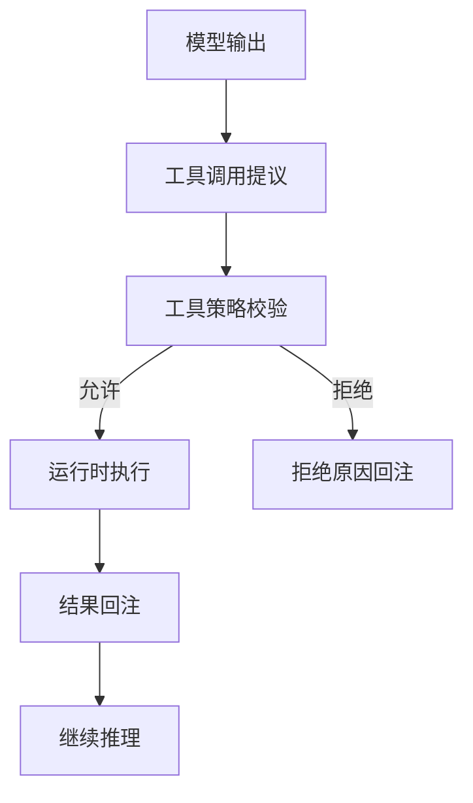

## 10.3 工具执行链路与结果回注

智能体系统的关键差异在于“能把自然语言转成可执行动作”。在 OpenClaw 中，这条链路由智能体循环、工具体系与工具策略共同完成：模型负责提出调用意图，运行时负责验证与执行，再将结果回注到对话中继续推理。本节以官方的智能体循环与工具文档为依据，讲清楚工具调用的生命周期、策略拦截点、以及如何避免回注导致的上下文失控。

### 10.3.1 生命周期：提议、校验、执行、回注、续推

工具调用可以拆成五步，每一步都对应一个确定性的工程控制点：

1. 提议：模型在智能体循环中输出一个工具调用请求。
2. 校验：运行时检查工具是否允许、参数是否符合约束。
3. 执行：由运行时执行真实动作，得到结果或错误。
4. 回注：将结果以结构化形式回注到对话上下文。
5. 续推：模型基于回注结果继续生成下一步。

智能体循环的整体机制见官方文档：[https://docs.openclaw.ai/concepts/features](https://docs.openclaw.ai/concepts/features)。工具体系的整体说明见：[https://docs.openclaw.ai/tools](https://docs.openclaw.ai/tools)。

下面用一个流程图展示工具执行链路的关键拦截点。



图 10-3：工具执行链路的关键拦截点

该图的核心含义是：工具策略在执行前提供确定性边界，避免把安全底线交给提示词或模型自觉。

### 10.3.2 策略拦截点：允许、拒绝与分层策略

工具治理应以工具策略为中心。官方文档说明了允许、拒绝、工具分组与配置档案的关系，并强调拒绝规则优先：[https://docs.openclaw.ai/tools](https://docs.openclaw.ai/tools)。

工程上建议把工具按风险分组：

- 读工具：查询、读取、探测，不产生外部副作用。
- 写工具：发消息、创建工单、修改配置等，会产生外部副作用。

然后把写工具默认拒绝，只在少数受控智能体或受控入口下显式允许。工具策略的完整写法见 [5.2 工具策略：允许、拒绝与分层策略](../05_tools_skills/5.2_tool_policy.md)。

### 10.3.3 回注策略：结构化、截断与可追溯引用

工具回注的目标是“给模型足够的信息继续决策”，而不是“把所有原始输出塞回上下文”。回注不受控会带来两类问题：

1. 上下文膨胀：大段原始数据消耗上下文预算，挤压关键指令与最近对话。
2. 污染推理：冗余噪声掩盖关键信息，导致模型在中段丢失重点。

**具体例子：大文本撑爆上下文的灾难现场**

假设研发智能体为了获取排障线索，调用了 `exec_shell` 或类似组件读取了线上的日志文件，该文件返回了 5MB（约 10 万 Token）的内容。如果将这 5MB 数据原封不动地全量回注，会导致整个 Prompt 历史（包括系统底层的安全指令、扮演角色以及用户早前的具体要求）全被冲毁（即“遗忘灾难”）。正确的做法是在工具执行侧或 Agent 网关侧进行处理，模型接收到的其实是结构化的截断信息：
> “查询结果共有 50000 行，已为您截断显示前 50 行。如果您需要提取特定错误码，请改用包含 `grep` 的工具指或者调用 `read_file_range` 分页读取。”

建议采用三条规则：

- 结构化：优先回注摘要与关键字段，而不是原始大文本。
- 截断：对长文本只保留可用片段，并注明已截断。
- 引用：完整产物落到可管控位置，只回注引用路径与摘要。

当对话变长导致性能与质量下降时，可结合会话裁剪与压缩机制做治理，相关机制见第6章的 [6.4 压缩与裁剪](../06_context_memory/6.4_compaction_pruning.md)。

### 10.3.4 排障方法：先确认策略与状态，再定位单次链路

工具相关问题的排障建议遵循“先状态、后单次链路”的顺序：

1. `status --deep` 确认工具策略与智能体配置是否被加载。
2. `logs --follow --json` 跟随日志，按 `traceId` 回放单次请求链路。
3. 如果问题呈系统性，先跑 `doctor` 获取依赖与配置层面的结构化诊断。

```bash
openclaw status --deep
openclaw logs --follow --json
openclaw doctor
```

当日志显示工具被拒绝时，优先回到工具策略规则检查拒绝原因；当工具执行失败时，优先区分是外部依赖故障还是参数不符合约束，再决定是否需要重试或降级。

