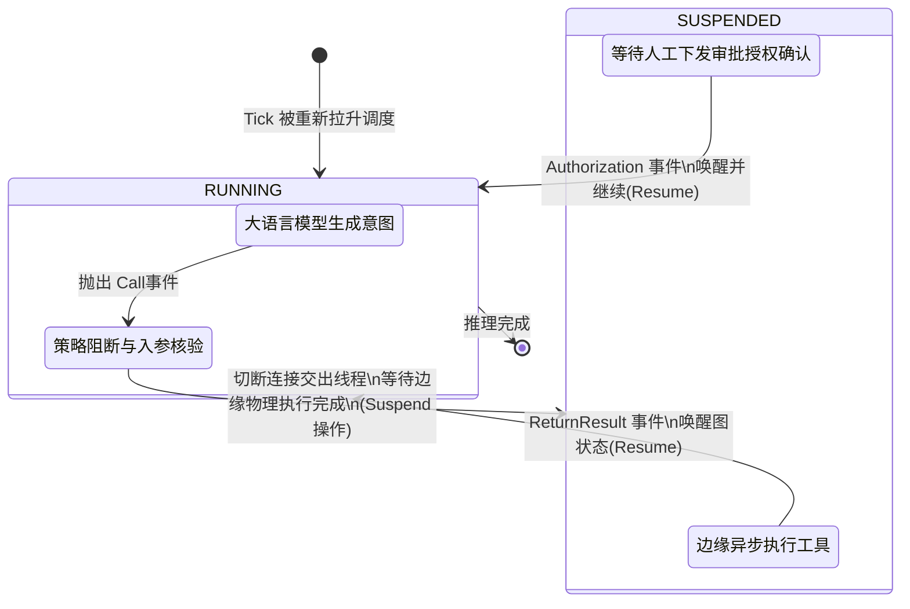

## 10.4 工具执行挂起（Suspend/Resume）与深层流转

智能体系统最令人激动的跃迁点在于“具备把自然语言编排转成可验证物理世界影响动作”的能力。然而在 OpenClaw 看来，这是系统崩溃风险最脆弱的一环。如果依然沿用同步的阻塞方法模型（如 LangChain 早期那样 `while` 等待 API 返回）去处理可能有几分钟超长通信周期的数据库全量扫描脚本读取插件，那框架的线程池会瞬间被枯竭。

本节以底层视角作为切入，揭开在 OpenClaw 中工具调用如何从“模型提议”化身为安全沙箱里的“挂起作业（Suspended Task）”，以及如何被流式唤醒回注。

### 10.4.1 生命周期：并非单纯的阻塞，而是状态机的挂起与唤醒

工具调用绝非一次简单的 HTTP 过程。在底层，单次执行工具行为经历了五大严格的跨域过程。每一个环节都必须保留物理断点镜像，使得哪怕在此刻整个中心调度服务器宕机重启，也能依据此图谱在毫秒之间恢复到原本的处理挂载点上安全续传：

1. **意图提议落盘（Proposing & Committing）**：大模型生成了一个格式化的 `ToolCallRequest` 发包后离开，此时，控制流回到 π 的主流程。
2. **审计阻断与校验（Policy Asserting）**：底层强制检验工具安全权限准星策略（白名单审计）及所携带参数的数据格式有效性，任何越权探测会在本步骤被即刻阻断无须抛回大模型消耗算力。
3. **休眠挂起并交出控制权（Suspend）**：这是一个关键动作，执行器（Executor）将当前任务从图状态标记为 `SUSPENDED` 并立即将其拥有的线程池资源吐出归还。这就解释了为什么 Agent 持有十几分钟的任务时系统也不会感觉负荷。
4. **边缘异步执行（Asynchronous Edge Execute）**：真实的物理逻辑工具实际上运行于系统的另一块边缘 Worker 或者隔离网关中。这可能是一个长时异步调用或者需要人类在外部 Web 端界面主动按下审批通过。
5. **回注唤醒（Resume & Inject）**：当 Worker 交付了执行结果，它向总控制中心发出一个 `ToolFinishedEvent` 中断信号。控制器再度将原状态 `SUSPENDED` 图激活为 `RUNNING` 级别并唤醒下一个执行核（Tick）继续挂载之前的快步。

下面用状态机的迁跃图展示该物理阻隔的生命流：



### 10.4.2 拦截体系：用物理围栏兜底而非指望大模型道德

把对于外部敏感世界的操作大权拱手相让是一场赌博。工程上，在 `PolicyAudit`（策略阻断）这一层建立规则永远优于依靠对大模型的千言万语洗脑：

对于所有带有物理效果性质（发送邮件、更新数据底表、重置虚拟机云主机）的修改操作类级别工具必须置于禁止名单之中，并配合专门设计的强授权许可流方可予以方形（例如：`Require Human-in-the-Loop` 必须强制获取钉钉人工授权确认反馈流）。详见在后续安全控制章节提到的内容规则说明。关于编写强制断截机制详参考 [5.2 工具策略](../05_tools_skills/5.2_tool_policy.md)。

### 10.4.3 回注与防遗忘设计机制：裁剪大尺寸实体

工具成功回归执行后，如果采用一种极度草率的直接向历史上下文内抛投其原文信息的设计手法将会对该会话产生毁灭性的记忆遗落大冲毁（即大本营遗忘灾难，Overwritten Catastrophe）。例如让其使用命令行终端下载排障文本而其一口气带回了十万行的 `nginx` 失败日志返回串。

系统对于结果汇注环节的约束必须严厉执行如下物理剥夺方法：

- **结构化提炼替代原词传输**：如果不是确切为了摘要，所有的查询应被设计只送出摘要提取结构化信息或者是高密度的分析点向控制底座进行汇报。
- **强制截断防范**：强行设置防范底线如果长度逾越了比如五千或是六千个字符必须进行掐头断尾裁截仅保留可用片段，并带有鲜明的警告注解标注在送入状态上下文池内以告知大模型情况。
- **外部分离挂载点法制策略**：不要回注庞大的原报文内容。而是返回一条指点位置的路径链接 URL 例如：“你刚才扫描分析的结果一共拥有五十兆庞大数据量体量现在他已经被打包存放于 `oss://log_archieve/temp_path.log` ，如需再次深入调查请重新发起查询”。

对于那些因为超规返回内容已经被迫导致严重膨胀拉伸以致影响分析状态的，还可通过底层执行器调动自动脱水折叠修剪法则，详参本篇 [6.4 压缩与裁剪](../06_context_memory/6.4_compaction_pruning.md)。

### 10.4.4 排障方法：以物理 Event 落盘顺序进行查证追溯

因为采取了彻底分离式挂起唤醒的机制（Suspend-Resume），定位由于外部插件或是配置失利引起的障碍点便有了异常坚挺精准的方法路径依据：绝不依靠猜想或者是看表层对话栏反应，直接查扣在运行图（Graph Runtime Trace）记录上那一根时间连线的挂断因果表征。

1. 率先调看 `status --deep` 深度检视查探清楚系统层有没真的放宽这个插件的许可进入底表控制档案记录。
2. 以 `traceId` 提取为凭据并拉取所有的执行器流变切确转换证据 `logs --follow --json` 翻看 `ToolCallRequest` 是否真的发生且发出了调用信号指令请求。
3. 利用医护功能 `doctor` 重视健康检查确认为否为跨网关代理或是依赖层导致的纯粹网络断路盲断报错。

```bash
openclaw status --deep
openclaw logs --follow --json
openclaw doctor
```

理解了这套在物理架构深处实施的脱离、剥夺与唤醒重召集循环回注流水线之后，在最终一步我们需要来剖析支撑这一连串活动不会因外部小错引发连环宕机灾难保护的流式重发控制退避重试法阵。
