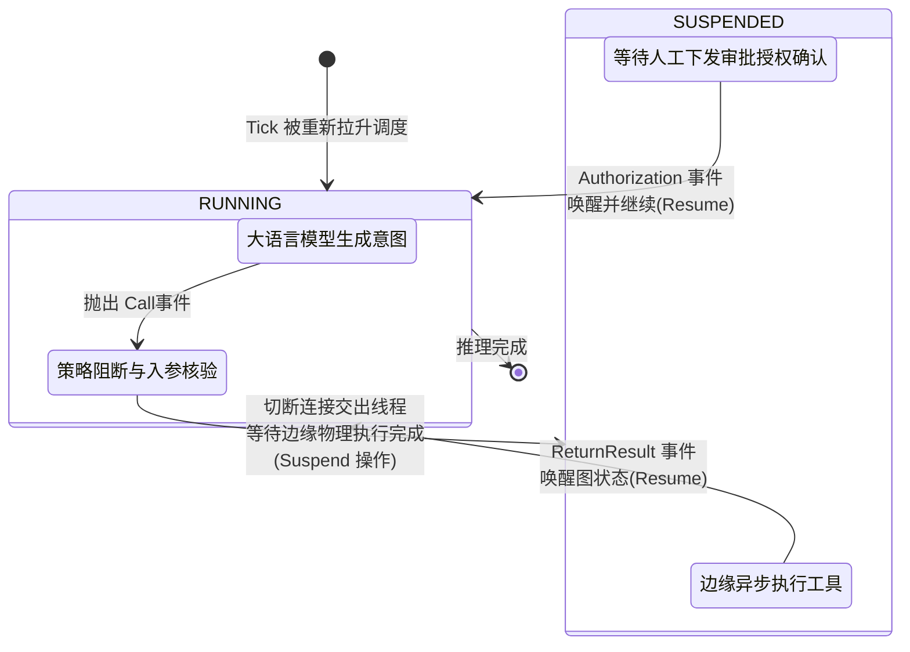

## 10.4 工具执行挂起（Suspend/Resume）与深层流转

智能体系统最令人激动的跃迁点在于“具备把自然语言编排转成可验证物理世界影响动作”的能力。然而在 OpenClaw 看来，这是系统崩溃风险最脆弱的一环。如果依然沿用同步的阻塞方法模型（如 LangChain 早期那样 `while` 等待 API 返回）去处理可能有几分钟超长通信周期的数据库全量扫描脚本读取插件，那框架的线程池会瞬间被枯竭。

本节以底层视角作为切入，揭开在 OpenClaw 中工具调用如何从“模型提议”化身为安全沙箱里的“挂起作业（Suspended Task）”，以及如何被流式唤醒回注。

## 10.4.1 生命周期：并非单纯的阻塞，而是状态机的挂起与唤醒

工具调用绝非一次简单的 HTTP 过程。在底层，单次执行工具行为经历了五大严格的跨域过程。每一个环节都必须保留物理断点镜像，使得哪怕在此刻整个中心调度服务器宕机重启，也能依据此图谱在毫秒之间恢复到原本的处理挂载点上安全续传：

1. **意图提议落盘（Proposing & Committing）**：大模型生成了一个格式化的 `ToolCallRequest` 发包后离开，此时，控制流回到 π 的主流程。
2. **审计阻断与校验（Policy Asserting）**：底层强制检验工具安全权限准星策略（白名单审计）及所携带参数的数据格式有效性，任何越权探测会在本步骤被即刻阻断无须抛回大模型消耗算力。
3. **休眠挂起并交出控制权（Suspend）**：这是一个关键动作，执行器（Executor）将当前任务从图状态标记为 `SUSPENDED` 并立即将其拥有的线程池资源吐出归还。这就解释了为什么 Agent 持有十几分钟的任务时系统也不会感觉负荷。
4. **边缘异步执行（Asynchronous Edge Execute）**：真实的物理逻辑工具实际上运行于系统的另一块边缘 Worker 或者隔离网关中。这可能是一个长时异步调用或者需要人类在外部 Web 端界面主动按下审批通过。
5. **回注唤醒（Resume & Inject）**：当 Worker 交付了执行结果，它向总控制中心发出一个 `ToolFinishedEvent` 中断信号。控制器再度将原状态 `SUSPENDED` 图激活为 `RUNNING` 级别并唤醒下一个执行核（Tick）继续挂载之前的快步。

下面用状态机的迁跃图展示该物理阻隔的生命流：


```mermaid
stateDiagram-v2
    [*] --> RUNNING: Tick 被重新拉升调度

    state RUNNING {
      ModelThinking: 大语言模型生成意图
      PolicyAudit: 策略阻断与入参核验
      ModelThinking --> PolicyAudit: 抛出 Call事件
    }
    
    PolicyAudit --> SUSPENDED: 切断连接交出线程<br/>等待边缘物理执行完成<br/>(Suspend 操作)

    state SUSPENDED {
      WaitTool: 边缘异步执行工具
      WaitHuman: 等待人工下发审批授权确认
    }

    WaitTool --> RUNNING: ReturnResult 事件<br/>唤醒图状态(Resume)
    WaitHuman --> RUNNING: Authorization 事件<br/>唤醒并继续(Resume)
    
    RUNNING --> [*]: 推理完成
```

### 10.4.2 before_tool_call 钩子：插件级的工具调用拦截

在策略围栏之外，OpenClaw 还提供了一个更灵活的拦截层——**before_tool_call 钩子**（`pi-tools.before-tool-call.ts`）。它允许插件在工具执行前介入，实现策略引擎难以表达的动态逻辑。

钩子在每次工具调用前运行，可以做两件事：

- **拦截执行**：返回 `{ blocked: true, reason: “...” }`，工具调用被终止，拒绝原因回注到对话中。
- **修改参数**：返回 `{ blocked: false, params: { ... } }`，调整后的参数替换原始参数传给工具执行器。

钩子通过全局钩子运行器（`getGlobalHookRunner()`）从插件中加载。插件只需声明 `before_tool_call` 钩子即可参与拦截链。一个内建的典型应用是**循环检测**：当系统发现智能体反复调用同一工具且参数相似时，钩子会标记为 `stuck`，根据严重程度（`critical` 拦截 / `warn` 告警）决定是否阻断。

调整后的参数会被缓存在一个有上限（1024 条）的 Map 中，供后续的审计和日志链路消费——这意味着钩子的参数修改对整条可观测链路可见。

### 10.4.3 拦截体系：用策略围栏兜底，而非依赖提示词约束

将外部世界的操作权委托给概率性的大模型，本质上是一场风险博弈。工程上，在 `PolicyAudit`（策略阻断）层建立确定性规则，永远优于在提示词中反复嘱咐模型”不要做危险操作”。

所有具有外部副作用的工具（如发送邮件、更新数据库、重置云主机等写操作），都应默认置于 `tools.deny` 禁止名单中，仅在满足以下条件时才放行：

- 通过 `toolsBySender` 限定可触发的用户范围。
- 配合人工确认流（Human-in-the-Loop），要求关键操作必须获得人工审批后方可执行。

关于工具策略的详细配置方法，参见 [5.2 工具策略](../05_tools_skills/5.2_tool_policy.md)。

### 10.4.4 回注与防遗忘：裁剪大尺寸工具结果

工具执行完成后，如果将大量原始输出直接回注到会话上下文中，会导致上下文窗口被低价值数据占满，挤出早期的关键指令与决策信息——这就是“上下文淹没”问题。例如，一次 Shell 命令返回了十万行 `nginx` 错误日志，直接注入上下文会导致模型完全丧失对之前任务的记忆。

系统在结果回注环节应严格遵循以下三条策略：

- **结构化摘要优先**：工具结果应提取关键字段与结论性摘要回注上下文，而非返回完整原始输出。
- **强制截断兜底**：设定结果体积上限（如 5000 字符），超出部分截断并插入占位说明（如“原始输出 12 万字符，已截断保留前 5000 字符”），确保模型知晓数据被裁剪。
- **外部存储引用**：对于大体量结果，不回注原始内容，而是返回存储路径引用（如“扫描结果已存储至 `/tmp/scan_result.log`，如需详细查看请重新读取”）。

对于已经膨胀的会话上下文，还可通过 `contextPruning` 机制进行自动裁剪，详见 [6.4 压缩与裁剪](../06_context_memory/6.4_compaction_pruning.md)。

### 10.4.5 排障方法：基于事件落盘顺序追溯

由于 Suspend/Resume 机制将工具调用的每个阶段都落盘为独立事件，排障时可以直接依据事件时间线定位故障点，而无需猜测或仅凭对话表面反应判断。

建议按以下顺序排查：

1. 用 `status --deep` 确认工具策略是否允许该工具执行，以及插件是否已加载。
2. 用 `logs --follow --json` 按 `traceId` 筛选事件流，确认 `ToolCallRequest` 是否已发出、是否被策略拦截、以及工具结果是否已回注。
3. 用 `doctor` 检查系统依赖与网络连通性，排除基础设施层面的故障。

```bash
openclaw status --deep
openclaw logs --follow --json
openclaw doctor
```

在理解了工具调用的挂起、执行与唤醒回注机制之后，下一节将探讨流式输出、重试与提前终止策略——它们共同保障长链路任务在遭遇外部故障时仍能可控降级。
