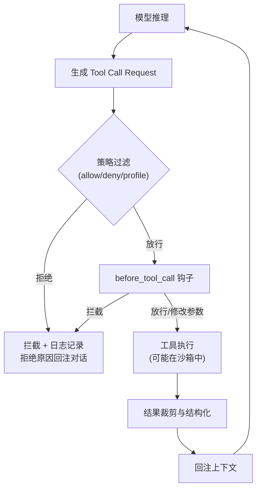

## 10.5 工具执行与结果回注

智能体系统最令人激动的跃迁点在于“具备把自然语言编排转成可验证物理世界影响动作”的能力。然而在 OpenClaw 看来，这也是系统崩溃风险最脆弱的一环——每一次工具调用都是从概率性的模型推理跨越到确定性的物理副作用。

本节从工具调用的全生命周期出发，拆解从模型提议到策略过滤、实际执行、结果回注的完整链路。

### 10.5.1 工具的本质：带类型签名的可调用函数

在 OpenClaw 中，工具（Tool）的定义是一个**带类型签名的可调用函数**。每个工具具有名称、参数结构（JSON Schema）、调用协议以及可选的安全标签。模型在推理过程中若决定调用工具，会生成一个包含工具名和参数的结构化请求（Tool Call Request）。

工具调用经历以下四个阶段：

1. **意图提议（Proposing）**：模型生成格式化的工具调用请求，控制流回到执行内核。
2. **策略过滤（Policy Filtering）**：系统检验该工具是否在当前策略允许范围内（`tools.allow` / `tools.deny`、工具档案 `tools.profile`、发送者限定 `toolsBySender`、以及当前版本里额外存在的 `tools.elevated.*` 高权限执行门控）。任何越权探测在此步骤被即刻阻断，无须消耗模型算力。
3. **实际执行（Execution）**：通过工具调用后经过安全检查的请求被分发到对应的执行器，可能运行在沙箱环境中。
4. **结果回注（Result Injection）**：工具返回的结果经过裁剪和结构化处理后，回注到对话上下文供模型继续推理。



图 10-10：工具调用的完整生命周期

### 10.5.2 before_tool_call 钩子：插件级的动态拦截

在策略围栏之外，OpenClaw 还提供了一个更灵活的拦截层——**before_tool_call 钩子**。它允许插件在工具执行前介入，实现策略引擎难以表达的动态逻辑（如基于运行时状态的条件拦截）。关于钩子系统的完整说明，见 [12.1.4 Hook 架构](../12_extension_engineering/12.1_plugin_architecture.md#1214-hook-架构插件的核心运行机制)。

钩子在每次工具调用前运行，可以做两件事：

- **拦截执行**：返回 `{ blocked: true, reason: "..." }`，工具调用被终止，拒绝原因回注到对话中。
- **修改参数**：返回 `{ blocked: false, params: { ... } }`，调整后的参数替换原始参数传给工具执行器。

插件只需声明 `before_tool_call` 钩子即可参与拦截链。一个内建的典型应用是**循环检测**：当系统发现智能体反复调用同一工具且参数相似时，钩子会标记为 `stuck`，根据严重程度（`critical` 拦截 / `warn` 告警）决定是否阻断。

调整后的参数会被缓存（上限 1024 条），供后续的审计和日志链路消费——这意味着钩子的参数修改对整条可观测链路可见。

### 10.5.3 拦截体系：用策略围栏兜底，而非依赖提示词约束

将外部世界的操作权委托给概率性的大模型，本质上是一场风险博弈。工程上，在策略过滤层建立确定性规则，永远优于在提示词中反复嘱咐模型“不要做危险操作”。

所有具有外部副作用的工具（如发送邮件、更新数据库、重置云主机等写操作），都应默认置于 `tools.deny` 禁止名单中，仅在满足以下条件时才放行：

- 通过 `toolsBySender` 限定可触发的用户范围。
- 对宿主机命令执行类能力，再叠加 `tools.elevated.enabled` / `tools.elevated.allowFrom` 之类的高权限门控，避免“工具已允许，但提权执行仍应被拦截”的漏斗缺口。
- 配合人工确认流（Human-in-the-Loop），要求关键操作必须获得人工审批后方可执行。

官方文档中，部分工具被硬编码为不可通过外部 API 调用（如 `cron`、`sessions_spawn`、`gateway`、`whatsapp_login`），这些限制独立于用户配置的策略规则。关于工具策略的详细配置方法，参见 [5.2 工具策略](../05_tools_skills/5.2_tool_policy.md)。

### 10.5.4 回注与防遗忘：裁剪大尺寸工具结果

工具执行完成后，如果将大量原始输出直接回注到会话上下文中，会导致上下文窗口被低价值数据占满，挤出早期的关键指令与决策信息——这就是“上下文淹没”问题。例如，一次 Shell 命令返回了十万行 `nginx` 错误日志，直接注入上下文会导致模型完全丧失对之前任务的记忆。

系统在结果回注环节应严格遵循以下三条策略：

- **结构化摘要优先**：工具结果应提取关键字段与结论性摘要回注上下文，而非返回完整原始输出。
- **强制截断兜底**：设定结果体积上限（如 5000 字符），超出部分截断并插入占位说明（如“原始输出 12 万字符，已截断保留前 5000 字符”），确保模型知晓数据被裁剪。
- **外部存储引用**：对于大体量结果，不回注原始内容，而是返回存储路径引用（如“扫描结果已存储至 `/tmp/scan_result.log`，如需详细查看请重新读取”）。

对于已经膨胀的会话上下文，还可通过 `contextPruning` 机制进行自动裁剪，详见 [6.4 压缩与裁剪](../06_context_memory/6.4_compaction_pruning.md)。

### 10.5.5 排障方法：基于事件日志追溯

由于工具调用的每个阶段都落盘为独立事件，排障时可以直接依据事件时间线定位故障点，而无需猜测或仅凭对话表面反应判断。

建议按以下顺序排查：

1. 用 `status --deep` 确认工具策略是否允许该工具执行，以及插件是否已加载。
2. 用 `logs --follow --json` 按 `traceId` 筛选事件流，确认工具调用请求是否已发出、是否被策略拦截、以及工具结果是否已回注。
3. 用 `doctor` 检查系统依赖与网络连通性，排除基础设施层面的故障。

```bash
openclaw status --deep
openclaw logs --follow --json
openclaw doctor
```

在理解了工具调用的策略过滤、执行与结果回注机制之后，下一节将探讨流式输出与重试策略——它们共同保障长链路任务在遭遇外部故障时仍能可控降级。
