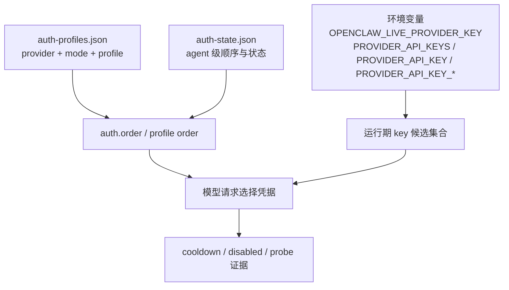

## 11.1 多密钥治理：认证档案、环境变量与轮换顺序

多密钥治理最容易被写成一份“轮换手册”，但它首先是一个**认证对象模型**问题：谁提供候选凭据，谁决定尝试顺序，谁记录运行期状态，以及这些信息如何落到不同智能体与不同环境上。只有先把这套对象关系讲清楚，后面的灰度、轮换和应急才不会沦为机械流程。

### 11.1.1 为什么多密钥治理不是单纯的运维动作

如果系统里只有一把 key，问题通常不只是“坏了就换”这么简单，还会同时引出三类工程风险：

- **可用性风险**：配额耗尽、供应商限流或单 key 被封禁时，全量失败。
- **隔离性风险**：开发流量、生产流量和高风险智能体共用同一凭据，爆炸半径过大。
- **可审计风险**：事故发生后，无法回答“哪条流量使用了哪条认证路径”。

因此，多密钥治理的目标不只是“多准备几把备用钥匙”，而是把**候选集合、尝试顺序、实际选择和审计证据**四件事分开治理。

### 11.1.2 认证对象模型：auth profiles、env keys、agent state

当前 OpenClaw 不使用 `models.providers.*.keys` / `keyId` 作为多密钥轮换模型。更准确的对象关系是：



图 11-1：多密钥治理中的认证对象模型

各层分别负责不同的问题：

- **环境变量候选集合**：为 API key 模式提供运行期 key 列表。`OPENCLAW_LIVE_<PROVIDER>_KEY` 是强制单 key 覆盖；若未设置，才从列表变量、主 key、前缀 key 和 provider manifest fallback 中去重组装候选池。常见例子包括 OpenAI 的 `OPENAI_API_KEYS` / `OPENAI_API_KEY` / `OPENAI_API_KEY_*`，Anthropic 的 `OPENCLAW_LIVE_ANTHROPIC_KEYS` / `ANTHROPIC_API_KEY` / `ANTHROPIC_API_KEY_*`。
- **`auth-profiles.json`**：保存 provider、认证模式与 profile 记录；API key、OAuth、CLI reuse 等认证路径都应落到可探针的 profile 视角。
- **`auth.order` / `auth-state.json`**：控制某个 provider 或 agent 下 profile 的尝试顺序，避免把“配置里有哪些凭据”和“当前会话实际先试谁”混为一谈。
- **运行期 cooldown / disabled 状态**：当某个 profile 因限流、超时、认证或计费问题暂时不可用时，运行时会记录状态并影响后续选择。

官方文档给出的常见认证档案路径是：

- 当前路径：`~/.openclaw/agents/<agentId>/agent/auth-profiles.json`
- 相关 agent 状态：`auth-state.json`

这也是为什么本章不能只谈“配置写法”。如果不理解对象关系，就很难在事故后复盘“默认配置”和“实际运行”之间的差异。

### 11.1.3 多密钥隔离策略：按环境、按智能体、按供应商切分

多密钥最常见的误区，是把“多把 key”误当成“高可用”本身。真正决定治理质量的，是你按什么边界去切分。

#### 11.1.3.1 按环境切分

- 开发、预发布、生产分别使用不同 key。
- 目标是避免测试流量污染生产配额，也避免生产故障被开发环境的实验请求放大。

#### 11.1.3.2 按智能体切分

- 高风险写操作智能体与低风险只读智能体使用不同认证 profile 或不同 provider 账户。
- 目标是把权限边界和凭据边界对齐，降低泄露后的爆炸半径。

#### 11.1.3.3 按供应商或计费域切分

- 同一供应商下，不同项目、不同团队或不同计费账号分别配置。
- 目标是便于成本归因、故障隔离与配额管理。

因此，多密钥治理的重点不是“配置里放几把 key”，而是让密钥边界和系统边界尽可能一致。

### 11.1.4 正常生命周期：生成、注入、验证、切换、吊销

从工程视角看，密钥轮换是正常生命周期的一部分，而不是临时运维技巧。生产环境里的最小安全流程如下：


图 11-2：多密钥轮换的正常生命周期

把这条生命周期拆开看：

1. **生成与注入**：新 key 先进入密钥系统、`~/.openclaw/.env` 或 SecretRef，不直接覆盖旧值。
2. **验证**：用 `openclaw models status --probe` 和 `openclaw health --json` 确认新 key 可用；`--check` 只用于自动化里检查缺失或过期状态。
3. **切换顺序**：通过 provider key 列表变量顺序、profile order 或 `openclaw models auth order ...` 控制优先尝试路径；`OPENCLAW_LIVE_<PROVIDER>_KEY` 应只用于临时强制单 key 覆盖。
4. **吊销与归档**：观察稳定后再撤销旧 key，并保留审计快照。

操作示例：

```bash
openclaw models status --probe
openclaw health --json
```

这里真正关键的是顺序：**先新增、再验证、后切换、最后吊销**。如果反过来做，就会引入脏窗口。

### 11.1.5 异常生命周期：泄露应急与失败模式

正常生命周期之外，最典型的异常分支就是密钥泄露。泄露后的应对动作不能只理解成“换 key”，而应理解为“从正常生命周期切换到异常响应路径”。

异常路径的核心步骤包括：

1. **立即吊销**：先在供应商侧阻断继续滥用。
2. **识别影响范围**：确认哪些 provider、哪些 agent、哪些外部系统受影响。
3. **并行轮换**：对受影响路径执行新的正常生命周期。
4. **加强隔离**：必要时临时下调工具权限、加强沙箱和审计。

### 11.1.6 常见误区与验收要点

多密钥治理失败，通常不是因为“不会配置”，而是因为对象关系和生命周期被混在一起了。常见误区包括：

- 把 key 明文写进配置文件或日志。
- 直接覆盖旧值，不保留回滚路径。
- 以为 `status --usage` 或成本视图会自动执行预算封顶。
- 把 `models.providers.*.keys` / `keyId` 当成当前官方轮换 schema。
- 把“候选密钥集合”和“实际运行选择”混为一谈。

验收时建议固定看三类证据：

1. **配置证据**：环境变量、SecretRef、auth profile order 是否符合预期。
2. **探针证据**：`models status --probe`、`health --json` 是否正常；自动化健康门禁可另跑 `models status --check`。
3. **运行证据**：`auth-profiles.json`、`auth-state.json` 与结构化日志是否能回答“谁在用哪条认证路径”。

```bash
openclaw models status --probe
openclaw logs --follow --json
```

只要把这三类证据都收齐，多密钥治理就不再只是一本运维说明单，而是一套可追溯、可切换、可复盘的认证治理机制。
