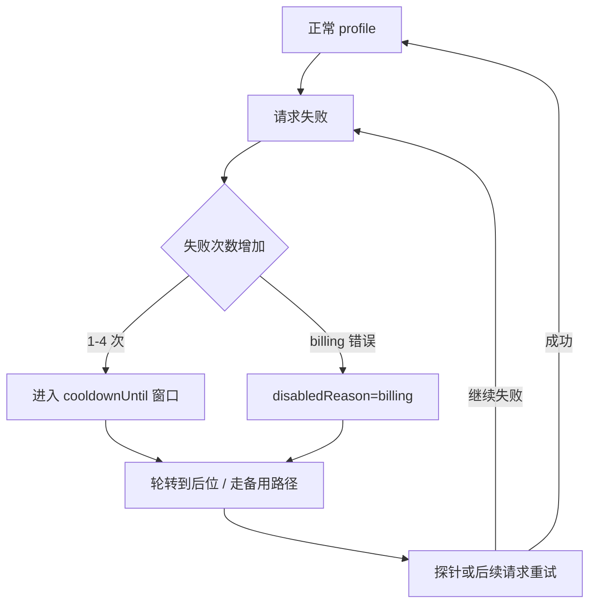

## 11.2 冷却与禁用：故障窗口内的止血机制

本节聚焦 **auth profile 层面**的冷却与禁用机制：当某个 API key 或 OAuth profile 持续报错时，系统如何自动退避并轮换，防止重试放大。模型级的跨模型回退（`fallbacks`）见 [11.3](11.3_fallback_rules.md)。

### 11.2.1 冷却解决什么：防止重试放大

在供应商抖动或限流时，如果系统持续对同一目标重试，会出现放大链条：失败触发重试，重试挤占并发与配额，队列堆积导致端到端超时。

冷却的目标是在故障窗口内降低无效尝试，把资源留给仍可能成功的路径。

### 11.2.2 Auth Profile 冷却：官方分级机制

OpenClaw 在 auth-profiles 层面内置了冷却分级机制。当某个 auth profile（API key 或 OAuth）持续报错时，系统自动施加指数退避冷却，并在 profile 轮转时将冷却中的 profile 移至末位。参考：https://docs.openclaw.ai/concepts/model-failover

它可以抽象成下面这条状态迁移链：



图 11-3：Auth profile 冷却与禁用的状态迁移

**冷却分级（按失败次数递增）：**

| 失败次数 | 冷却时长 |
|----------|----------|
| 1 次 | 1 分钟 |
| 2 次 | 5 分钟 |
| 3 次 | 25 分钟 |
| 4+ 次 | 1 小时（上限） |

当前应把“凭据/profile 持久化”和“运行期 auth 路由状态”分开理解：`auth-profiles.json` 负责保存认证档案本身，而运行期冷却、禁用与路由状态应独立管理，不应再把它们都写成 `auth-profiles.json` 的字段。

```json
{
  "usageStats": {
    "provider:profile": {
      "lastUsed": 1736160000000,
      "cooldownUntil": 1736160600000,
      "errorCount": 2
    }
  }
}
```

**Billing disable 退避（计费错误专项）：**

- 起步 5 小时，每次 billing 失败翻倍，上限 24 小时。
- `disabledReason: "billing"` 单独标记，与普通冷却区分。
- 24 小时内无失败则计数重置。

**可配置字段（`openclaw.json`）：**

```jsonc
{
  auth: {
    cooldowns: {
      billingBackoffHours: 5,           // billing 退避起步时长（小时）
      billingBackoffHoursByProvider: {  // 按供应商覆盖起步时长
        openai: 3,
      },
      billingMaxHours: 24,              // billing 最大禁用时长
      failureWindowHours: 24,           // 无失败后重置计数的窗口
    },
  },
}
```

### 11.2.3 验收与排障

- 如果回退频繁发生但主链路看起来正常，优先检查运行期 auth state 中的 `cooldownUntil`、`errorCount` 与禁用原因，确认是否存在持续触发冷却的 profile。
- 如果 billing disable 持续触发，检查 `disabledReason` 与 `auth.cooldowns.*` 配置，评估是否需要调整退避起步时长。
- 如果故障已恢复但仍长时间走备用链路，检查 `cooldownUntil` 时间戳是否已过期；若已过期仍未恢复，用探针命令主动验证。

操作示例：

```bash
openclaw models status --check
openclaw status --deep
```
