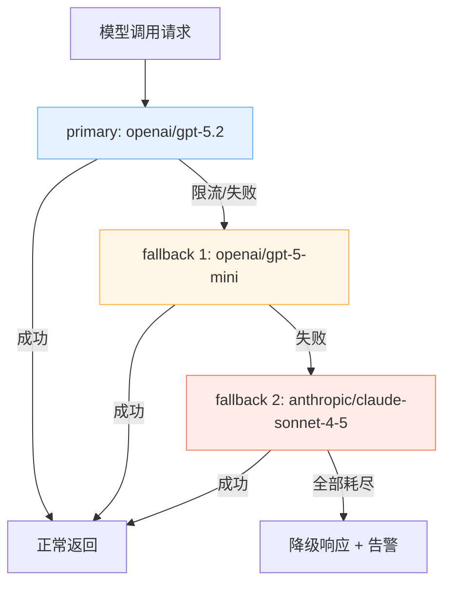

## 11.3 模型回退链路与错误分流

本节把“失败如何处理”落到官方 failover 规则上：通过 `fallbacks` 字符串列表声明按顺序尝试的回退目标，并把错误分流成可执行动作，而不是一句“重试一下”。重点包括回退链路的可解释性、证据链字段、以及通过故障注入证明回退确实生效。回退配置的基础结构见 [4.4 故障转移基础](../04_config_models/4.4_failover.md)。

### 11.3.1 回退目标：连续性优先但要可解释

回退的目标通常是服务连续性优先，但不能变成无声切换。否则输出质量下降、成本上升时无法定位原因。

建议每次回退至少记录：

- 触发原因：错误类型与原始目标。
- 命中规则：命中的回退顺序与策略版本。
- 回退路径：从哪个模型切到哪个模型。
- 后续动作：是否进入退避、限流保护或人工介入。

### 11.3.2 规则设计：按顺序分流

错误分流不仅依靠失败后的切换，更需要依靠重试预算的设置。官方 `fallbacks` 目前是纯顺序尝试，因此需将备用模型按可靠性排序：

- `primary`：优先使用的主力提供商模型。
- 第一回退：同供应商小模型（应对主模型并发限流）。
- 第二回退：备用供应商对应模型（应对主供应商网络或 API 错误）。

下面的流程图展示了回退链路的决策逻辑：



图 11-1：模型回退链路的决策逻辑

示例：

```json5
{
  agents: {
    defaults: {
      model: {
        primary: 'openai/gpt-5.2',
        fallbacks: [
          'openai/gpt-5-mini', // 应对同供应商的主模型限流
          'anthropic/claude-sonnet-4-5', // 应对跨供应商网络或架构故障
        ],
      },
    },
  },
}
```

官方参考：https://docs.openclaw.ai/concepts/model-failover。

### 11.3.3 验证方法：故障注入加日志对账

回退不是写进配置就算完成，必须验证它真的会触发。

1. 基线探针通过：`models status --check` 正常。
2. 制造故障：触发限流或人为制造网络/上游 API 错误。
3. 观察日志：出现回退事件，并且命中目标与配置一致。

```bash
openclaw models status --check
openclaw logs --follow --json
```

如果日志里无法对账回退原因，优先补齐结构化日志字段与审计，而不是继续加规则。
