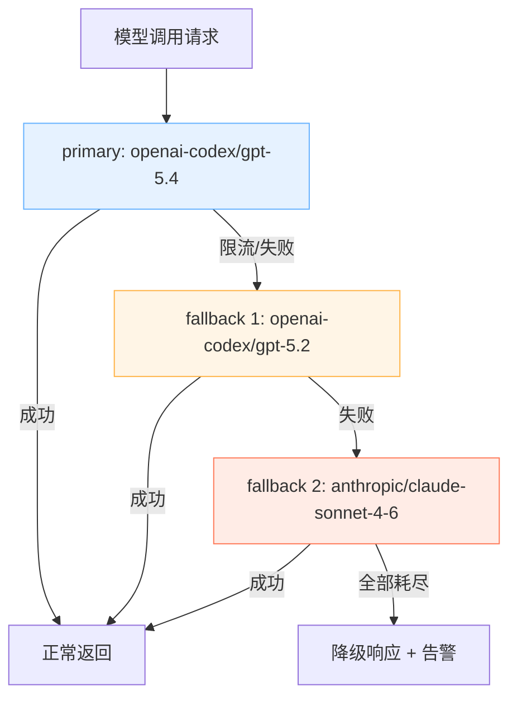

## 11.3 模型回退链路与错误分流

本节把“失败如何处理”落到官方 failover 规则上：通过 `fallbacks` 字符串列表声明按顺序尝试的回退目标，并把错误分流成可执行动作，而不是一句“重试一下”。重点包括回退链路的可解释性、证据链字段、以及通过故障注入证明回退确实生效。回退配置的基础结构见 [4.4 故障转移基础](../04_config_models/4.4_failover.md)。

### 11.3.1 回退目标：连续性优先但要可解释

回退的目标通常是服务连续性优先，但不能变成无声切换。否则输出质量下降、成本上升时无法定位原因。

建议每次回退至少记录：

- 触发原因：错误类型与原始目标。
- 命中规则：命中的回退顺序与策略版本。
- 回退路径：从哪个模型切到哪个模型。
- 后续动作：是否进入退避、限流保护或人工介入。

### 11.3.2 规则设计：按顺序分流

错误分流不仅依靠失败后的切换，更需要依靠重试预算的设置。官方 `fallbacks` 目前是纯顺序尝试，因此需将备用模型按可靠性排序：

- `primary`：优先使用的主力提供商模型。
- 第一回退：同供应商小模型（应对主模型并发限流）。
- 第二回退：备用供应商对应模型（应对主供应商网络或 API 错误）。

下面的流程图展示了回退链路的决策逻辑：


```mermaid
flowchart TD
  req["模型调用请求"] --> p["primary: openai-codex/gpt-5.4"]
  p -->|"成功"| ok["正常返回"]
  p -->|"限流/失败"| f1["fallback 1: openai-codex/gpt-5.2"]
  f1 -->|"成功"| ok
  f1 -->|"失败"| f2["fallback 2: anthropic/claude-sonnet-4-6"]
  f2 -->|"成功"| ok
  f2 -->|"全部耗尽"| degrade["降级响应 + 告警"]

  style p fill:#e6f2ff,stroke:#66b2ff
  style f1 fill:#fff5e6,stroke:#ffb347
  style f2 fill:#ffece6,stroke:#ff7a59
```

图 11-3：模型回退链路的决策逻辑

示例：

```javascript
{
  agents: {
    defaults: {
      model: {
        primary: 'openai-codex/gpt-5.4',
        fallbacks: [
          'openai-codex/gpt-5.2', // 应对同供应商的主模型限流
          'anthropic/claude-sonnet-4-6', // 应对跨供应商网络或架构故障
        ],
      },
    },
  },
}
```

两层机制的关系：auth profile 冷却（[11.2](11.2_rotation_cooldown.md)）在供应商内部轮换密钥/profile；模型 fallback 在模型之间跨级切换。先走 auth 层轮换，全部 profile 耗尽后才触发模型级 fallback。如果你的环境使用的是 `openai/*` 而不是 `openai-codex/*`，应整体保持同一前缀，不要混写。

### 11.3.3 回退链路中的智能行为

以下是对排障至关重要的几个回退行为细节：

**上下文溢出错误不触发回退。** 系统会检测 `request_too_large`、`context_window_exceeded` 等错误模式。一旦识别为上下文溢出，直接抛出错误而不尝试回退——因为更小的备选模型只会更快失败。此时正确的做法是触发压缩（Compaction）而非换模型。

**冷却期间的探针机制。** 当主模型处于冷却中但冷却即将在 2 分钟内到期时，系统会以 30 秒间隔发送探针请求验证是否已恢复。这避免了“冷却刚过就瞬间全量恢复”导致的流量尖峰，实现了类似断路器“半开”状态的渐进恢复。

**计费错误的指数退避公式。** 具体公式为 `baseMs × 2^(min(errorCount-1, 10))`，时长上限为 `billingMaxHours`（默认 24 小时）。与通用冷却相比，计费冷却的退避曲线更陡峭——这反映了计费问题通常需要人工介入才能恢复。

**聚合型供应商旁路。** 部分聚合型模型供应商（如 OpenRouter 等）默认跳过 auth 冷却检查，因为它们自身有内部的供应商轮转机制。使用这类聚合服务时，OpenClaw 的冷却策略不会生效。

**错误原因优先级。** 当所有 profile 都不可用时，系统通过优先级链推断最可能的根因：`auth_permanent` > `auth` > `billing` > `format` > `model_not_found` > `overloaded` > `timeout` > `rate_limit` > `unknown`。这个优先级决定了对外暴露的错误类型和建议操作。

### 11.3.4 验证方法：故障注入加日志对账

回退不是写进配置就算完成，必须验证它真的会触发。

1. 基线探针通过：`models status --check` 正常。
2. 制造故障：触发限流或人为制造网络/上游 API 错误。
3. 观察日志：出现回退事件，并且命中目标与配置一致。

```bash
openclaw models status --check
openclaw logs --follow --json
```

如果日志里无法对账回退原因，优先补齐结构化日志字段与审计，而不是继续加规则。
