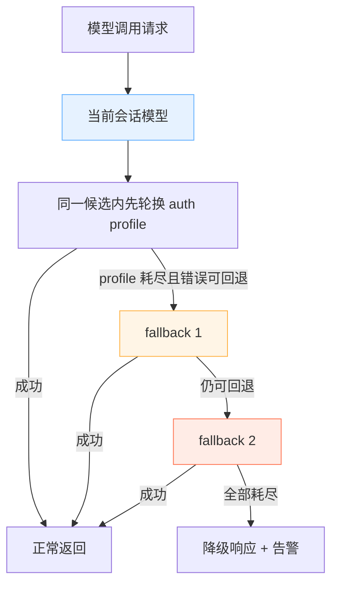

## 11.3 模型回退链路与错误分流

本节把“失败如何处理”落到官方 failover 规则上：通过 `fallbacks` 字符串列表声明按顺序尝试的回退目标，并把错误分流成可执行动作，而不是一句“重试一下”。重点包括回退链路的可解释性、证据链字段、以及通过故障注入证明回退确实生效。回退配置的基础结构见 [4.4 故障转移基础](../04_config_models/4.4_failover.md)。

### 11.3.1 回退目标：连续性优先但要可解释

回退的目标通常是服务连续性优先，但不能变成无声切换。否则输出质量下降、成本上升时无法定位原因。

建议每次回退至少记录：

- 触发原因：错误类型与原始目标。
- 命中规则：命中的回退顺序与策略版本。
- 回退路径：从哪个模型切到哪个模型。
- 后续动作：是否进入退避、限流保护或人工介入。

### 11.3.2 规则设计：按顺序分流

错误分流不仅依靠失败后的切换，更需要先分清“auth profile 轮换”和“模型 fallback”两层。一次普通文本运行的候选顺序是：当前会话选中的模型 → `agents.defaults.model.fallbacks` 中声明的模型 → 如果本次运行从 override 开始，则最后回到配置的 primary。每个模型候选内部会先尝试 auth-profile 轮换/冷却规则，只有该 provider/profile 路径被可回退错误耗尽后，才进入下一个模型候选。

- 当前会话模型：本次运行实际选中的 `provider/model`。
- 第一回退：同供应商小模型（应对主模型并发限流）。
- 第二回退：备用供应商对应模型（应对主供应商网络或 API 错误）。

下面的流程图展示了回退链路的决策逻辑：


```mermaid
flowchart TD
  req["模型调用请求"] --> p["当前会话模型"]
  p --> ap["同一候选内先轮换 auth profile"]
  ap -->|"成功"| ok["正常返回"]
  ap -->|"profile 耗尽且错误可回退"| f1["fallback 1"]
  f1 -->|"成功"| ok
  f1 -->|"仍可回退"| f2["fallback 2"]
  f2 -->|"成功"| ok
  f2 -->|"全部耗尽"| degrade["降级响应 + 告警"]

  style p fill:#e6f2ff,stroke:#66b2ff
  style f1 fill:#fff5e6,stroke:#ffb347
  style f2 fill:#ffece6,stroke:#ff7a59
```

图 11-4：模型回退链路的决策逻辑

示例：

```javascript
{
  agents: {
    defaults: {
      model: {
        primary: 'provider/main-model',
        fallbacks: [
          'provider/smaller-or-sibling-model', // 应对同供应商的主模型限流
          'backup-provider/backup-model', // 应对跨供应商网络或架构故障
        ],
      },
    },
  },
}
```

两层机制的关系：auth profile 冷却（[11.2](11.2_rotation_cooldown.md)）在供应商内部轮换密钥/profile；模型 fallback 在模型之间跨级切换。先走 auth 层轮换，全部 profile 耗尽后才触发模型级 fallback。显式配置的 fallback 代表操作员意图，候选链会去重，但不会因为普通 allowlist 过滤而自动消失。

### 11.3.3 回退链路中的智能行为

以下是对排障至关重要的几个回退行为细节：

**上下文溢出错误不触发模型 fallback。** 系统会检测 `request_too_large`、`context length exceeded`、`input exceeds the maximum number of tokens`、`input token count exceeds the maximum number of input tokens`、`input is too long for the model`、`ollama error: context length exceeded` 等错误模式。这类错误应留在压缩（Compaction）和溢出恢复重试链路内处理，而不是换到下一个模型候选。

**冷却期间的探针机制。** 当某个 provider 的 auth profiles 都在冷却中时，OpenClaw 不会永远跳过该 provider；它按候选作决定。持久 auth 失败会直接跳过，计费禁用通常跳过但 primary 可按节流探测，瞬态限流/过载/未知错误允许有限的同 provider sibling 尝试。不要在文档或监控里写死“几分钟内到期、多少秒探针一次”这类实现常量。

**计费错误的指数退避。** 计费/余额类失败通常不是短暂错误，OpenClaw 会把 profile 标记为 disabled 并使用更长退避。公开文档给出的默认行为是：计费 backoff 从 5 小时开始，按失败次数翻倍，上限 24 小时；如果 profile 24 小时内没有再次失败，计数可重置。

**失败字段只回写 fallback 拥有的模型选择状态。** fallback 运行会在重试前持久化它选中的 provider/model/auth profile override，让其他会话读取者看到同一个目标；失败回滚时只回滚自己写入且仍匹配的字段，避免覆盖运行期间发生的手动 `/model` 或会话更新。

**最终失败摘要。** 当所有候选都失败时，OpenClaw 抛出 `FallbackSummaryError`，包含每次尝试的 provider/model、原因、可选状态码和可读错误摘要；外层回复可据此给出“全部模型暂时限流”等更具体提示，并在已知时带上最早冷却恢复时间。

### 11.3.4 验证方法：故障注入加日志对账

回退不是写进配置就算完成，必须验证它真的会触发。

1. 基线探针通过：`models status --probe` 正常。
2. 制造故障：触发限流或人为制造网络/上游 API 错误。
3. 观察日志：出现回退事件，并且命中目标与配置一致。

```bash
openclaw models status --probe
openclaw logs --follow --json
```

如果日志里无法对账回退原因，优先补齐结构化日志字段与审计，而不是继续加规则。
