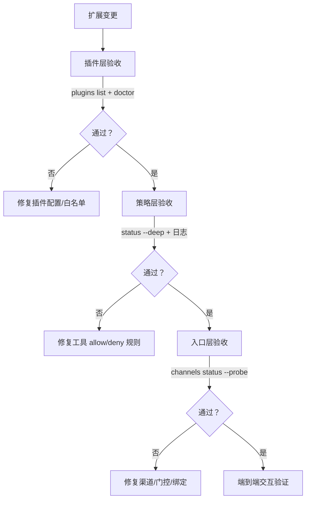

## 12.3 测试与调试：把扩展做成可回放的工程闭环

扩展工程最难的不是写代码，而是把变更做成可验证、可回滚、可定位。插件、工具策略与渠道策略叠加后，任何一个环节的偏差都可能表现为“智能体不工作”。本节给出一套面向 OpenClaw 的扩展测试与调试流程，强调用官方自检与探针命令建立证据链，而不是靠对话猜测。

### 12.3.1 验收范围：分层验证而不是一次性端到端

建议把扩展验收拆成三层，按层级逐步合并。下面的流程图展示了分层验收的推荐路径：



图 12-1：扩展变更后的分层验收路径

1. 插件层：插件是否被加载、配置是否通过校验、白名单是否生效。
2. 策略层：工具策略是否按预期允许或拒绝，拒绝原因是否可见。
3. 入口层：渠道是否在线、门控是否生效、绑定是否命中。

这种分层的好处是定位快：当端到端失败时，先用每层的自检命令把范围收敛，再回到具体变更点。

### 12.3.2 最小自检命令：先 doctor，再 status，再各类探针

官方 CLI 提供了自检、状态与诊断命令。建议将下面这组命令作为扩展变更后的最小验收集：

- 自检：[https://docs.openclaw.ai/cli/doctor](https://docs.openclaw.ai/cli/doctor)
- 状态：[https://docs.openclaw.ai/cli/status](https://docs.openclaw.ai/cli/status)
- 插件：[https://docs.openclaw.ai/cli/plugins](https://docs.openclaw.ai/cli/plugins)
- 渠道：[https://docs.openclaw.ai/cli/channels](https://docs.openclaw.ai/cli/channels)
- 模型：[https://docs.openclaw.ai/cli/models](https://docs.openclaw.ai/cli/models)

```bash
openclaw doctor
openclaw status --deep
openclaw plugins doctor
openclaw channels status --probe
openclaw models status --check
```

当这些命令中任意一项失败，优先修复失败项，而不是继续做端到端交互。

### 12.3.3 回放定位：按 traceId 还原一次请求链路

扩展相关的调试建议以“回放”而不是“猜测”为核心。做法是：

1. 在复现问题时记录 `traceId`。
2. 跟随 JSON 日志并按 `traceId` 过滤，观察路由、工具拒绝、插件诊断等关键事件。

```bash
openclaw logs --follow --json   | jq -c 'select(.traceId=="<TRACE_ID>")   | {ts, traceId, event, agentId, channelId, tool, reason, err}'
```

如果日志显示工具被拒绝，应回到工具策略检查拒绝规则；如果日志显示插件未加载或配置无效，应优先看 `plugins doctor` 的诊断输出。

### 12.3.4 灰度与回滚：用显式开关把风险降到可控范围

扩展上线建议采用灰度策略：

1. 配置层面保留显式启停开关，例如插件条目中的 `enabled`。
2. 白名单收敛到最小集合，先覆盖少量入口或少量对端。
3. 发生异常时先回滚开关与白名单，再回滚代码版本。

官方插件文档说明了如何通过 `enabled` 快速启停插件，并通过白名单控制可用范围：[https://docs.openclaw.ai/tools/plugin](https://docs.openclaw.ai/tools/plugin)。

### 12.3.5 本节小结

扩展调试的关键是分层验收与可回放证据链：先用 `doctor` 与 `status --deep` 验证运行时状态，再用 `plugins doctor`、`channels status --probe`、`models status --check` 收敛问题层级，最后用结构化日志按 `traceId` 回放单次链路定位根因。上线采用显式启停与白名单灰度，可以把扩展风险控制在可回滚范围。
