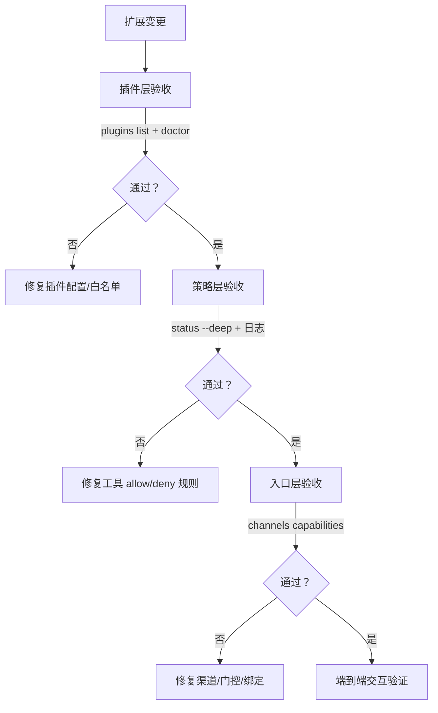

## 12.3 测试与调试：把扩展做成可回放的工程完整流程

扩展工程最难的不是写代码，而是把变更做成可验证、可回滚、可定位。插件、工具策略与渠道策略叠加后，任何一个环节的偏差都可能表现为“智能体不工作”。本节给出一套面向 OpenClaw 的扩展测试与调试流程，强调用官方自检与探针命令建立证据链，而不是靠对话猜测。

### 12.3.1 验收范围：分层验证而不是一次性端到端

建议把扩展验收拆成三层，按层级逐步合并。下面的流程图展示了分层验收的推荐路径：


```mermaid
flowchart TD
  start["扩展变更"] --> L1["插件层验收"]
  L1 -->|"plugins list + doctor"| L1ok{通过？}
  L1ok -->|"否"| fix1["修复插件配置/白名单"]
  L1ok -->|"是"| L2["策略层验收"]
  L2 -->|"status --deep + 日志"| L2ok{通过？}
  L2ok -->|"否"| fix2["修复工具 allow/deny 规则"]
  L2ok -->|"是"| L3["入口层验收"]
  L3 -->|"channels capabilities"| L3ok{通过？}
  L3ok -->|"否"| fix3["修复渠道/门控/绑定"]
  L3ok -->|"是"| e2e["端到端交互验证"]
```

图 12-2：扩展变更后的分层验收路径

1. 插件层：插件是否被加载、配置是否通过校验、白名单是否生效。
2. 策略层：工具策略是否按预期允许或拒绝，拒绝原因是否可见。
3. 入口层：渠道是否在线、门控是否生效、绑定是否命中。

这种分层的好处是定位快：当端到端失败时，先用每层的自检命令把范围收敛，再回到具体变更点。

### 12.3.2 最小自检命令：先 doctor，再 status，再各类探针

官方 CLI 提供了自检、状态与诊断命令。建议将下面这组命令作为扩展变更后的最小验收集：

- 自检：[https://docs.openclaw.ai/cli/doctor](https://docs.openclaw.ai/cli/doctor)
- 状态：[https://docs.openclaw.ai/cli/status](https://docs.openclaw.ai/cli/status)
- 插件：[https://docs.openclaw.ai/cli/plugins](https://docs.openclaw.ai/cli/plugins)
- 渠道：[https://docs.openclaw.ai/cli/channels](https://docs.openclaw.ai/cli/channels)
- 模型：[https://docs.openclaw.ai/cli/models](https://docs.openclaw.ai/cli/models)

```bash
openclaw doctor
openclaw status --deep
openclaw plugins doctor
```

> [!NOTE]
> 上述三条命令为截至 2026 年 3 月官方 CLI 已稳定支持的自检命令。若还要继续确认渠道能力或模型可用性，可再看 `channels capabilities`、`models status --check`；相关参数与输出仍应以 `openclaw --help` 和官方文档为准。

当这些命令中任意一项失败，优先修复失败项，而不是继续做端到端交互。

### 12.3.3 快照测试：配置与行为的基线对比

扩展变更后，最容易出现的问题是“配置改了，但预期结果变了”。快照测试通过保存已知良好的配置与行为输出作为基线，在每次变更后对比快照，快速发现回归。

快照包含两部分：配置快照与行为快照。配置快照应记录工具策略、插件配置、渠道策略的当前完整状态；行为快照应记录典型请求的响应输出与工具调用序列。

```bash
# 生成当前状态快照（先用当前版本稳定支持的文本或 JSON 输出）
openclaw status --deep > snapshots/status-baseline.txt
openclaw plugins list > snapshots/plugins-baseline.txt
openclaw plugins doctor > snapshots/plugins-doctor-baseline.txt
```

> [!NOTE]
> 这里的重点是“为当前版本保存一份可比较的基线”，而不是依赖某个固定的 `--format json` 参数名。如果你的 CLI 明确支持 JSON 输出，当然优先保存 JSON；如果不支持，就保存当前版本能稳定导出的文本结果，再通过脚本做结构化比对。

行为快照则需通过实际对话交互生成。由于 `openclaw invoke` 尚不是官方稳定命令，建议通过脚本向已配置的渠道发送测试消息，并从结构化日志中捕获响应：

```bash
# 从日志中提取最近的工具调用事件作为行为基线
openclaw logs --json | jq -c 'select(.tool_call) | {trace_id, tool, result}' \
  | tail -20 > snapshots/behavior-baseline.json
```

快照对比脚本应检查以下内容：

1. 工具允许集合是否变化（是否意外放开或禁止了工具）。
2. 工具调用序列是否改变（是否因插件或策略改动导致调用顺序变化）。
3. 关键输出字段是否改变（版本号、返回值结构等）。

```bash
#!/bin/bash
# scripts/snapshot-diff.sh
# 用法：bash scripts/snapshot-diff.sh ./snapshots ./snapshots-new

BASELINE=$1
CURRENT=$2

echo "=== Config Snapshot Diff ==="
diff "$BASELINE/status-baseline.txt" "$CURRENT/status-baseline.txt" && \
  echo "PASS: Status baseline unchanged" || echo "FAIL: Status baseline changed"

echo "=== Plugin Snapshot Diff ==="
diff "$BASELINE/plugins-baseline.txt" "$CURRENT/plugins-baseline.txt" && \
  echo "PASS: Plugin list unchanged" || echo "FAIL: Plugin list changed"

echo "=== Plugin Doctor Diff ==="
diff "$BASELINE/plugins-doctor-baseline.txt" "$CURRENT/plugins-doctor-baseline.txt" && \
  echo "PASS: Plugin doctor unchanged" || echo "FAIL: Plugin doctor changed"
```

在 CI/CD 流程中，快照对比应作为部署前的强制门控：变更必须通过快照校验或明确增加新的快照基线。

### 12.3.4 回放定位：按 traceId 还原一次请求链路

扩展相关的调试建议以“回放”而不是“猜测”为核心。做法是：

1. 在复现问题时记录 `traceId`。
2. 跟随 JSON 日志并按 `traceId` 过滤，观察路由、工具拒绝、插件诊断等关键事件。

```bash
openclaw logs --follow --json   | jq -c 'select(.type=="log") | .log | select(.trace_id=="<TRACE_ID>")   | {ts, trace_id, event, agentId, channelId, tool, reason, err}'
```

如果日志显示工具被拒绝，应回到工具策略检查拒绝规则；如果日志显示插件未加载或配置无效，应优先看 `plugins doctor` 的诊断输出。

### 12.3.5 自动化测试流水线：CI/CD 中的扩展验证

扩展变更应纳入 CI/CD 流程，把手工验收自动化。推荐的流水线设计包括：配置校验、快照对比、沙箱集成测试、灰度部署。

下面是一个典型 CI 配置示例（以 GitHub Actions 为例）：

```yaml
name: Extension Verification

on: [push, pull_request]

jobs:
  verify:
    runs-on: ubuntu-latest
    steps:
      # 步骤 1: 配置校验（使用官方稳定命令）
      - name: Validate Plugin Configuration
        run: |
          openclaw doctor
          openclaw plugins doctor
          openclaw status --deep

      # 步骤 2: 快照对比
      - name: Run Snapshot Tests
        run: |
          openclaw status --deep > /tmp/status-baseline.txt
          openclaw plugins list > /tmp/plugins-baseline.txt
          openclaw plugins doctor > /tmp/plugins-doctor-baseline.txt
          bash scripts/snapshot-diff.sh ./snapshots /tmp

      # 步骤 3: 单元测试（工具定义与脚本）
      - name: Unit Tests
        run: |
          python -m pytest tests/tools/ -v
          bash tests/scripts/tool-unit-tests.sh

      # 步骤 4: 集成测试（通过渠道发送测试消息并验证日志）
      - name: Integration Tests
        run: |
          bash tests/integration/test-tool-chains.sh

      # 步骤 5: 灰度模拟
      - name: Canary Simulation
        run: |
          bash tests/canary/simulate-rollout.sh --dry-run
```

> [!NOTE]
> 上述流水线中的 `openclaw doctor`、`openclaw plugins doctor`、`openclaw status --deep` 为官方稳定命令。`--format json` 参数需以实际 CLI 版本为准。部署步骤（如灰度发布）因团队基础设施而异，此处仅展示验证阶段的参考结构。

每个步骤失败都应停止流程，防止错误配置进入生产。关键的集成测试脚本应覆盖：

1. 单个工具的输入验证与输出结构。
2. 工具被正确拒绝的场景（工具策略与访问控制）。
3. 多工具编排的依赖与执行顺序。
4. 工具调用日志的可追溯性。

由于 OpenClaw 目前不提供 `invoke` 子命令来直接执行单次工具调用，集成测试需通过渠道发送消息并从结构化日志中验证结果。以下是一个基于日志验证的集成测试脚本示例：

```bash
#!/bin/bash
# tests/integration/test-tool-chains.sh
# 通过日志验证工具调用行为，而非直接调用 CLI 子命令

set -e

LOG_FILE="/tmp/openclaw-test-$(date +%s).log"

echo "=== Test 1: 启动 Gateway 并收集日志 ==="
openclaw logs --json > "$LOG_FILE" &
LOG_PID=$!
sleep 2  # 等待日志流建立

echo "=== Test 2: 验证工具策略加载 ==="
# 从 status 输出中确认 deny 规则已生效
openclaw status --deep | grep -q "deny" || {
  echo "FAIL: Tool deny rules not found in status"
  kill $LOG_PID 2>/dev/null; exit 1
}
echo "PASS: Tool deny rules loaded"

echo "=== Test 3: 验证插件加载状态 ==="
openclaw plugins doctor || {
  echo "FAIL: Plugin doctor reported issues"
  kill $LOG_PID 2>/dev/null; exit 1
}
echo "PASS: All plugins healthy"

echo "=== Test 4: 检查日志中的工具拒绝事件格式 ==="
# 确认拒绝事件包含必要字段（trace_id、tool、reason）
cat "$LOG_FILE" | jq -c 'select(.tool_denied) | {trace_id, tool, reason}' | head -5
echo "PASS: Tool denial events are structured"

kill $LOG_PID 2>/dev/null
echo "All integration tests passed."
```

### 12.3.6 灰度与回滚：用显式开关把风险降到可控范围

扩展上线建议采用灰度策略：

1. 配置层面保留显式启停开关，例如插件条目中的 `enabled`。
2. 白名单收敛到最小集合，先覆盖少量入口或少量对端。
3. 发生异常时先回滚开关与白名单，再回滚代码版本。

官方插件文档说明了如何通过 `enabled` 快速启停插件，并通过白名单控制可用范围：[https://docs.openclaw.ai/tools/plugin](https://docs.openclaw.ai/tools/plugin)。
