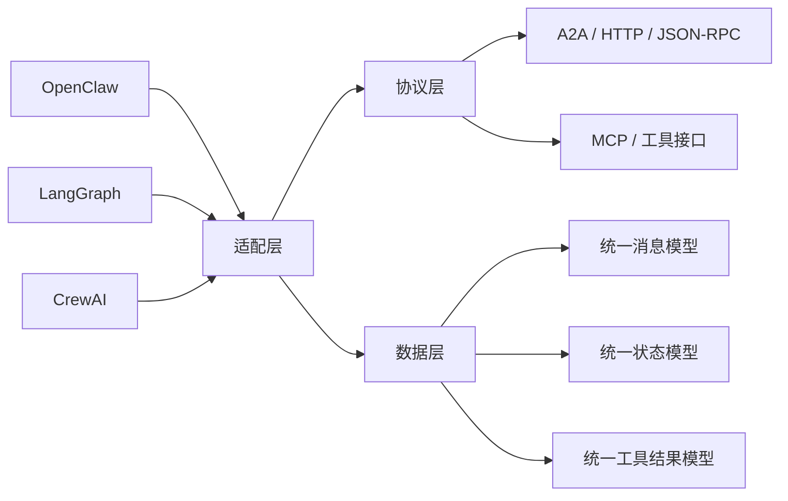

## 12.5 主流框架互操作性指南

讨论互操作时，最容易犯的错误是先罗列框架清单、协议名称和迁移步骤，却没有先回答一个更根本的问题：**为什么要互操作，而不是选定一个框架一路做下去**。本节先建立这个判断框架，再解释互操作的架构层次、三种典型落地模式，以及 OpenClaw 与其他框架在系统边界上的本质差异。

### 12.5.1 为什么需要互操作

单一框架通常更简单，但在以下场景里，互操作是合理的工程选择：

- **渐进迁移**：企业已有 LangGraph、CrewAI 或自研 Agent 系统，不可能一次性迁到 OpenClaw。
- **能力复用**：希望保留旧系统里的工作流、工具封装或 Agent 资产，而不是全部重写。
- **系统解耦**：把“生产入口治理”和“复杂推理编排”拆给不同系统，各自发挥长项。

互操作真正解决的问题，不是“把所有框架接在一起看起来更高级”，而是让系统在迁移期、混合部署期和多团队协作期保持连续性。如果只是单个新项目、单一团队、单一部署目标，优先选定一个框架往往更划算。

### 12.5.2 互操作的三层架构

要把互操作讲系统，最关键的是把它拆成三层：**适配层、协议层、数据层**。不同框架之间并不是直接“互相调用”，而是先经过适配层，把能力对齐到共同的协议与数据模型上。



图 12-3：跨框架互操作的三层架构

三层分别负责的事情不同：

- **适配层**：处理“某个框架怎么接进来”。例如把 LangGraph 的状态机运行、CrewAI 的任务代理、OpenClaw 的会话与工具调用映射到统一入口。
- **协议层**：处理“通过什么通道通信”。常见形态包括 A2A、HTTP/JSON-RPC、MCP 或本地运行时桥接。
- **数据层**：处理“双方到底交换什么”。没有统一消息、状态和工具结果模型，协议再标准也会互相误解。

### 12.5.3 三种典型落地模式

真正落地时，互操作通常不会是抽象的“任意互联”，而是落在下面三种模式之一。

#### 12.5.3.1 本地嵌入式互操作

这种模式下，多个框架运行在同一进程或同一宿主环境中，通过适配器直接调用。

- 适用：实验环境、同一团队维护、低网络开销需求。
- 优点：延迟低、调试直接、协议转换少。
- 代价：部署边界不清晰，升级耦合度高。

#### 12.5.3.2 远程服务式互操作

这种模式下，OpenClaw 与其他框架通过 HTTP、JSON-RPC、gRPC 或 A2A 等协议跨进程或跨主机通信。

- 适用：团队边界明确、需要独立部署与扩缩容。
- 优点：系统边界清楚，服务可独立演进。
- 代价：网络延迟、鉴权、重试与幂等问题都会浮出水面。

#### 12.5.3.3 外部框架桥接式互操作

这种模式下，OpenClaw 不直接“理解”外部框架，而是通过桥接层统一做消息规范化、工具转译和状态同步。

- 适用：已有异构系统，需要平滑接入而非彻底重写。
- 优点：迁移成本可控，旧系统资产能保留。
- 代价：适配层会变成新的复杂点，协议漂移和调试复杂度上升。

如果从工程治理角度看，这三种模式的差别不在“技术栈”，而在**边界在哪里定义**：是定义在进程内、服务间，还是适配层本身。

### 12.5.4 OpenClaw 与其他框架的关键差异

理解互操作的前提，不是背框架功能表，而是看清它们各自优化的目标。

| 维度 | OpenClaw | LangGraph | CrewAI |
|------|----------|-----------|--------|
| 主要目标 | 生产入口治理与可靠运行 | 灵活编排与状态控制 | 快速构建高层工作流 |
| 核心优势 | 多渠道、权限治理、运行审计 | 条件分支、图式流程、可组合性 | 易上手、任务组织直观 |
| 典型短板 | 深度图式编排不如专用框架灵活 | 生产治理与渠道接入要自己补 | 大规模工程治理能力较弱 |

从互操作角度，最重要的不是“谁更强”，而是**保留各自强项**：

- OpenClaw 适合做生产入口、会话治理、权限收敛和工具边界控制。
- LangGraph 适合做复杂条件分支、状态图式编排和研究型工作流。
- CrewAI 更适合高层任务编排和快速验证多角色协作。
- Symphony（OpenAI 2026-04 开源）适合把项目看板（如 Linear）变成编码智能体的持续运行控制面，侧重任务分发与自动重启而非通用对话编排。

这也是为什么互操作不应该变成“所有东西都迁到同一抽象里”。更好的做法是：让 OpenClaw 管生产边界，让其他框架保留它们在编排或工作流上的专长。

LangGraph 的 `conditional_edges` 与 OpenClaw 的路由，就是一个典型对比：

- LangGraph 偏函数式决策，优势是灵活。
- OpenClaw 偏配置式决策，优势是可审计、可版本化、可治理。

如果你的系统同时需要这两者，最合理的不是选边站，而是明确“谁负责入口决策，谁负责内部编排”。

### 12.5.5 协议与数据模型：A2A 只是其中一种选择

很多互操作讨论一上来就讲 A2A，容易让人误以为它是唯一正统路径。实际上，A2A 只是协议层的一种选择。

当前常见的协议层方案包括：

- **A2A**：适合标准化 Agent-to-Agent 发现与通信，但 OpenClaw 的原生支持仍在演进中。
- **HTTP / JSON-RPC**：实现门槛低，适合服务式桥接。
- **MCP**：适合把外部能力收敛成工具接口，但不等于所有互操作都必须 MCP 化。
- **本地运行时桥接**：适合单机或嵌入式集成，省去网络协议开销。

不管采用哪种协议，数据层都需要统一最小模型。下面是一个足够实用的统一消息骨架：

```typescript
interface UnifiedAgentMessage {
  agent_id: string;
  content: string;
  message_type: "text" | "tool_call" | "error";
  metadata: Record<string, unknown>;
  source_framework: "openclaw" | "langgraph" | "crewai";
}

interface UnifiedAgentState {
  agent_id: string;
  current_task: string;
  context: Record<string, unknown>;
  tool_results: Record<string, unknown>;
  message_history: Array<{ role: string; content: string }>;
  metadata: Record<string, unknown>;
}
```

这里真正重要的，不是字段长什么样，而是统一三件事：

- 消息如何表示
- 状态如何表示
- 工具结果如何表示

没有这三件事，所谓“协议兼容”通常只停留在传输层，到了业务层还是会崩。

### 12.5.6 迁移路径与决策建议

如果已经决定做互操作，迁移顺序建议固定成下面这条路径：

1. **先判定是否真的需要互操作**：如果单框架足够，就不要引入额外复杂度。
2. **先搭适配层，再谈协议细节**：先把边界收敛清楚，再决定用 A2A、MCP 还是 HTTP。
3. **先统一最小数据模型，再扩字段**：优先确保消息、状态、工具结果可对齐。
4. **先做单 Agent 验证，再做多 Agent 编排**：不要一开始就做全链路混合编排。
5. **最后才做性能与发布决策**：延迟、吞吐、重试、故障恢复都应在验证后评估。

迁移前尤其要问清楚四个问题：

- 这个系统是为了渐进迁移，还是为了长期双栈共存？
- 边界放在哪一层最稳定：入口层、协议层，还是适配层？
- 哪一侧负责权限与治理，哪一侧负责编排与推理？
- 多一层适配带来的复杂度，是否值得换来资产复用？

最后给一个实用判断：

- **该做互操作**：已有历史系统、跨团队共建、需要保留专长框架、生产入口必须治理。
- **不该做互操作**：单团队新项目、需求明确、系统规模不大、性能和调试复杂度更重要。

因此，互操作不是默认选项，而是一种有明确收益、也有明确代价的系统设计决策。
