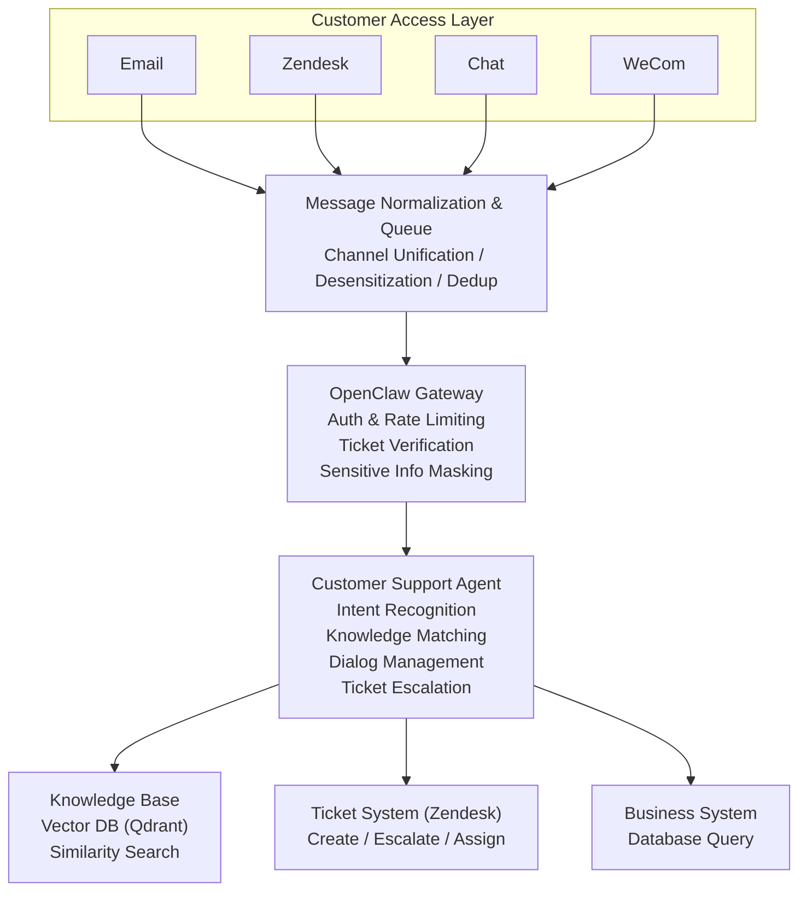
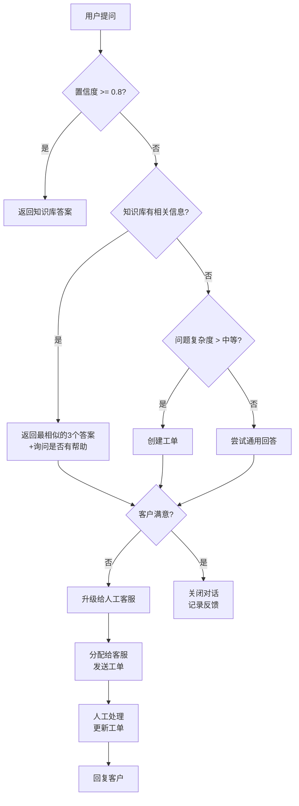

## 13.2 实战案例2：客户支持智能体（含知识库、工单系统集成）

本节详细介绍如何构建一个生产级的客户支持智能体，完整展示知识库查询、工单流转、多语言支持、以及与现有客服系统无缝集成的完整闭环。

### 13.2.1 需求分析与系统约束

#### 业务背景

某B2B SaaS公司（如数据分析平台）日均接收500+ 客户支持请求，分布在邮件、在线chat、Zendesk等多个渠道。现有客服团队6人，处理成本高、响应时间长（平均4小时）。目标是部署一个支持智能体，自动处理70%的常见问题，将一线响应时间降至5分钟内。

#### 核心需求与难点

| 需求 | 难点 | 解决方案 |
|-----|-----|--------|
| **FAQ自动回复** | 如何准确匹配问题与答案 | 向量化知识库 + 相似度检索 |
| **上下文连贯** | 多轮对话中丢失前置信息 | 会话记忆与智能摘要 |
| **自动升级工单** | 何时升级、升级给谁 | 置信度阈值 + 路由规则 |
| **多语言支持** | 如何支持中英日韩等 | 语言检测 + 翻译 + 多语言知识库 |
| **审计与合规** | 所有对话必须可追溯 | 完整日志 + 加密存储 |

### 13.2.2 整体架构设计

#### 系统架构图



#### 工单流转决策树



### 13.2.3 完整配置与代码实现

#### 配置文件结构

文件路径：`~/.openclaw/customer-support.json`

```json
{
  "gateway": {
    "port": 18789,
    "auth": {
      "requirePairing": true,
      "requireMTLS": true,
      "certPath": "/etc/openclaw/tls/cert.pem",
      "keyPath": "/etc/openclaw/tls/key.pem"
    }
  },

  "agents": {
    "customer-support": {
      "name": "客户支持智能体",
      "description": "处理客户咨询，自动解答常见问题，智能升级工单",
      "model": "claude-opus-4-6",
      "tools": [
        "knowledge_base_search",
        "zendesk_ticket_manager",
        "customer_profile_lookup",
        "solution_feedback",
        "language_detector"
      ],
      "systemPrompt": "你是一个专业的客户支持代理。你的职责是：\n1. 理解客户的问题\n2. 在知识库中检索相关解决方案\n3. 提供清晰、准确的答案\n4. 如果无法解决，创建工单并升级给人工\n\n关键原则：\n- 如果不确定答案，宁可升级也不要误导\n- 始终保持礼貌和同情心\n- 优先尝试自助解决，减少人工干预\n- 记录客户反馈用于持续改进知识库",
      "memory": {
        "strategy": "session_with_summary",
        "maxTokens": 6000,
        "compactAfterTurns": 15,
        "summaryPrompt": "总结客户的主要问题和已尝试的解决方案"
      },
      "constraints": {
        "maxConcurrentRequests": 20,
        "requestTimeoutMs": 30000,
        "rateLimit": {
          "perUser": "50/day",
          "perGlobal": "10000/day"
        }
      },
      "escalation": {
        "triggers": [
          {
            "type": "confidence_low",
            "threshold": 0.5,
            "action": "ask_for_confirmation"
          },
          {
            "type": "confidence_very_low",
            "threshold": 0.3,
            "action": "escalate_to_human"
          },
          {
            "type": "sentiment_negative",
            "threshold": -0.7,
            "action": "escalate_to_manager"
          },
          {
            "type": "request_human",
            "keywords": ["人工", "客服", "经理"],
            "action": "escalate_to_human"
          }
        ]
      }
    }
  },

  "profiles": {
    "customer": {
      "clearanceLevel": 1,
      "allowedTools": [
        "knowledge_base_search",
        "zendesk_ticket_manager:read",
        "zendesk_ticket_manager:create",
        "customer_profile_lookup:self",
        "solution_feedback"
      ],
      "deniedTools": [
        "zendesk_ticket_manager:delete",
        "zendesk_ticket_manager:admin_reassign"
      ]
    },
    "support_agent": {
      "clearanceLevel": 3,
      "allowedTools": [
        "zendesk_ticket_manager",
        "customer_profile_lookup",
        "knowledge_base_search"
      ]
    }
  },

  "tools": {
    "knowledge_base_search": {
      "enabled": true,
      "type": "vector_db",
      "provider": "qdrant",
      "endpoint": "http://qdrant:6333",
      "indexName": "customer_kb",
      "searchTopK": 5,
      "minScore": 0.5,
      "cache": {
        "enabled": true,
        "ttl": 86400,
        "keyPrefix": "kb_search:"
      },
      "policy": {
        "minClearance": 1,
        "timeout": 5000
      }
    },

    "zendesk_ticket_manager": {
      "enabled": true,
      "type": "zendesk",
      "subdomain": "${ZENDESK_SUBDOMAIN}",
      "email": "${ZENDESK_EMAIL}",
      "apiToken": "${ZENDESK_API_TOKEN}",
      "timeout": 10000,
      "policy": {
        "minClearance": 1,
        "allowedActions": ["read", "create", "comment"],
        "deniedActions": ["delete", "reassign"],
        "requireConfirmation": ["create", "escalate"]
      },
      "fieldMapping": {
        "customerEmail": "requester.email",
        "customerName": "requester.name",
        "ticketStatus": "status",
        "priority": "priority",
        "category": "custom_fields.category"
      },
      "autoTagging": {
        "enabled": true,
        "extractTags": true,
        "maxTags": 5
      }
    },

    "customer_profile_lookup": {
      "enabled": true,
      "type": "internal_api",
      "endpoint": "https://crm-api.company.com/customers",
      "auth": {
        "type": "api_key",
        "keyHeader": "Authorization",
        "keyValue": "${CRM_API_KEY}"
      },
      "timeout": 5000,
      "cache": {
        "enabled": true,
        "ttl": 3600
      },
      "policy": {
        "minClearance": 1,
        "allowedFields": [
          "email",
          "name",
          "company",
          "subscription_tier",
          "account_status"
        ],
        "deniedFields": ["payment_method", "ssn", "internal_notes"]
      }
    },

    "solution_feedback": {
      "enabled": true,
      "type": "custom",
      "endpoint": "http://feedback-service:8080",
      "timeout": 3000,
      "policy": {
        "minClearance": 1
      }
    },

    "language_detector": {
      "enabled": true,
      "type": "langdetect",
      "defaultLanguage": "en",
      "supportedLanguages": ["en", "zh", "ja", "ko", "de", "fr", "es"]
    }
  },

  "channels": {
    "email": {
      "enabled": true,
      "type": "email_webhook",
      "provider": "zendesk",
      "webhookPath": "/webhook/zendesk/email",
      "retryStrategy": "exponential_backoff",
      "maxRetries": 3,
      "policy": {
        "autoReply": true,
        "acknowledgeWithinMinutes": 5
      }
    },

    "zendesk_chat": {
      "enabled": true,
      "type": "zendesk_chat",
      "botName": "Support Bot",
      "webhookPath": "/webhook/zendesk/chat",
      "policy": {
        "maxResponseTime": 10000,
        "typingIndicator": true
      }
    },

    "webhook": {
      "enabled": true,
      "type": "generic_webhook",
      "webhookPath": "/webhook/support",
      "requireSignature": true,
      "signatureHeader": "X-Webhook-Signature",
      "signatureSecret": "${WEBHOOK_SIGNATURE_SECRET}"
    }
  },

  "hooks": {
    "onMessageReceived": {
      "enabled": true,
      "script": "hooks/support_message_received.js"
    },
    "beforeToolExecution": {
      "enabled": true,
      "script": "hooks/support_before_tool.js"
    },
    "afterToolExecution": {
      "enabled": true,
      "script": "hooks/support_after_tool.js"
    },
    "onEscalation": {
      "enabled": true,
      "script": "hooks/support_on_escalation.js"
    }
  },

  "security": {
    "enableAudit": true,
    "auditLog": "/var/log/openclaw/support_audit.log",
    "piiDetection": {
      "enabled": true,
      "maskPII": true,
      "patterns": {
        "email": "\\b[A-Za-z0-9._%+-]+@[A-Za-z0-9.-]+\\.[A-Z|a-z]{2,}\\b",
        "phone": "\\b\\d{3}[-.]?\\d{3}[-.]?\\d{4}\\b",
        "creditCard": "\\b\\d{4}[\\s-]?\\d{4}[\\s-]?\\d{4}[\\s-]?\\d{4}\\b"
      }
    },
    "encryption": {
      "enabled": true,
      "algorithm": "AES-256-GCM",
      "keyRotationDays": 90
    }
  }
}
```

#### 关键Hook实现

文件路径：`hooks/support_message_received.js`

```javascript
/**
 * 客户支持消息处理Hook
 * 职责：消息预处理、语言检测、优先级判断、敏感信息遮蔽
 */

const LanguageDetector = require('language-detect');
const SentimentAnalyzer = require('sentiment');

module.exports = {
  name: 'support_message_received',
  version: '1.0.0',

  async execute(context) {
    const { message, channel, sender, logger } = context;

    logger.info('[Support] Message received', {
      messageId: message.id,
      channel,
      sender: sender.email || sender.id,
      length: message.text.length
    });

    try {
      // 1. 语言检测
      const detector = new LanguageDetector();
      const language = detector.detect(message.text)[0] || 'en';

      logger.debug('[Support] Language detected', { language });

      // 2. 情感分析
      const sentiment = new SentimentAnalyzer().analyze(message.text);
      const sentimentScore = sentiment.comparative;

      logger.debug('[Support] Sentiment analyzed', {
        score: sentimentScore,
        words: sentiment.positive.concat(sentiment.negative)
      });

      // 3. 敏感信息检测与遮蔽
      const sensitiveInfo = await detectSensitiveInfo(message.text);
      let maskedText = message.text;
      for (const info of sensitiveInfo) {
        maskedText = maskedText.replace(info.value, info.mask);
        logger.warn('[Support] Sensitive info detected and masked', {
          type: info.type,
          mask: info.mask
        });
      }

      // 4. 优先级判断
      let priority = 'normal';
      if (sentimentScore < -0.5) {
        priority = 'high'; // 负面情绪客户优先处理
      }
      if (hasUrgentKeywords(message.text)) {
        priority = 'urgent';
      }

      // 5. 意图预分类
      const intent = await classifyIntent(message.text);

      logger.info('[Support] Message analysis complete', {
        language,
        sentimentScore,
        priority,
        intent,
        hasUserData: sensitiveInfo.length > 0
      });

      // 6. 检查客户档案
      let customerProfile = null;
      if (sender.email) {
        try {
          customerProfile = await context.getCustomerProfile(sender.email);
        } catch (e) {
          logger.warn('[Support] Failed to load customer profile', {
            email: sender.email,
            error: e.message
          });
        }
      }

      return {
        allow: true,
        metadata: {
          language,
          sentimentScore,
          priority,
          intent,
          maskedText,
          customerProfile,
          originalText: message.text, // 保留原文用于后续需要
          processingTime: Date.now()
        }
      };
    } catch (error) {
      logger.error('[Support] Error in message processing', {
        error: error.message,
        stack: error.stack
      });

      return {
        allow: true, // 即使出错也允许继续，防止服务中断
        metadata: {
          language: 'en',
          priority: 'normal',
          intent: 'unknown',
          processingError: error.message
        }
      };
    }
  }
};

async function detectSensitiveInfo(text) {
  const patterns = {
    email: {
      pattern: /\b[A-Za-z0-9._%+-]+@[A-Za-z0-9.-]+\.[A-Z|a-z]{2,}\b/g,
      mask: '[EMAIL]'
    },
    phone: {
      pattern: /\b\d{3}[-.]?\d{3}[-.]?\d{4}\b/g,
      mask: '[PHONE]'
    },
    creditCard: {
      pattern: /\b\d{4}[\s-]?\d{4}[\s-]?\d{4}[\s-]?\d{4}\b/g,
      mask: '[CARD]'
    }
  };

  const sensitiveInfo = [];
  for (const [type, config] of Object.entries(patterns)) {
    const matches = text.matchAll(config.pattern);
    for (const match of matches) {
      sensitiveInfo.push({
        type,
        value: match[0],
        mask: config.mask,
        index: match.index
      });
    }
  }

  return sensitiveInfo;
}

function hasUrgentKeywords(text) {
  const urgentKeywords = [
    'urgent', 'emergency', 'critical', 'down', 'outage',
    'broken', 'error', '紧急', '故障', '宕机', '崩溃'
  ];
  return urgentKeywords.some(kw =>
    text.toLowerCase().includes(kw.toLowerCase())
  );
}

async function classifyIntent(text) {
  // 简单的关键词匹配意图分类
  // 实际可以使用更复杂的NLU模型
  const intents = {
    'billing': ['price', 'cost', 'invoice', '账单', '费用'],
    'technical': ['error', 'bug', 'crash', '错误', '报错'],
    'feature': ['how to', 'how do i', '怎么', '如何'],
    'account': ['password', 'login', '登录', '账户'],
    'general': []
  };

  for (const [intent, keywords] of Object.entries(intents)) {
    if (keywords.some(kw =>
      text.toLowerCase().includes(kw.toLowerCase())
    )) {
      return intent;
    }
  }

  return 'general';
}
```

文件路径：`hooks/support_on_escalation.js`

```javascript
/**
 * 升级处理Hook
 * 职责：确定升级目标、创建工单、发送通知、记录升级原因
 */

module.exports = {
  name: 'support_on_escalation',
  version: '1.0.0',

  async execute(context) {
    const {
      message,
      escalationReason,
      metadata,
      logger,
      tools
    } = context;

    logger.warn('[Support] Message escalation triggered', {
      reason: escalationReason,
      sentiment: metadata.sentimentScore,
      intent: metadata.intent
    });

    try {
      // 1. 确定升级目标
      const assignee = await determineAssignee(metadata);

      logger.info('[Support] Assignee determined', {
        name: assignee.name,
        email: assignee.email,
        tier: assignee.tier
      });

      // 2. 创建Zendesk工单
      const ticketData = {
        subject: buildTicketSubject(message, metadata),
        description: buildTicketDescription(message, metadata),
        requester_email: message.sender?.email || 'unknown@customer.com',
        assignee_id: assignee.zendeskId,
        priority: priorityMap[metadata.priority],
        type: 'incident',
        custom_fields: {
          sentiment: metadata.sentimentScore,
          intent: metadata.intent,
          language: metadata.language,
          escalation_reason: escalationReason,
          conversation_summary: await summarizeConversation(context)
        },
        tags: await extractTags(message, metadata)
      };

      const ticket = await tools.zendesk_ticket_manager.create(ticketData);

      logger.info('[Support] Ticket created', {
        ticketId: ticket.id,
        ticketUrl: ticket.html_url,
        assignee: assignee.name
      });

      // 3. 发送确认消息给客户
      const confirmationMessage = buildConfirmationMessage(
        ticket,
        metadata.language
      );

      // 4. 通知人工客服
      await notifyAssignee(assignee, ticket, message);

      // 5. 记录升级事件
      await logEscalationEvent({
        ticketId: ticket.id,
        customerId: message.sender?.id,
        reason: escalationReason,
        confidence: metadata.confidence,
        assignedTo: assignee.name,
        timestamp: Date.now(),
        conversationId: context.conversationId
      });

      return {
        success: true,
        ticketId: ticket.id,
        assignee: assignee.name,
        confirmationMessage,
        nextSteps: [
          `工单已创建：#${ticket.id}`,
          `已分配给客服：${assignee.name}`,
          `预计响应时间：${assignee.sla} 分钟`
        ]
      };
    } catch (error) {
      logger.error('[Support] Escalation failed', {
        error: error.message,
        stack: error.stack
      });

      // 降级处理：至少发送email告知管理员
      await sendEmergencyAlert({
        error: error.message,
        metadata,
        originalMessage: message.text
      });

      return {
        success: false,
        error: '升级处理失败，已通知管理员',
        fallbackAction: 'email_alert_sent'
      };
    }
  }
};

async function determineAssignee(metadata) {
  // 基于意图、优先级、客户等级路由至合适的客服
  const routingRules = {
    'billing': { group: 'billing_team' },
    'technical': { group: 'tech_support', requiresExpert: true },
    'feature': { group: 'product_team' },
    'account': { group: 'account_support' }
  };

  const rule = routingRules[metadata.intent] || routingRules['general'];

  // 查询可用的客服（伪代码）
  const availableAgents = await queryAvailableAgents({
    group: rule.group,
    maxLoad: 5
  });

  if (availableAgents.length === 0) {
    // 所有客服都忙，分配给经理
    return await getEscalationManager();
  }

  // 选择当前负荷最低的客服
  return availableAgents.reduce((prev, curr) =>
    prev.currentLoad <= curr.currentLoad ? prev : curr
  );
}

function buildTicketSubject(message, metadata) {
  const intentLabel = {
    'billing': '[账单] ',
    'technical': '[技术] ',
    'feature': '[功能] ',
    'account': '[账户] '
  };

  let subject = `${intentLabel[metadata.intent] || ''}客户问题`;

  // 从消息的第一句提取主题
  const firstSentence = message.text.split('。')[0].split('？')[0];
  if (firstSentence.length < 100) {
    subject = firstSentence;
  }

  return subject;
}

function buildTicketDescription(message, metadata) {
  return `
**自动化对话摘要**

客户消息：
${message.text}

语言：${metadata.language}
意图分类：${metadata.intent}
情感分析：${metadata.sentimentScore.toFixed(2)}
升级原因：${message.escalationReason}

**客户信息**
邮箱：${message.sender?.email}
公司：${metadata.customerProfile?.company}
订阅等级：${metadata.customerProfile?.tier}

**对话历史**
[对话历史将自动附加]
`;
}

function buildConfirmationMessage(ticket, language) {
  const templates = {
    'en': `Thank you for contacting us. We've created a ticket #${ticket.id} for your issue. Our support team will get back to you within 24 hours. You can track your ticket at: ${ticket.html_url}`,
    'zh': `感谢您的反馈。我们已为您创建工单 #${ticket.id}。客服团队将在24小时内回复您。您可以通过以下链接跟踪工单状态：${ticket.html_url}`,
    'ja': `お問い合わせありがとうございます。チケット #${ticket.id} を作成いたしました。サポートチームが24時間以内に対応いたします。チケットはこちらで確認できます：${ticket.html_url}`
  };

  return templates[language] || templates['en'];
}

async function notifyAssignee(assignee, ticket, originalMessage) {
  // 发送Slack/企业微信通知给客服
  const notification = {
    type: 'ticket_assigned',
    ticketId: ticket.id,
    assignedTo: assignee.email,
    priority: ticket.priority,
    preview: originalMessage.text.substring(0, 200),
    actionUrl: ticket.html_url,
    timestamp: Date.now()
  };

  // 实际实现会调用Slack/企业微信API
  console.log('Notification to assignee:', notification);
}

async function logEscalationEvent(event) {
  const fs = require('fs').promises;
  await fs.appendFile(
    '/var/log/openclaw/escalations.log',
    JSON.stringify(event) + '\n'
  );
}

async function sendEmergencyAlert(details) {
  // 在紧急情况下发送管理员告警
  const alert = {
    level: 'error',
    component: 'support_escalation',
    timestamp: Date.now(),
    details
  };

  console.error('Emergency Alert:', alert);
  // 实际会调用告警系统（Pagerduty, Opsgenie等）
}

async function queryAvailableAgents(criteria) {
  // 从客服管理系统查询可用的人力资源
  // 这是一个伪实现
  return [
    {
      id: 'agent1',
      name: 'Alice',
      email: 'alice@support.com',
      group: criteria.group,
      currentLoad: 3,
      maxCapacity: 8
    },
    {
      id: 'agent2',
      name: 'Bob',
      email: 'bob@support.com',
      group: criteria.group,
      currentLoad: 5,
      maxCapacity: 8
    }
  ];
}

async function getEscalationManager() {
  return {
    id: 'manager1',
    name: 'Support Manager',
    email: 'manager@support.com',
    tier: 'manager',
    zendeskId: 1001,
    sla: 30
  };
}

async function summarizeConversation(context) {
  // 使用 LLM 总结对话历史
  return "用户询问关于账单问题...";
}

async function extractTags(message, metadata) {
  const tags = [];

  // 基于意图添加标签
  tags.push(`intent_${metadata.intent}`);

  // 基于优先级添加标签
  tags.push(`priority_${metadata.priority}`);

  // 基于语言添加标签
  tags.push(`lang_${metadata.language}`);

  // 基于情感添加标签
  if (metadata.sentimentScore < -0.5) {
    tags.push('negative_sentiment');
  }

  return tags.slice(0, 5); // 最多5个标签
}

const priorityMap = {
  'urgent': 'urgent',
  'high': 'high',
  'normal': 'normal',
  'low': 'low'
};
```

### 13.2.4 知识库构建与维护

#### 向量化知识库结构

```python

# kb_indexer.py
# 知识库向量化与索引构建脚本

import json
import os
from qdrant_client import QdrantClient
from sentence_transformers import SentenceTransformer
from typing import List, Dict

class KnowledgeBaseIndexer:
    def __init__(self, qdrant_url: str = "http://localhost:6333"):
        self.client = QdrantClient(url=qdrant_url)
        self.encoder = SentenceTransformer('sentence-transformers/all-MiniLM-L6-v2')
        self.collection_name = "customer_kb"

    def create_collection(self):
        """创建向量索引集合"""
        from qdrant_client.http import models

        self.client.recreate_collection(
            collection_name=self.collection_name,
            vectors_config=models.VectorParams(
                size=384,
                distance=models.Distance.COSINE
            )
        )
        print(f"✓ Collection '{self.collection_name}' created")

    def load_kb_from_file(self, kb_file: str) -> List[Dict]:
        """从JSON文件加载知识库"""
        with open(kb_file, 'r', encoding='utf-8') as f:
            kb = json.load(f)

        articles = []
        for category, items in kb.items():
            for item in items:
                article = {
                    'title': item['title'],
                    'content': item['content'],
                    'category': category,
                    'language': item.get('language', 'en'),
                    'lastUpdated': item.get('lastUpdated', ''),
                    'tags': item.get('tags', []),
                    'priority': item.get('priority', 'normal')
                }
                articles.append(article)

        return articles

    def index_articles(self, articles: List[Dict]):
        """将文章向量化并索引"""
        from qdrant_client.http import models
        import uuid

        points = []
        for i, article in enumerate(articles):
            # 将标题和内容合并后编码
            text = f"{article['title']}\n{article['content']}"
            vector = self.encoder.encode(text).tolist()

            point = models.PointStruct(
                id=i,
                vector=vector,
                payload={
                    'title': article['title'],
                    'content': article['content'],
                    'category': article['category'],
                    'language': article['language'],
                    'tags': article['tags'],
                    'priority': article['priority'],
                    'lastUpdated': article['lastUpdated']
                }
            )
            points.append(point)

        # 批量插入
        batch_size = 100
        for i in range(0, len(points), batch_size):
            batch = points[i:i + batch_size]
            self.client.upsert(
                collection_name=self.collection_name,
                points=batch
            )

        print(f"✓ {len(articles)} articles indexed")

    def search(self, query: str, limit: int = 5, language: str = None) -> List[Dict]:
        """搜索知识库"""
        query_vector = self.encoder.encode(query).tolist()

        # 构建过滤条件（如果指定了语言）
        query_filter = None
        if language:
            from qdrant_client.http import models
            query_filter = models.HasIdCondition(
                has_id=[
                    # 这里简化处理，实际需要更复杂的过滤
                ]
            )

        results = self.client.search(
            collection_name=self.collection_name,
            query_vector=query_vector,
            limit=limit,
            query_filter=query_filter
        )

        articles = []
        for result in results:
            articles.append({
                'score': result.score,
                **result.payload
            })

        return articles

    def update_article(self, article_id: int, updated_content: Dict):
        """更新知识库文章"""
        from qdrant_client.http import models

        point = self.client.retrieve(
            collection_name=self.collection_name,
            ids=[article_id]
        )[0]

        # 重新编码更新后的内容
        text = f"{updated_content['title']}\n{updated_content['content']}"
        vector = self.encoder.encode(text).tolist()

        updated_payload = {**point.payload, **updated_content}
        new_point = models.PointStruct(
            id=article_id,
            vector=vector,
            payload=updated_payload
        )

        self.client.upsert(
            collection_name=self.collection_name,
            points=[new_point]
        )

        print(f"✓ Article {article_id} updated")

# 使用示例
if __name__ == '__main__':
    indexer = KnowledgeBaseIndexer()
    indexer.create_collection()

    # 加载知识库
    articles = indexer.load_kb_from_file('data/customer_kb.json')
    indexer.index_articles(articles)

    # 搜索示例
    results = indexer.search("How do I reset my password?", limit=3)
    for result in results:
        print(f"- {result['title']} (score: {result['score']:.2f})")
```

#### 知识库JSON结构

文件路径：`data/customer_kb.json`

```json
{
  "account": [
    {
      "title": "How to reset my password",
      "content": "To reset your password:\n1. Click 'Forgot Password' on the login page\n2. Enter your email address\n3. Check your email for the reset link\n4. Click the link and create a new password\n5. Use your new password to log in",
      "language": "en",
      "tags": ["password", "account", "login"],
      "priority": "high",
      "lastUpdated": "2024-01-15"
    },
    {
      "title": "忘记密码",
      "content": "重置密码步骤：\n1. 点击登录页面的\"忘记密码\"\n2. 输入您的邮箱地址\n3. 查看邮箱中的重置链接\n4. 点击链接并创建新密码\n5. 使用新密码登录",
      "language": "zh",
      "tags": ["密码", "账户", "登录"],
      "priority": "high",
      "lastUpdated": "2024-01-15"
    }
  ],
  "billing": [
    {
      "title": "How to update billing information",
      "content": "To update your billing information:\n1. Go to Settings > Billing\n2. Click 'Edit Payment Method'\n3. Enter your new card details\n4. Click 'Save'\n5. A confirmation email will be sent",
      "language": "en",
      "tags": ["billing", "payment", "card"],
      "priority": "normal",
      "lastUpdated": "2024-01-10"
    }
  ],
  "technical": [
    {
      "title": "What to do when encountering API errors",
      "content": "Common API error solutions:\n- 401 Unauthorized: Check your API key\n- 429 Too Many Requests: Implement rate limiting (max 100 req/min)\n- 500 Internal Server Error: Our team is investigating, contact support",
      "language": "en",
      "tags": ["api", "error", "troubleshooting"],
      "priority": "high",
      "lastUpdated": "2024-01-12"
    }
  ]
}
```

### 13.2.5 性能测试与优化

#### 压力测试脚本

```bash
#!/bin/bash

# tests/load_test.sh

set -e

GATEWAY_URL="http://localhost:18789"
CONCURRENT_USERS=50
DURATION=300
RESULTS_FILE="load_test_results.json"

echo "=== OpenClaw 客户支持智能体压力测试 ==="
echo "并发用户数: $CONCURRENT_USERS"
echo "测试时长: ${DURATION}s"
echo ""

# 生成测试消息
generate_test_message() {
  local user_id=$1
  local message_templates=(
    "How do I reset my password?"
    "我需要修改账单信息"
    "API返回401错误"
    "Can you help with billing?"
  )

  local random_idx=$((RANDOM % ${#message_templates[@]}))
  local message="${message_templates[$random_idx]}"

  echo "{
    \"sender\": {
      \"id\": \"user_${user_id}\",
      \"email\": \"user${user_id}@example.com\"
    },
    \"channel\": \"email\",
    \"text\": \"$message\"
  }"
}

# 使用ab工具进行压力测试
echo "[1/2] 使用Apache Bench进行HTTP压力测试..."

ab -n 5000 \
  -c $CONCURRENT_USERS \
  -H "Content-Type: application/json" \
  -p <(generate_test_message 1) \
  "$GATEWAY_URL/webhook/support" | tee -a load_test_results.txt

# 使用wrk工具进行更复杂的压力测试
echo "[2/2] 使用Wrk进行持续压力测试..."

cat > /tmp/wrk_script.lua << 'EOF'
request = function()
  wrk.method = "POST"
  wrk.headers["Content-Type"] = "application/json"
  wrk.body = '{"sender":{"id":"user1","email":"test@example.com"},"channel":"email","text":"How to reset password?"}'
  return wrk.format(nil)
end

response = function(status, headers, body)
  if status == 200 then
    io.write("✓")
  else
    io.write("✗")
  end
end
EOF

wrk -t 8 -c $CONCURRENT_USERS -d ${DURATION}s \
  -s /tmp/wrk_script.lua \
  "$GATEWAY_URL/webhook/support" | tee -a load_test_results.txt

echo ""
echo "✓ 压力测试完成"
echo "结果已保存至: load_test_results.txt"
```

### 13.2.6 部署与监控

通过之前章节中提到的Kubernetes配置扩展，部署客户支持智能体的关键补充：

```yaml

# 增加自定义指标
apiVersion: v1
kind: ConfigMap
metadata:
  name: openclaw-prometheus-config
  namespace: ai-platform

data:
  prometheus.yml: |
    global:
      scrape_interval: 15s
    scrape_configs:
    - job_name: 'openclaw-support'
      static_configs:
      - targets: ['openclaw-work-assistant:9090']
      metric_relabel_configs:
      - source_labels: [__name__]
        regex: 'support_.*'
        action: keep
```

### 13.2.7 常见问题与最佳实践

**Q：如何保证敏感信息安全？**

A：采用多层防护：
1. 消息接收时自动遮蔽PII
2. 工单中使用加密字段存储敏感信息
3. 审计日志仅记录脱敏信息
4. 定期自动清理过期对话记录

**Q：升级决策如何避免漏升或过度升级？**

A：使用多因素融合的置信度计算：

```javascript
const escalationScore = (
  (1 - knowledgeBaseConfidence) * 0.4 +
  abs(sentimentScore) * 0.3 +
  topicComplexity * 0.2 +
  customerTierImportance * 0.1
);

const shouldEscalate = escalationScore > threshold || hasUrgentKeyword;
```

**Q：如何处理多语言客户的跟进？**

A：保存客户最后一次交互的语言，后续都使用该语言回复；同时在知识库中维护多语言版本。

客户支持智能体通过知识库、工单系统、权限控制、多语言支持的深度集成，展示了OpenClaw在实际企业场景中的完整应用能力。
