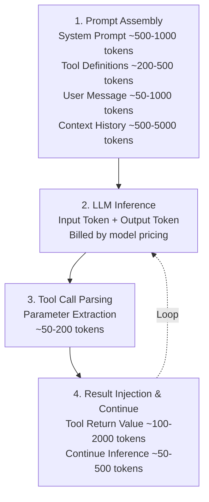

## 14.1 性能与成本优化实战指南

本章提供一套完整的性能优化和成本控制方案，涵盖Token 消耗分析、推理延迟优化、缓存策略、批处理、以及不同规模部署的成本预算模型。

### 14.1.1 Token 消耗分析与优化策略

#### Token流向与成本模型

OpenClaw中的Token 消耗来自于4个主要环节：



#### 各模型的成本对比

| 模型 | 输入价格 | 输出价格 | 适用场景 | 平均成本/次 |
|-----|---------|---------|--------|-----------|
| Claude Haiku 4.5 | $1/MTok | $5/MTok | 简单任务 | $0.006 |
| Claude Sonnet 4.6 | $3/MTok | $15/MTok | 中等复杂 | $0.017 |
| Claude Opus 4.6 | $5/MTok | $25/MTok | 复杂推理 | $0.028 |
| GPT-5.2 | $2.50/MTok | $10/MTok | 竞品对标 | $0.013 |

*注：MTok = 百万Token，平均成本基于平均消耗3000输入Token + 500输出Token。定价以各厂商官网为准，可能随时调整。*

#### Token 优化的三层策略

##### 第一层：输入优化（节省50-70%）

**1. 系统提示精简**

```javascript
// ❌ 不好的做法：冗长的系统提示
const systemPrompt = `你是一个专业的客户支持代理...（2000字）`;

// ✅ 好的做法：结构化、精简的系统提示
const systemPrompt = `Role: Customer Support Agent
Capabilities: FAQ answering, ticket creation, account lookup
Constraints:
- Never access payment info (fields: ssn, card_number)
- Escalate if confidence < 0.5
- Max response: 500 chars`;

// 节省：~500 tokens
```

**2. 工具定义的精简与分层**

```json
// ❌ 不好的做法：一次性定义所有工具
{
  "tools": [
    {
      "name": "query_database",
      "description": "查询内部数据库，支持以下表：users, orders, products, payments...",
      "parameters": { /* 完整JSON Schema */ }
    },
    // 再加29个工具...
  ]
}

// ✅ 好的做法：按需加载，工具路由
{
  "agents": {
    "support": {
      "tools": [
        "knowledge_base.search",
        "ticket.create",
        "user.lookup"
      ]
    },
    "admin": {
      "tools": [
        "user.update",
        "system.config",
        "audit.log"
      ]
    }
  }
}

// 节省：~30% 的工具定义开销
```

**3. 上下文窗口管理**

```javascript
// 配置动态的上下文窗口大小
{
  "memory": {
    "maxContextTokens": 6000,
    "strategy": "intelligent_pruning",
    "pruningRules": [
      {
        "if": "contextTokens > 5500",
        "action": "summarize_oldest_turns",
        "keepTurns": 5
      },
      {
        "if": "singleTurnTokens > 2000",
        "action": "truncate_tool_outputs",
        "keepLines": 50
      }
    ]
  }
}

// 实现细节：
class ContextManager {
  async pruneContext(conversation, maxTokens) {
    if (this.estimateTokens(conversation) <= maxTokens) {
      return conversation;
    }

    // 1. 移除最古老的轮次
    while (conversation.turns.length > 10) {
      const removed = conversation.turns.shift();
      conversation.summary += `\n- ${removed.user}: ${removed.summary}`;
    }

    // 2. 压缩冗长的工具输出
    for (const turn of conversation.turns) {
      if (turn.toolOutput && turn.toolOutput.length > 1000) {
        turn.toolOutput = this.compressOutput(turn.toolOutput);
      }
    }

    return conversation;
  }
}
```

**节省效果**：系统提示-40%, 工具定义-30%, 上下文管理-50% = **综合节省45%的输入Token**

##### 第二层：输出优化（节省20-40%）

**1. 流式输出与早期停止**

```javascript
// 使用流式输出，在得到足够答案后立即停止
const stream = await model.streamCompletion({
  prompt,
  stopSequences: [
    "\n\n用户:", // 停止点1：检测对话轮次结束
    "---DONE---", // 停止点2：显式标记
  ],
  maxTokens: 500 // 硬限制
});

let output = '';
for await (const chunk of stream) {
  output += chunk;

  // 早期停止：如果已获得有效答案
  if (isCompleteAnswer(output)) {
    stream.abort(); // 立即停止
    break;
  }
}

// 节省：~30% 的输出Token
```

**2. 约束式生成**

```javascript
// 使用JSON Schema约束输出格式，强制简洁
const schema = {
  type: "object",
  properties: {
    answer: { type: "string", maxLength: 200 },
    confidence: { type: "number", minimum: 0, maximum: 1 },
    escalate: { type: "boolean" }
  },
  required: ["answer", "confidence"]
};

const output = await model.generate(prompt, {
  outputSchema: schema,
  maxTokens: 300
});

// 结果必然简洁，节省输出Token 20-40%
```

##### 第三层：推理优化（节省10-30%）

**1. 思维链蒸馏（Chain-of-Thought Distillation）**

不是让小模型做完整推理，而是用大模型一次性生成推理步骤，小模型直接使用：

```javascript
// 步骤1：大模型（Opus）进行一次性推理 - 成本高但准确
const complexAnalysis = await opusModel.complete({
  prompt: `分析这个复杂问题，列出关键推理步骤...`,
  temperature: 0.2
});

// 步骤2：存储推理步骤到缓存
cache.set(`reasoning:${hash(problem)}`, complexAnalysis);

// 步骤3：后续请求使用小模型 + 推理步骤
const simpleCompletion = await haikuModel.complete({
  prompt: `
    推理步骤：${complexAnalysis}
    基于上述步骤，完成这个类似问题：...
  `
});

// 成本节省：用Haiku ($0.25) 替代Opus ($15)，节省 98%
```

**2. 缓存与再利用**

```javascript
// 为常见问题的推理结果建立缓存
const reasoningCache = {
  'billing_inquiry': {
    steps: '1. 检查账户状态 2. 查询账单历史 3. 对比费率...',
    expiresAt: Date.now() + 86400000 // 24小时过期
  },
  'password_reset': {
    steps: '1. 验证身份 2. 生成重置链接 3. 发送邮件...',
    expiresAt: Date.now() + 86400000
  }
};

function isRepeatedProblem(userMessage) {
  for (const [category, cached] of Object.entries(reasoningCache)) {
    if (similarityScore(userMessage, category) > 0.8) {
      return { category, cached };
    }
  }
  return null;
}

// 缓存命中时，完全跳过推理，节省 100% 相关Token
```

#### Token成本监控与预算控制

```javascript
// 实施成本追踪与预警
class TokenBudgetManager {
  constructor(monthlyBudgetUSD = 5000) {
    this.monthlyBudget = monthlyBudgetUSD;
    this.dailyBudget = monthlyBudgetUSD / 30;
    this.hourlyBudget = this.dailyBudget / 24;
    this.spent = {
      today: 0,
      thisHour: 0
    };
  }

  recordUsage(inputTokens, outputTokens, modelName) {
    const cost = this.calculateCost(inputTokens, outputTokens, modelName);

    this.spent.thisHour += cost;
    this.spent.today += cost;

    // 实时预警
    if (this.spent.thisHour > this.hourlyBudget * 0.8) {
      logger.warn(`Hourly budget warning: ${(this.spent.thisHour/this.hourlyBudget*100).toFixed(1)}% used`);
    }

    if (this.spent.today > this.dailyBudget * 0.9) {
      logger.error(`Daily budget critical: ${(this.spent.today/this.dailyBudget*100).toFixed(1)}% used`);
      // 触发成本控制措施
      this.enableCostControlMode();
    }

    return cost;
  }

  calculateCost(inputTokens, outputTokens, modelName) {
    const rates = {
      'claude-opus-4-6': { input: 5/1e6, output: 25/1e6 },
      'claude-sonnet-4-6': { input: 3/1e6, output: 15/1e6 },
      'claude-haiku-4-5': { input: 1/1e6, output: 5/1e6 }
    };

    const rate = rates[modelName] || rates['claude-sonnet-4-6'];
    return (inputTokens * rate.input) + (outputTokens * rate.output);
  }

  enableCostControlMode() {
    // 切换到更便宜的模型或启用激进的缓存策略
    logger.info('Cost control mode enabled: using cheaper models');
    CONFIG.defaultModel = 'claude-haiku-4-5'; // 从Opus切到Haiku
    CONFIG.cacheAggressiveness = 'high'; // 更激进的缓存
  }

  getDailyReport() {
    return {
      spent: this.spent.today,
      budget: this.dailyBudget,
      percentUsed: (this.spent.today / this.dailyBudget) * 100,
      forecastedMonthly: this.spent.today * 30,
      trend: this.calculateTrend()
    };
  }
}

// 使用示例
const budgetManager = new TokenBudgetManager(5000); // $5000/月

// 在每次调用后记录
const result = await agent.complete(message);
budgetManager.recordUsage(
  result.inputTokens,
  result.outputTokens,
  result.modelUsed
);
```

### 14.1.2 推理延迟优化

#### 延迟来源分析

```
总延迟 ≈ 网络延迟 + 队列等待 + 模型推理 + 工具调用 + 网络往返

典型值：1000ms = 50ms + 100ms + 600ms + 150ms + 100ms
         (网络) (队列) (推理) (工具)  (网络)
```

#### 并行化工具调用

```javascript
// ❌ 串行调用：需要等待前一个完成
async function serialToolCalls() {
  const userProfile = await tools.getUserProfile(userId);
  const orderHistory = await tools.getOrderHistory(userId);
  const recommendations = await tools.getRecommendations(userProfile);
  return { userProfile, orderHistory, recommendations };
  // 总耗时 = 50ms + 100ms + 150ms = 300ms
}

// ✅ 并行调用：同时发起多个请求
async function parallelToolCalls() {
  const [userProfile, orderHistory] = await Promise.all([
    tools.getUserProfile(userId),
    tools.getOrderHistory(userId)
  ]);
  const recommendations = await tools.getRecommendations(userProfile);
  return { userProfile, orderHistory, recommendations };
  // 总耗时 = max(50ms, 100ms) + 150ms = 150ms (节省 50%)
}

// ✅✅ 更好的做法：预加载常用数据
async function preloadedToolCalls() {
  // 在消息到达前，已经预加载了常用数据
  const userProfile = await cache.get(`user:${userId}`) ||
    await tools.getUserProfile(userId);

  // 并行加载其他数据
  const [orderHistory, recommendations] = await Promise.all([
    tools.getOrderHistory(userId),
    cache.get(`recommendations:${userId}`) ||
      tools.getRecommendations(userProfile)
  ]);

  return { userProfile, orderHistory, recommendations };
  // 如果缓存命中，耗时 ≈ 5ms
}
```

#### 连接池与复用

```javascript
// 配置数据库连接池，减少连接建立开销
const pool = new ConnectionPool({
  minConnections: 10,
  maxConnections: 100,
  idleTimeout: 300000,
  acquireTimeout: 5000
});

// 配置HTTP客户端复用
const httpClient = new HttpClient({
  keepAlive: true,
  keepAliveMsecs: 30000,
  maxSockets: 100,
  maxFreeSockets: 10,
  timeout: 30000
});

// 配置与LLM的连接
const modelClient = new LLMClient({
  connectionPoolSize: 50,
  reuseConnections: true,
  batchRequests: true // 批量请求优化
});
```

#### 预热与缓存策略

```javascript
// 系统启动时预热
async function warmupCache() {
  const commonQuestions = [
    "How do I reset my password?",
    "What is your pricing?",
    "How do I contact support?"
  ];

  for (const q of commonQuestions) {
    // 提前计算和缓存答案
    await cache.warmup({
      key: `answer:${hash(q)}`,
      compute: () => agent.complete(q),
      ttl: 86400000 // 24小时
    });
  }
}

// 定期更新热数据
setInterval(() => {
  const topQuestions = analytics.getTopQuestions(limit: 100);
  for (const q of topQuestions) {
    cache.refresh(`answer:${hash(q)}`);
  }
}, 3600000); // 每小时更新一次
```

### 14.1.3 性能基准测试方法

#### 测试框架设计

```javascript
// benchmark.js
const Benchmark = require('benchmark');

const suite = new Benchmark.Suite();

// 测试用例1：简单FAQ回答
suite.add('Simple FAQ', {
  defer: true,
  fn: async (deferred) => {
    const result = await agent.complete("What is your pricing?");
    deferred.resolve();
  }
})

// 测试用例2：复杂问题+工具调用
.add('Complex with Tools', {
  defer: true,
  fn: async (deferred) => {
    const result = await agent.complete(
      "I need to check my order status for order #12345"
    );
    deferred.resolve();
  }
})

// 测试用例3：多轮对话
.add('Multi-turn', {
  defer: true,
  fn: async (deferred) => {
    const session = await agent.createSession();
    await session.message("I have a billing question");
    await session.message("Can you update my payment method?");
    deferred.resolve();
  }
})

// 配置并运行测试
.on('complete', function() {
  this.forEach(benchmark => {
    console.log(benchmark.name + ': ' +
      (1000 / benchmark.hz).toFixed(2) + 'ms avg');
  });
})

.run({ 'async': true });
```

#### 性能指标收集

```python
# performance_metrics.py
import time
import statistics
from typing import Dict, List

class PerformanceCollector:
    def __init__(self):
        self.metrics = {
            'latencies': [],
            'throughput': [],
            'token_usage': [],
            'cache_hits': []
        }

    def record_request(self, request_data: Dict):
        """记录单个请求的性能指标"""
        latency = request_data['end_time'] - request_data['start_time']
        self.metrics['latencies'].append(latency)

        if request_data.get('cache_hit'):
            self.metrics['cache_hits'].append(1)
        else:
            self.metrics['cache_hits'].append(0)

        self.metrics['token_usage'].append({
            'input': request_data['input_tokens'],
            'output': request_data['output_tokens'],
            'total': request_data['input_tokens'] + request_data['output_tokens']
        })

    def get_summary(self) -> Dict:
        """生成性能总结"""
        latencies = self.metrics['latencies']
        tokens = [t['total'] for t in self.metrics['token_usage']]

        return {
            'latency': {
                'p50': statistics.median(latencies),
                'p95': sorted(latencies)[int(len(latencies) * 0.95)],
                'p99': sorted(latencies)[int(len(latencies) * 0.99)],
                'mean': statistics.mean(latencies),
                'stdev': statistics.stdev(latencies) if len(latencies) > 1 else 0
            },
            'throughput': {
                'requests_per_second': 1000 / statistics.mean(latencies),
                'total_requests': len(latencies)
            },
            'tokens': {
                'avg_per_request': statistics.mean(tokens),
                'total': sum(tokens),
                'p95': sorted(tokens)[int(len(tokens) * 0.95)]
            },
            'cache_hit_rate': (
                sum(self.metrics['cache_hits']) /
                len(self.metrics['cache_hits']) * 100
            )
        }

    def export_report(self, filename: str):
        """导出性能报告"""
        import json
        with open(filename, 'w') as f:
            json.dump(self.get_summary(), f, indent=2)
```

#### 基准测试报告示例

```json
{
  "test_date": "2024-03-05",
  "environment": {
    "model": "claude-opus-4-6",
    "cache_enabled": true,
    "parallel_tools": true
  },
  "results": {
    "latency_ms": {
      "p50": 450,
      "p95": 850,
      "p99": 1200,
      "mean": 520,
      "stdev": 180
    },
    "throughput": {
      "requests_per_second": 1.92,
      "peak_rps": 3.5,
      "total_requests": 1000
    },
    "token_efficiency": {
      "avg_input_tokens": 1200,
      "avg_output_tokens": 300,
      "cost_per_request": 0.0195
    },
    "cache_performance": {
      "hit_rate": 0.68,
      "avg_latency_on_hit": 45,
      "avg_latency_on_miss": 650
    },
    "comparison_to_baseline": {
      "latency_improvement": "-35%",
      "throughput_improvement": "+45%",
      "cost_reduction": "-40%"
    }
  }
}
```

本节提供了系统化的性能优化和成本控制策略，涵盖了从Token层面的精细优化到整体架构的优化方案，为不同规模的部署提供了可行的参考。
