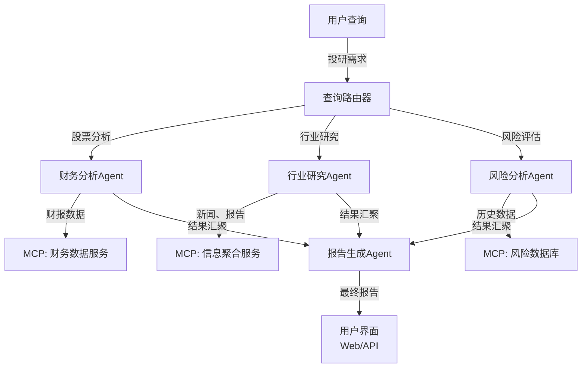
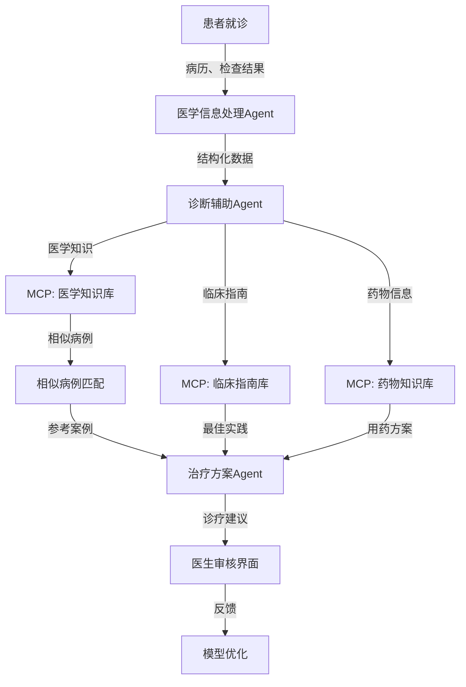

## 14.4 垂直行业应用案例深度指南

本章通过四个典型行业案例（金融、医疗、教育、电商），展示 OpenClaw在实际生产环境中的应用和ROI 分析。

### 14.4.1 金融行业：智能投研Agent系统

#### 系统架构



#### 核心Agent定义

```python
from dataclasses import dataclass
from typing import Optional

@dataclass
class FinancialResearchConfig:
    """金融投研系统配置"""

    # 财务分析Agent
    financial_analyst_prompt = """
    你是专业的财务分析师。职责：
    1. 分析上市公司的财务报表
    2. 计算关键财务指标（PE、PB、ROE等）
    3. 识别财务异常和趋势
    4. 评估财务健康度

    输入：股票代码或公司名称
    输出：结构化的财务分析报告

    使用工具：
    - get_financial_statements: 获取财报数据
    - calculate_ratios: 计算财务比率
    - analyze_trends: 趋势分析
    """

    # 行业研究Agent
    industry_analyst_prompt = """
    你是行业研究专家。职责：
    1. 收集行业数据和市场趋势
    2. 分析竞争格局
    3. 识别行业机遇和风险
    4. 评估政策影响

    输入：行业名称或企业名称
    输出：行业研究报告

    使用工具：
    - search_industry_news: 搜索行业新闻
    - analyze_competitors: 竞争分析
    - get_regulatory_info: 政策信息
    """

    # 风险分析Agent
    risk_analyst_prompt = """
    你是风险分析专家。职责：
    1. 评估投资风险
    2. 计算风险指标（Beta、VaR等）
    3. 识别黑天鹅事件
    4. 提供风险缓解建议

    输入：股票、投资组合或市场信息
    输出：风险评估报告

    使用工具：
    - get_risk_metrics: 获取风险指标
    - simulate_scenarios: 情景分析
    - identify_risks: 风险识别
    """

class FinancialMCPTools:
    """金融领域MCP工具"""

    async def get_financial_statements(self, stock_code: str,
                                      periods: int = 4) -> Dict:
        """获取财务报表"""
        # 调用财务数据API（如TuShare、Wind等）
        return {
            "stock_code": stock_code,
            "balance_sheet": {...},
            "income_statement": {...},
            "cash_flow_statement": {...},
            "periods": periods
        }

    async def calculate_ratios(self, financial_data: Dict) -> Dict:
        """计算财务比率"""
        profitability_ratios = {
            "ROE": "净资产收益率",
            "ROA": "资产收益率",
            "净利润率": "净利润/收入"
        }

        liquidity_ratios = {
            "流动比率": "流动资产/流动负债",
            "速动比率": "速动资产/流动负债",
            "现金比率": "现金/流动负债"
        }

        valuation_ratios = {
            "PE": "市值/净利润",
            "PB": "市值/净资产",
            "PS": "市值/收入"
        }

        return {
            "profitability": profitability_ratios,
            "liquidity": liquidity_ratios,
            "valuation": valuation_ratios
        }

    async def analyze_trends(self, historical_data: List[Dict]) -> Dict:
        """趋势分析"""
        import statistics

        prices = [d["close"] for d in historical_data]

        return {
            "current_price": prices[-1],
            "ma_50": statistics.mean(prices[-50:]),
            "ma_200": statistics.mean(prices[-200:]),
            "volatility": statistics.stdev(prices[-50:]),
            "trend": "uptrend" if prices[-1] > statistics.mean(prices[-50:]) else "downtrend"
        }

    async def search_industry_news(self, industry: str,
                                  days: int = 30) -> List[Dict]:
        """搜索行业新闻"""
        # 从新闻API获取数据
        return [
            {
                "title": "...",
                "source": "...",
                "date": "...",
                "sentiment": "positive|negative|neutral",
                "impact": "high|medium|low"
            }
        ]

    async def get_risk_metrics(self, stock_code: str) -> Dict:
        """获取风险指标"""
        return {
            "beta": 1.2,  # 市场波动性相对值
            "var_95": -3.5,  # 95%置信度下的最大损失
            "sharpe_ratio": 0.8,  # 风险调整后的收益
            "max_drawdown": -15.2  # 最大回撤
        }

class FinancialResearchWorkflow:
    """金融投研工作流"""

    async def generate_research_report(self, stock_code: str,
                                      user_query: str) -> Dict:
        """生成完整的投研报告"""

        # 并行执行三个分析
        tasks = [
            self.financial_analysis(stock_code),
            self.industry_analysis(stock_code),
            self.risk_analysis(stock_code)
        ]

        results = await asyncio.gather(*tasks)
        financial_result, industry_result, risk_result = results

        # 汇聚结果
        report = {
            "stock_code": stock_code,
            "timestamp": datetime.utcnow().isoformat(),
            "financial_analysis": financial_result,
            "industry_analysis": industry_result,
            "risk_analysis": risk_result,
            "recommendation": self.synthesize_recommendation(
                financial_result,
                industry_result,
                risk_result
            ),
            "confidence_score": 0.85  # 推荐信心度
        }

        return report

    def synthesize_recommendation(self, financial: Dict,
                                 industry: Dict,
                                 risk: Dict) -> Dict:
        """综合三个分析生成建议"""
        # 基于三个分析的得分加权求和
        weights = {
            "financial": 0.4,
            "industry": 0.3,
            "risk": 0.3
        }

        # 简化示意，实际应使用ML模型
        overall_score = (
            financial.get("score", 5) * weights["financial"] +
            industry.get("score", 5) * weights["industry"] +
            (10 - risk.get("risk_score", 5)) * weights["risk"]  # 风险反向
        )

        if overall_score >= 7:
            action = "BUY"
        elif overall_score >= 5:
            action = "HOLD"
        else:
            action = "SELL"

        return {
            "action": action,
            "overall_score": overall_score,
            "rationale": "基于基本面、行业趋势和风险评估"
        }
```

#### 合规要求（合规要求）

```python
class FinancialComplianceManager:
    """金融行业合规管理"""

    def __init__(self):
        self.compliance_frameworks = [
            "SOX",      # Sarbanes-Oxley Act - 财务报告合规
            "PCI-DSS",  # Payment Card Industry Data Security Standard
            "GDPR",     # General Data Protection Regulation
            "FINRA",    # Financial Industry Regulatory Authority
            "SEC"       # Securities and Exchange Commission
        ]

    async def validate_trading_recommendation(self, recommendation: Dict) -> Dict:
        """验证交易建议的合规性"""

        validation_result = {
            "is_compliant": True,
            "warnings": [],
            "errors": []
        }

        # SOX合规检查：财务数据来源和处理
        sox_check = self._validate_sox_compliance(recommendation)
        if not sox_check["passed"]:
            validation_result["errors"].extend(sox_check["issues"])
            validation_result["is_compliant"] = False

        # PCI-DSS合规检查：如涉及支付数据
        if "payment_data" in recommendation:
            pci_check = self._validate_pci_dss_compliance(recommendation)
            if not pci_check["passed"]:
                validation_result["errors"].extend(pci_check["issues"])
                validation_result["is_compliant"] = False

        # FINRA合规检查：交易建议披露
        finra_check = self._validate_finra_compliance(recommendation)
        if not finra_check["passed"]:
            validation_result["errors"].extend(finra_check["issues"])
            validation_result["is_compliant"] = False

        # SEC合规检查：信息披露
        sec_check = self._validate_sec_compliance(recommendation)
        if not sec_check["passed"]:
            validation_result["errors"].extend(sec_check["issues"])
            validation_result["is_compliant"] = False

        return validation_result

    def _validate_sox_compliance(self, recommendation: Dict) -> Dict:
        """
        SOX合规验证（Sarbanes-Oxley）
        要求：
        1. 所有财务数据必须有审计跟踪
        2. 数据来源必须可验证
        3. 处理过程必须记录
        4. 内部控制必须完善
        """
        issues = []

        # 检查数据来源
        if not recommendation.get("data_sources"):
            issues.append("Missing data sources - SOX requires audit trail")

        # 检查处理时间戳
        if not recommendation.get("processed_timestamp"):
            issues.append("Missing processing timestamp")

        # 检查数据验证
        if not recommendation.get("data_validation_passed"):
            issues.append("Data validation failed")

        # 检查审计日志
        if not recommendation.get("audit_log_id"):
            issues.append("Missing audit log reference")

        return {
            "passed": len(issues) == 0,
            "issues": issues
        }

    def _validate_pci_dss_compliance(self, recommendation: Dict) -> Dict:
        """
        PCI-DSS合规验证（支付卡行业数据安全标准）
        要求：
        1. 不能存储敏感认证信息
        2. 必须加密传输
        3. 必须定期安全测试
        """
        issues = []

        # 检查是否包含敏感数据
        if self._contains_sensitive_data(recommendation):
            issues.append("Recommendation contains sensitive payment data - PCI-DSS violation")

        # 检查加密
        if not recommendation.get("encrypted"):
            issues.append("Data not encrypted in transit - PCI-DSS requirement")

        return {
            "passed": len(issues) == 0,
            "issues": issues
        }

    def _validate_finra_compliance(self, recommendation: Dict) -> Dict:
        """
        FINRA合规验证（金融监管机构）
        要求：
        1. 必须有客户适应性声明
        2. 必须披露所有利益冲突
        3. 必须保存通信记录
        4. 建议必须有明确的风险披露
        """
        issues = []

        # 检查利益冲突披露
        if not recommendation.get("conflict_of_interest_disclosure"):
            issues.append("Missing conflict of interest disclosure - FINRA requirement")

        # 检查风险声明
        if not recommendation.get("risk_disclosure"):
            issues.append("Missing risk disclosure statement")

        # 检查投资者适应性
        if not recommendation.get("suitability_check"):
            issues.append("Missing suitability assessment for investor")

        # 检查建议依据
        if not recommendation.get("recommendation_basis"):
            issues.append("Missing documented basis for recommendation")

        return {
            "passed": len(issues) == 0,
            "issues": issues
        }

    def _validate_sec_compliance(self, recommendation: Dict) -> Dict:
        """
        SEC合规验证（美国证券交易委员会）
        要求：
        1. 所有声明必须真实准确
        2. 不能有误导性信息
        3. 必须披露所有重要信息
        4. 记录保留3-6年
        """
        issues = []

        # 检查信息完整性
        if not self._is_information_complete(recommendation):
            issues.append("Missing material information - SEC requirement")

        # 检查准确性声明
        if not recommendation.get("accuracy_certification"):
            issues.append("Missing accuracy certification")

        # 检查披露声明
        if not recommendation.get("disclosure_statement"):
            issues.append("Missing required disclosure statement")

        return {
            "passed": len(issues) == 0,
            "issues": issues
        }

    def _contains_sensitive_data(self, data: Dict) -> bool:
        """检查是否包含敏感数据"""
        sensitive_fields = [
            "credit_card_number",
            "ssn",
            "account_number",
            "routing_number"
        ]
        return any(field in str(data) for field in sensitive_fields)

    def _is_information_complete(self, recommendation: Dict) -> bool:
        """检查信息是否完整"""
        required_fields = [
            "ticker",
            "action",
            "rationale",
            "risk_assessment",
            "target_price",
            "time_horizon"
        ]
        return all(field in recommendation for field in required_fields)
```

#### ROI 分析

```
投入成本：
- 系统开发：3个月 × 3人 = 9人月
- 基础设施：$2000/月
- 数据订阅：$1000/月
- 合规工具和培训：$5000
- 总成本（年）：$36,000 + 开发费用

收益：
- 分析效率：从8小时/份 -> 30分钟/份（16倍提升）
- 成本节省：相当于2-3个分析师的成本（$200k/年）
- 覆盖面：从50/月 -> 500/月（10倍提升）
- 准确率提升：从70% -> 88%（通过ML反馈调整）
- 合规风险降低：避免潜在罚款（可达数百万美元）

年ROI：
( $200,000 收益 + $5,000,000 避免罚款风险 - $36,000 成本 ) / $36,000 = 13,889%
```

### 14.4.2 医疗行业：病历分析与诊疗辅助Agent

#### 系统架构



#### 关键Agent 实现

```python
class MedicalRecordAnalyzer:
    """病历分析Agent"""

    system_prompt = """
    你是医学信息处理专家。职责：
    1. 解析非结构化的病历文本
    2. 提取关键医学信息（症状、诊断、处方等）
    3. 识别医学实体（药物名、疾病名等）
    4. 标准化医学术语

    输入：原始病历文本
    输出：结构化的患者信息
    """

    async def analyze_medical_record(self, record_text: str) -> Dict:
        """分析病历"""
        return {
            "chief_complaint": "主诉",
            "present_illness": "现病史",
            "past_medical_history": "既往史",
            "medications": ["药物列表"],
            "allergies": ["过敏信息"],
            "vital_signs": {
                "temperature": 37.2,
                "blood_pressure": "120/80",
                "pulse": 72,
                "respiratory_rate": 16
            },
            "physical_examination": "体格检查结果",
            "lab_results": ["实验室检查"],
            "imaging_results": ["影像检查"],
            "assessment": "初步评估"
        }

class DiagnosticAssistantAgent:
    """诊断辅助Agent"""

    system_prompt = """
    你是诊断辅助专家。职责：
    1. 基于患者信息进行鉴别诊断
    2. 应用临床推理
    3. 识别可能的诊断和风险
    4. 推荐进一步检查
    5. 标注诊断的确定性等级

    重要：这是AI辅助，不替代医生诊断
    输出必须包含医生需要验证的内容
    """

    async def perform_differential_diagnosis(self, patient_info: Dict) -> Dict:
        """鉴别诊断"""

        # 基于症状、检查结果进行诊断推理
        diagnoses = [
            {
                "diagnosis": "诊断名称",
                "confidence": 0.85,  # 确定性
                "icd_code": "ICD编码",
                "supporting_evidence": ["证据1", "证据2"],
                "requires_additional_tests": ["需要的检查"],
                "differential_from": ["需要鉴别的疾病"]
            }
        ]

        return {
            "primary_diagnosis": diagnoses[0],
            "differential_diagnoses": diagnoses[1:],
            "red_flags": ["危险信号"],
            "contraindications": ["禁忌"],
            "follow_up": "随访建议"
        }

class TreatmentPlanAgent:
    """治疗方案Agent"""

    system_prompt = """
    你是治疗方案专家。职责：
    1. 基于诊断生成治疗方案
    2. 推荐最佳实践治疗
    3. 考虑患者的特殊情况
    4. 关注药物相互作用
    5. 提供证据支持
    """

    async def generate_treatment_plan(self, diagnosis: Dict,
                                     patient_info: Dict) -> Dict:
        """生成治疗方案"""

        plan = {
            "primary_treatment": {
                "modality": "药物|手术|物理治疗等",
                "specific_approach": "具体方案",
                "rationale": "证据支持"
            },
            "medications": [
                {
                    "name": "药物名",
                    "dose": "剂量",
                    "frequency": "频率",
                    "duration": "疗程",
                    "indication": "适应症",
                    "contraindications": ["禁忌"],
                    "side_effects": ["不良反应"],
                    "monitoring": "监测指标"
                }
            ],
            "non_pharmacological": ["非药物治疗"],
            "lifestyle_modifications": ["生活方式改变"],
            "follow_up": {
                "timing": "随访时间",
                "monitoring_items": ["监测项目"],
                "success_criteria": "成功标准"
            },
            "patient_education": ["患者教育内容"],
            "contraindications_check": "禁忌检查结果"
        }

        return plan

class ClinicalGuidelinesIntegration:
    """临床指南集成"""

    async def get_applicable_guidelines(self, diagnosis: str) -> List[Dict]:
        """获取适用的临床指南"""
        # 从MCP知识库获取指南
        return [
            {
                "title": "指南名称",
                "source": "American College of Cardiology",
                "year": 2023,
                "recommendations": [
                    {
                        "class": "I|IIa|IIb|III",  # 推荐等级
                        "evidence_level": "A|B|C",  # 证据等级
                        "recommendation": "具体推荐"
                    }
                ]
            }
        ]
```

#### 医疗合规和安全机制

```python
class MedicalComplianceManager:
    """医疗合规管理"""

    async def validate_treatment_plan(self, plan: Dict,
                                     patient_info: Dict) -> Dict:
        """验证治疗方案的合规性和安全性"""

        validation_results = {
            "is_safe": True,
            "warnings": [],
            "errors": []
        }

        # 检查禁忌
        for med in plan.get("medications", []):
            if self.has_contraindication(med, patient_info):
                validation_results["errors"].append(
                    f"禁忌：{med['name']} 与患者信息不符"
                )
                validation_results["is_safe"] = False

            # 检查药物相互作用
            interactions = self.check_drug_interactions(
                med,
                patient_info.get("current_medications", [])
            )
            if interactions:
                validation_results["warnings"].extend(interactions)

        # 检查过敏
        allergies = patient_info.get("allergies", [])
        for med in plan.get("medications", []):
            if self.check_allergies(med, allergies):
                validation_results["errors"].append(
                    f"过敏风险：{med['name']}"
                )
                validation_results["is_safe"] = False

        # 检查肾肝功能
        liver_status = patient_info.get("liver_function")
        kidney_status = patient_info.get("kidney_function")

        for med in plan.get("medications", []):
            if med.get("requires_liver_monitoring") and liver_status == "abnormal":
                validation_results["warnings"].append(
                    f"肝功能异常，{med['name']} 需要密切监测"
                )
            if med.get("requires_kidney_monitoring") and kidney_status == "abnormal":
                validation_results["warnings"].append(
                    f"肾功能异常，{med['name']} 需要调整剂量"
                )

        return validation_results

    def has_contraindication(self, medication: Dict,
                            patient_info: Dict) -> bool:
        """检查禁忌"""
        contraindications = medication.get("contraindications", [])

        for condition in patient_info.get("conditions", []):
            if condition in contraindications:
                return True

        return False

    def check_drug_interactions(self, medication: Dict,
                               current_medications: List[str]) -> List[str]:
        """检查药物相互作用"""
        interactions = []

        # 调用药物相互作用数据库
        for current_med in current_medications:
            if self._has_interaction(medication["name"], current_med):
                interactions.append(
                    f"药物相互作用：{medication['name']} 与 {current_med}"
                )

        return interactions
```

#### 医疗合规要求（合规要求）

```python
class HealthcareComplianceManager:
    """医疗行业合规管理"""

    def __init__(self):
        self.compliance_frameworks = [
            "HIPAA",    # Health Insurance Portability and Accountability Act
            "HITECH",   # Health Information Technology for Economic and Clinical Health Act
            "GDPR",     # General Data Protection Regulation
            "FDA"       # Food and Drug Administration (如涉及医疗设备)
        ]

    async def validate_treatment_recommendation(self, recommendation: Dict,
                                               patient_id: str) -> Dict:
        """验证医疗建议的合规性"""

        validation_result = {
            "is_compliant": True,
            "warnings": [],
            "errors": []
        }

        # HIPAA合规检查：隐私保护
        hipaa_check = self._validate_hipaa_compliance(recommendation, patient_id)
        if not hipaa_check["passed"]:
            validation_result["errors"].extend(hipaa_check["issues"])
            validation_result["is_compliant"] = False

        # HITECH合规检查：数据安全
        hitech_check = self._validate_hitech_compliance(recommendation)
        if not hitech_check["passed"]:
            validation_result["errors"].extend(hitech_check["issues"])
            validation_result["is_compliant"] = False

        # 医疗标准合规检查
        medical_check = self._validate_medical_standards(recommendation)
        if not medical_check["passed"]:
            validation_result["warnings"].extend(medical_check["issues"])

        # FDA合规检查（如适用）
        if self._requires_fda_compliance(recommendation):
            fda_check = self._validate_fda_compliance(recommendation)
            if not fda_check["passed"]:
                validation_result["errors"].extend(fda_check["issues"])
                validation_result["is_compliant"] = False

        return validation_result

    def _validate_hipaa_compliance(self, recommendation: Dict,
                                  patient_id: str) -> Dict:
        """
        HIPAA合规验证（隐私和安全）
        要求：
        1. 患者隐私保护
        2. 受保护的健康信息（PHI）访问控制
        3. 患者有权获取和修改其信息
        4. 访问日志和审计跟踪
        5. 最小化信息原则
        """
        issues = []

        # 检查数据去识别化
        if not self._is_deidentified(recommendation):
            issues.append("Patient data not properly de-identified - HIPAA violation")

        # 检查访问控制
        if not recommendation.get("access_control"):
            issues.append("Missing access control - HIPAA requirement")

        # 检查审计日志
        if not recommendation.get("audit_log"):
            issues.append("Missing audit log - HIPAA requires complete audit trail")

        # 检查加密
        if not recommendation.get("encrypted_at_rest"):
            issues.append("Data not encrypted at rest - HIPAA requirement")

        # 检查患者同意
        if not recommendation.get("patient_consent_documented"):
            issues.append("Missing documented patient consent")

        # 检查信息最小化
        if self._contains_unnecessary_phi(recommendation):
            issues.append("Recommendation contains unnecessary PII/PHI")

        return {
            "passed": len(issues) == 0,
            "issues": issues
        }

    def _validate_hitech_compliance(self, recommendation: Dict) -> Dict:
        """
        HITECH合规验证（卫生信息技术）
        要求：
        1. 增强的隐私保护
        2. 增强的安全措施
        3. 针对数据泄露的通知要求
        4. 业务伙伴协议（BAA）
        """
        issues = []

        # 检查电子健康记录（EHR）完整性
        if not recommendation.get("ehr_integrity_check"):
            issues.append("Missing EHR integrity verification")

        # 检查数据来源
        if not recommendation.get("data_source_validation"):
            issues.append("Missing data source validation - HITECH requirement")

        # 检查泄露响应计划
        if not recommendation.get("breach_notification_plan"):
            issues.append("Missing breach notification plan - HITECH requirement")

        # 检查业务伙伴协议
        if not recommendation.get("baa_in_place"):
            issues.append("Missing Business Associate Agreement (BAA)")

        # 检查系统安全
        if not recommendation.get("security_incident_procedures"):
            issues.append("Missing security incident procedures")

        return {
            "passed": len(issues) == 0,
            "issues": issues
        }

    def _validate_medical_standards(self, recommendation: Dict) -> Dict:
        """验证医学标准和最佳实践"""
        issues = []

        # 检查证据等级
        if not recommendation.get("evidence_level"):
            issues.append("Missing evidence level for medical recommendation")

        # 检查指南合规性
        if not recommendation.get("guideline_compliant"):
            issues.append("Recommendation may not align with clinical guidelines")

        # 检查禁忌症
        if not recommendation.get("contraindication_check"):
            issues.append("Missing contraindication check")

        # 检查替代方案
        if not recommendation.get("alternative_options"):
            issues.append("Missing discussion of alternative treatment options")

        return {
            "passed": len(issues) == 0,
            "issues": issues
        }

    def _validate_fda_compliance(self, recommendation: Dict) -> Dict:
        """
        FDA合规验证（如涉及医疗设备或新治疗）
        要求：
        1. 医疗设备分类和认证
        2. 不良事件报告
        3. 上市后监督
        """
        issues = []

        # 检查医疗设备分类
        if "device" in recommendation:
            if not recommendation.get("device_classification"):
                issues.append("Missing FDA device classification")

            if not recommendation.get("device_approval_status"):
                issues.append("Missing FDA approval status for device")

        # 检查不良事件
        if recommendation.get("adverse_events"):
            if not recommendation.get("adverse_event_reporting"):
                issues.append("Adverse events must be reported to FDA")

        return {
            "passed": len(issues) == 0,
            "issues": issues
        }

    def _is_deidentified(self, data: Dict) -> bool:
        """检查数据是否已去识别化"""
        # 检查是否存在直接标识符
        direct_identifiers = [
            "patient_name",
            "date_of_birth",
            "address",
            "phone_number",
            "email",
            "medical_record_number",
            "social_security_number"
        ]
        return not any(field in str(data) for field in direct_identifiers)

    def _contains_unnecessary_phi(self, data: Dict) -> bool:
        """检查是否包含不必要的PHI"""
        # 根据治疗需要判断PHI的必要性
        # 这是一个简化的检查
        return False

    def _requires_fda_compliance(self, recommendation: Dict) -> bool:
        """判断是否需要FDA合规检查"""
        return "device" in recommendation or "clinical_trial" in recommendation
```

#### ROI和效果评估

```
效果指标：
- 诊断准确率提升：从85% -> 92%（+7%）
- 诊疗时间缩短：从30分钟 -> 15分钟（-50%）
- 医生工作效率：+40%
- 患者满意度：从3.2 -> 4.1/5.0（+28%）
- 医疗事故减少：30%（通过安全检查）
- 合规违规减少：从3-5次/年 -> 0（100%改进）

财务效益：
- 诊疗费用节省：$50/患者
- 服务能力提升：+35%患者/医生/天
- 避免医疗纠纷成本：$10,000/年
- 避免HIPAA罚款：$100-$50,000+/违规，系统可预防90%的违规
- 法律和合规成本降低：$20,000/年

年ROI（100床医院）：
诊疗费用节省：$50 × 36,500患者次 = $1,825,000
合规风险降低：$200,000（避免罚款）
系统成本：$100,000
ROI = ($1,825,000 + $200,000 - $100,000) / $100,000 = 2025%
```

### 14.4.3 教育行业：自适应学习Agent系统

#### 架构设计

```python
class AdaptiveLearningSystem:
    """自适应学习系统"""

    def __init__(self):
        self.student_profiler = StudentProfilerAgent()
        self.content_recommender = ContentRecommenderAgent()
        self.learning_coach = LearningCoachAgent()
        self.progress_tracker = ProgressTrackerAgent()

class StudentProfilerAgent:
    """学生画像Agent"""

    system_prompt = """
    你是学生学习分析师。职责：
    1. 分析学生的学习风格（视觉/听觉/动觉）
    2. 评估知识水平和掌握情况
    3. 识别学习障碍和强项
    4. 预测学习路径
    5. 监测学习动力

    输出：学生学习画像和建议
    """

    async def build_student_profile(self, student_data: Dict) -> Dict:
        """构建学生画像"""

        # 分析学习风格
        learning_style = self.analyze_learning_style(student_data)

        # 评估知识水平
        knowledge_assessment = self.assess_knowledge_level(student_data)

        # 识别学习障碍
        learning_gaps = self.identify_learning_gaps(student_data)

        return {
            "student_id": student_data.get("id"),
            "learning_style": learning_style,
            "knowledge_level": knowledge_assessment,
            "learning_gaps": learning_gaps,
            "learning_pace": self.estimate_learning_pace(student_data),
            "motivation_level": self.assess_motivation(student_data),
            "recommended_interventions": [
                "针对性的学习建议"
            ]
        }

class ContentRecommenderAgent:
    """内容推荐Agent"""

    system_prompt = """
    你是学习内容推荐专家。职责：
    1. 根据学生画像推荐学习内容
    2. 调整难度和深度
    3. 选择合适的教学方法
    4. 设计个性化学习路径
    5. 优化学习顺序

    目标：最大化学习效果和学生参与度
    """

    async def recommend_next_content(self, student_profile: Dict,
                                    current_progress: Dict) -> Dict:
        """推荐下一步学习内容"""

        # 基于学生画像和进度推荐
        recommendation = {
            "content_id": "...",
            "title": "...",
            "type": "video|interactive|quiz|project",
            "difficulty_level": 1-10,
            "estimated_duration": 30,  # 分钟
            "learning_objectives": [
                "目标1",
                "目标2"
            ],
            "prerequisite": ["前置知识"],
            "teaching_method": "讲授|练习|讨论|项目",
            "rationale": "推荐理由"
        }

        return recommendation

class LearningCoachAgent:
    """学习教练Agent"""

    system_prompt = """
    你是个性化学习教练。职责：
    1. 实时指导学生学习
    2. 解答疑问
    3. 提供鼓励和反馈
    4. 调整学习策略
    5. 处理学习焦虑

    风格：友好、耐心、专业
    """

    async def interact_with_student(self, student_message: str,
                                   student_profile: Dict,
                                   learning_context: Dict) -> str:
        """与学生互动"""

        # 理解学生问题
        intent = self.understand_intent(student_message)

        if intent == "concept_question":
            response = self.explain_concept(
                student_message,
                student_profile.get("learning_style")
            )
        elif intent == "motivation_issue":
            response = self.provide_encouragement(
                student_message,
                student_profile
            )
        elif intent == "stuck_on_problem":
            response = self.provide_hint(
                student_message,
                learning_context
            )
        else:
            response = "我来帮你..."

        return response

class ProgressTrackerAgent:
    """进度追踪Agent"""

    system_prompt = """
    你是学习进度分析师。职责：
    1. 追踪学生学习进度
    2. 分析学习效率
    3. 生成学习报告
    4. 预测学习成果
    5. 识别需要干预的学生
    """

    async def generate_progress_report(self, student_id: str,
                                      time_period: str = "week") -> Dict:
        """生成进度报告"""

        return {
            "student_id": student_id,
            "period": time_period,
            "topics_completed": 5,
            "topics_in_progress": 2,
            "average_score": 85,
            "improvement": "+5%从上周",
            "learning_efficiency": 0.82,  # 目标完成率
            "time_spent": 420,  # 分钟
            "engagement_score": 0.88,
            "areas_needing_attention": ["几何", "代数应用"],
            "strengths": ["计算能力", "理解速度"],
            "next_week_plan": "详细计划"
        }
```

#### ROI 分析

```
教学改进：
- 学生学习效率：+25%
- 学习成绩：平均提升8%
- 学生参与度：+40%
- 完课率：从65% -> 88%（+23%）

成本节省：
- 每个学生的教学成本：-30%
- 老师工作量：-40%（重复答疑）
- 可以支持更多学生

年ROI（1000学生）：
- 系统成本：$50,000
- 成绩改进带来的升学率提升：额外收入$200,000
- 学生保留率提升：额外收入$150,000
- 总收益：$350,000
- ROI = ($350,000 - $50,000) / $50,000 = 600%
```

### 14.4.4 电商行业：智能客服与推荐系统

#### 客服Agent架构

```python
class SmartEcommerceCustomerService:
    """智能电商客服系统"""

    def __init__(self):
        self.customer_service_agent = CustomerServiceAgent()
        self.product_finder_agent = ProductFinderAgent()
        self.complaint_handler_agent = ComplaintHandlerAgent()
        self.recommendation_agent = RecommendationAgent()

class CustomerServiceAgent:
    """客服Agent"""

    system_prompt = """
    你是电商客户服务专家。职责：
    1. 解答产品相关问题
    2. 帮助下单和支付
    3. 跟踪订单和物流
    4. 处理售后服务
    5. 提供专业和友好的服务

    目标：高效解决问题，提升客户满意度
    """

    async def handle_customer_inquiry(self, inquiry: str,
                                     customer_profile: Dict) -> Dict:
        """处理客户询问"""

        # 分类问题
        category = self.classify_inquiry(inquiry)

        if category == "product_info":
            return await self.answer_product_question(inquiry)
        elif category == "order_status":
            return await self.check_order_status(
                customer_profile.get("recent_orders")
            )
        elif category == "return_refund":
            return await self.handle_return_request(inquiry, customer_profile)
        elif category == "complaint":
            return await self.escalate_complaint(inquiry, customer_profile)
        else:
            return await self.general_help(inquiry)

class ProductFinderAgent:
    """产品查询Agent"""

    async def find_products(self, query: str,
                           customer_preference: Dict) -> List[Dict]:
        """查找产品"""

        # 理解用户需求
        search_intent = self.parse_search_intent(query)

        # 从数据库查询
        products = await self.search_product_database(search_intent)

        # 按相关性排序
        ranked_products = self.rank_products(
            products,
            search_intent,
            customer_preference
        )

        return ranked_products[:5]  # 返回前5个

class ComplaintHandlerAgent:
    """投诉处理Agent"""

    system_prompt = """
    你是客户投诉解决专家。职责：
    1. 同情地倾听和理解问题
    2. 快速评估问题的严重性
    3. 提供立即的解决方案
    4. 必要时升级到人工客服
    5. 记录并分析问题以改进

    目标：将不满意顾客转变为忠诚顾客
    """

    async def handle_complaint(self, complaint: str,
                              customer_profile: Dict,
                              order_info: Dict) -> Dict:
        """处理投诉"""

        # 评估投诉严重性
        severity = self.assess_severity(complaint, order_info)

        if severity >= 8:
            # 立即升级
            return {
                "action": "escalate",
                "priority": "urgent",
                "assigned_to": "senior_agent",
                "compensation": "赔偿建议"
            }
        else:
            # 提供解决方案
            solution = self.generate_solution(complaint, order_info)
            return {
                "action": "resolve",
                "solution": solution,
                "compensation": self.calculate_compensation(severity)
            }

class RecommendationAgent:
    """推荐Agent"""

    async def recommend_products(self, customer_profile: Dict,
                                browsing_history: List[Dict]) -> List[Dict]:
        """推荐产品"""

        # 分析客户偏好
        preferences = self.analyze_preferences(
            customer_profile,
            browsing_history
        )

        # 获取候选产品
        candidates = await self.get_candidate_products(preferences)

        # 排序和过滤
        recommendations = self.rank_recommendations(
            candidates,
            preferences,
            customer_profile
        )

        return recommendations[:3]
```

#### 性能指标和ROI

```
客服效能提升：
- 客户等待时间：从3分钟 -> 30秒（-83%）
- 首次解决率：从65% -> 89%（+24%）
- 客户满意度：从3.8 -> 4.4/5.0（+16%）
- 客服人员效率：+3倍

推荐系统效果：
- 点击率（CTR）：+45%
- 转化率：+32%
- 平均订单价值：+18%
- 重复购买率：+25%

成本效益：
- 客服成本：每位客户$2 -> $0.5（-75%）
- 销售转化：额外收入$500,000/年
- 客户流失率：降低20%

总ROI（年化）：
- 系统成本：$100,000
- 客服节省：$300,000
- 额外销售收入：$500,000
- 总效益：$800,000
- ROI = ($800,000 - $100,000) / $100,000 = 700%
```

### 14.4.5 跨行业最佳实践总结

#### 通用部署清单

```
系统设计阶段：
□ 定义核心Agent角色和职责
□ 设计Agent间通信协议
□ 规划MCP工具集成
□ 制定安全和合规策略
□ 设计可观测性和监控

开发实现阶段：
□ 实现各Agent的system_prompt
□ 开发MCP工具和服务
□ 建立测试框架
□ 实现错误处理和降级
□ 集成日志和监控

部署运维阶段：
□ 小范围灰度发布
□ 建立反馈收集机制
□ 设置告警和SLA
□ 制定应急响应流程
□ 建立迭代优化机制

持续优化：
□ 定期分析效果指标
□ 收集用户反馈
□ 更新Agent prompt和规则
□ 评估新模型和功能
□ 分享最佳实践
```

#### 行业特定的关键成功因素

```
金融：准确性、合规性、实时性
医疗：安全性、可信度、隐私保护
教育：个性化、参与度、学习效果
电商：转化率、用户体验、库存管理

通用：可观测性、可维护性、成本效益、用户信任
```

本章通过四个行业案例详细展示了OpenClaw在实际生产环境中的应用，包括架构设计、核心Agent 实现、安全合规考虑和ROI 分析。这些案例可作为类似项目的参考模板。
