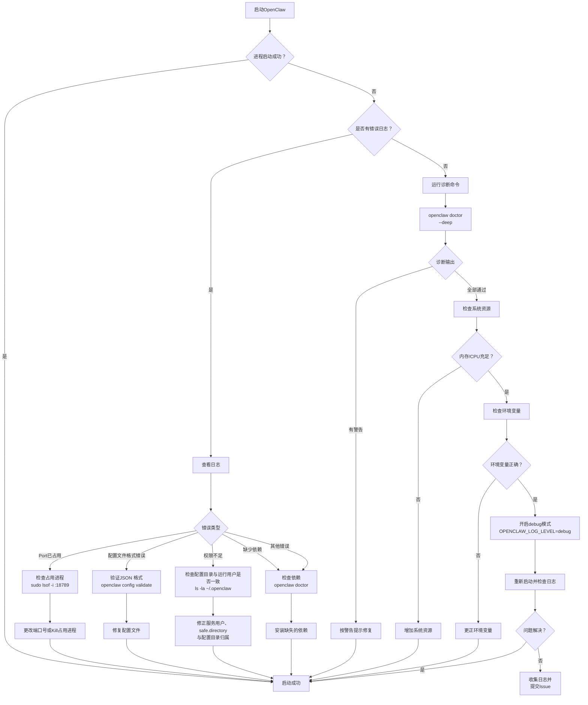
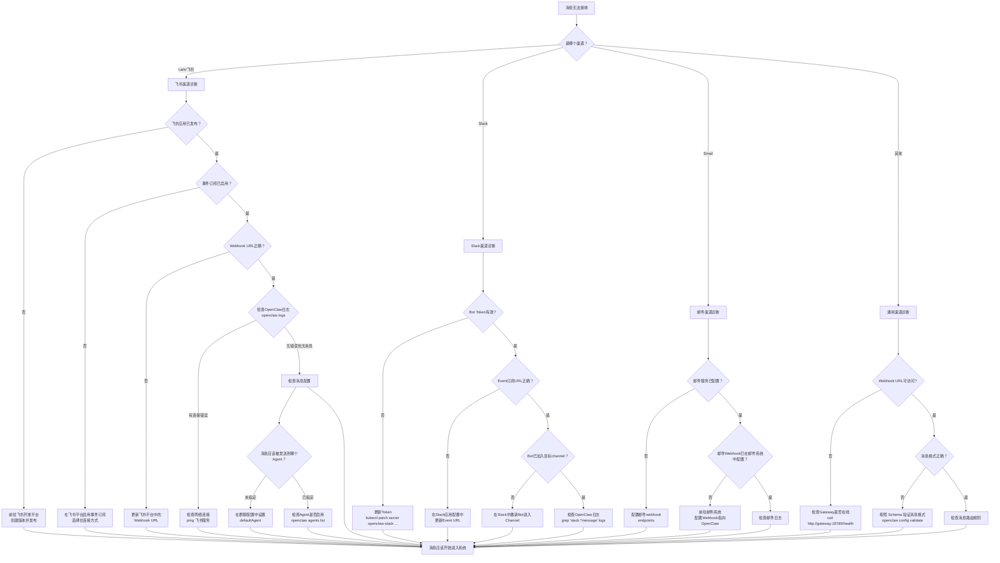
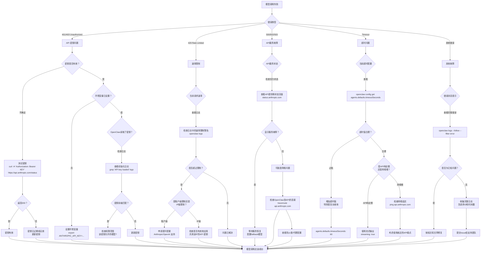
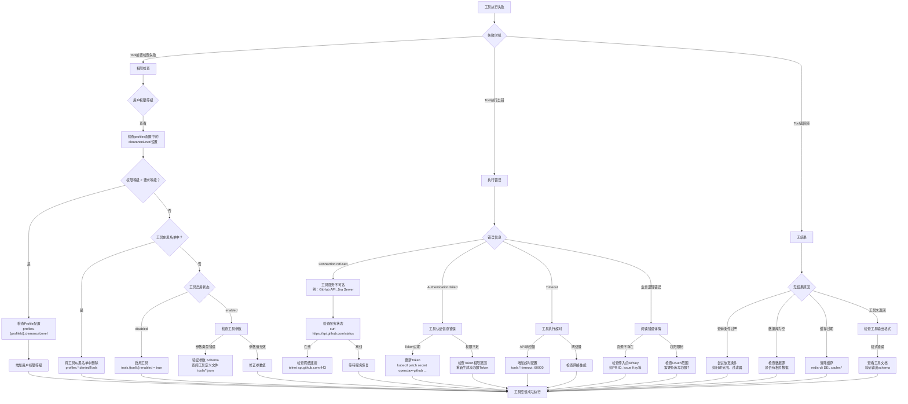
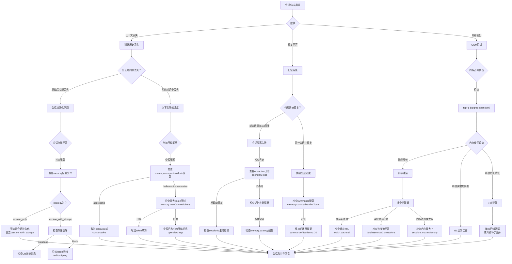
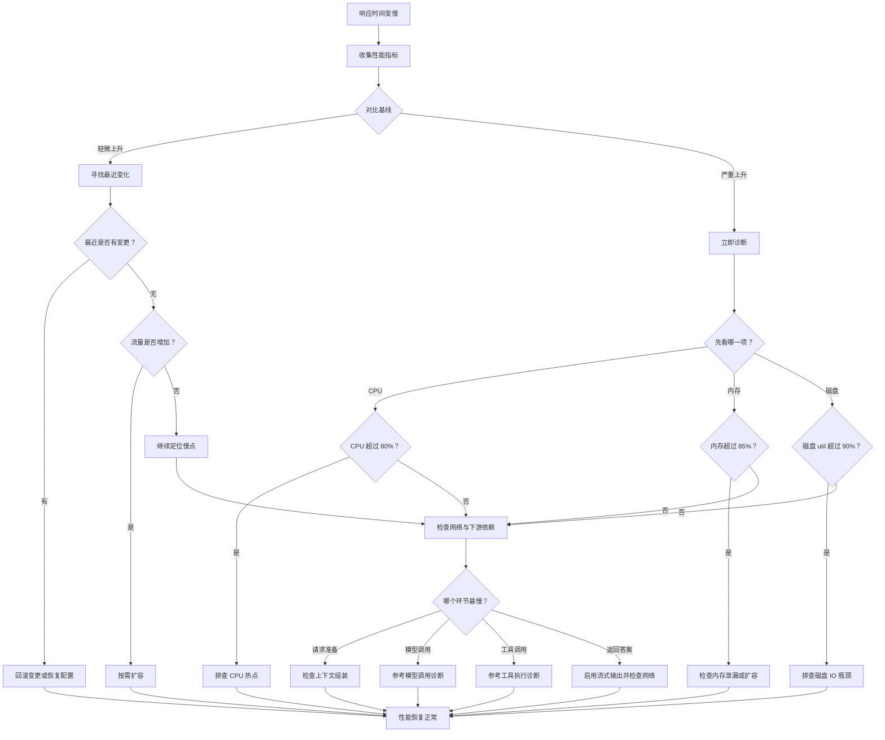

## 15.1 常见故障的分层诊断

本章以Mermaid决策树的形式展现OpenClaw常见故障的排查流程，帮助工程师快速定位和解决问题。

### 15.1.1 启动失败诊断流程

以下流程帮助诊断 OpenClaw 启动阶段遇到的各种故障。



### 15.1.2 消息无法接收诊断流程

当 OpenClaw 无法从各渠道接收消息时，按照此流程进行诊断。



### 15.1.3 模型调用异常诊断流程

当与 LLM API 的通信出现异常时，使用此诊断流程快速定位问题。



### 15.1.4 工具执行失败诊断流程

当工具执行出错时，按照此流程诊断是权限问题、执行错误还是无结果返回。



### 15.1.5 会话与内存异常诊断流程

当遇到上下文丢失、重复回答或内存溢出时，使用此诊断流程定位根因。



### 15.1.6 性能退化诊断流程



> [!NOTE]
> 当前版本排查 Control UI 连接异常时，还应优先留意日志中的 `CONTROL_UI_ORIGIN_NOT_ALLOWED` 与 `CONTROL_UI_DEVICE_IDENTITY_REQUIRED`。这类错误通常说明问题在控制面来源校验或设备身份签名链，而不是简单的“端口不通”。

### 15.1.7 快速诊断命令参考

```bash
# 完整系统诊断
openclaw doctor
openclaw doctor --deep

# 实时日志跟踪
openclaw logs
openclaw logs --follow

# 配置验证与查看
openclaw config
openclaw configure

# 服务状态检查
openclaw status
openclaw gateway status

# 健康检查
openclaw health

# 获取帮助信息
openclaw --help
openclaw --version
```

**注意**：
- 更多诊断命令和完整命令列表参见**附录 E - 命令速查表**（参考 `/appendix/command_cheatsheet.md`）
- 对于特定组件的深入诊断（如数据库、网络、API密钥验证），请参考上述各个诊断决策树流程

这套决策树和基础诊断命令可以帮助工程师快速定位和解决OpenClaw运行中的常见问题，同时提供了逐步深入的诊断方法。
