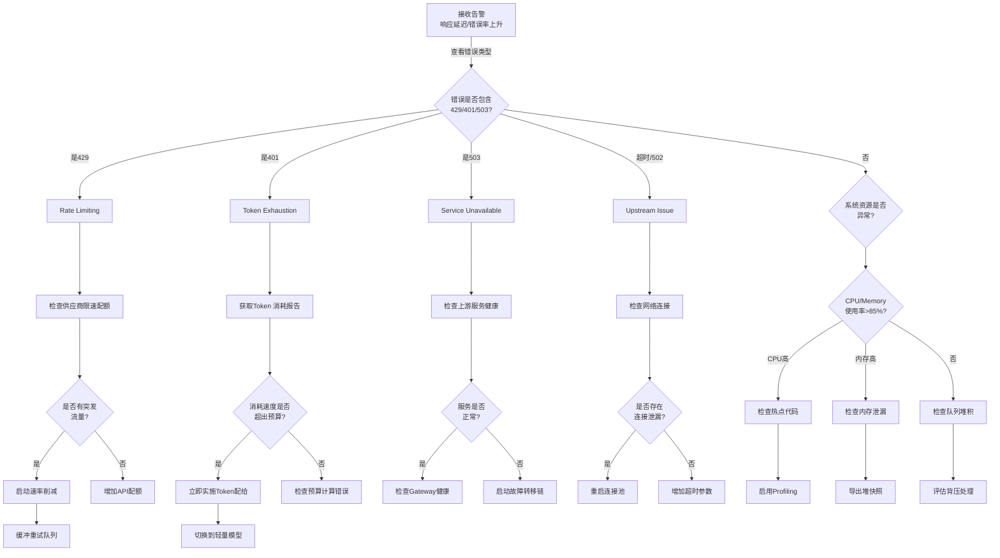

## 15.2 高并发故障诊断决策树与优化指南

在生产环境中，OpenClaw系统在高并发负载下可能面临多种故障模式。本章提供完整的诊断决策树和解决方案，帮助工程师快速定位和解决问题。

### 15.2.1 高并发场景中的常见故障类型

#### 故障分类矩阵

| 故障类型 | 症状表现 | 根本原因 | 平均诊断时间 |
|---------|---------|---------|------------|
| Rate Limiting | 429 响应 | API 限速 | < 5 分钟 |
| Token Exhaustion | 401 / 超额费用 | Token 预算不足 | 10-15 分钟 |
| Queue Overflow | 超时 / 丢弃 | 消费速度慢 | 15-30 分钟 |
| Memory Leak | OOM 错误 | 内存未释放 | 30-60 分钟 |
| Connection Pool | 连接超时 | 连接泄漏 | 20-40 分钟 |
| Cascading Failure | 全系统故障 | 无故障转移 | 5-10 分钟 |
| Thundering Herd | 突发高峰 | 并发 spike | 5-15 分钟 |
| Tail Latency | P99 响应时间高 | 不均匀分布 | 30-45 分钟 |

### 15.2.2 诊断决策树

#### 主诊断树



### 15.2.3 Rate Limiting策略与恢复

#### Rate Limiting诊断与应对

```python
import asyncio
import time
from collections import defaultdict
from typing import Optional, Dict, Tuple
from dataclasses import dataclass
from datetime import datetime, timedelta
import logging

logger = logging.getLogger(__name__)

@dataclass
class RateLimitInfo:
    """限速信息"""
    limit: int                    # 限额（请求数/分钟）
    remaining: int                # 剩余配额
    reset_at: datetime           # 重置时间
    current_window: str          # 当前时间窗口

class AdaptiveRateLimiter:
    """自适应限速器"""

    def __init__(self, initial_rps: float = 10):
        self.initial_rps = initial_rps
        self.current_rps = initial_rps
        self.min_rps = 1
        self.max_rps = 100

        self.request_history: Dict[str, list] = defaultdict(list)
        self.error_history: Dict[str, list] = defaultdict(list)

        self.backoff_factor = 1.5  # 递增缩减因子
        self.recovery_rate = 1.1   # 恢复增速

    async def acquire(self, agent_id: str, timeout: float = 5.0) -> bool:
        """获取请求令牌"""
        deadline = time.time() + timeout
        interval = 1.0 / self.current_rps

        while time.time() < deadline:
            last_request = self._get_last_request_time(agent_id)
            time_since_last = time.time() - last_request

            if time_since_last >= interval:
                # 记录请求
                self.request_history[agent_id].append(time.time())
                self._cleanup_old_requests(agent_id)
                return True

            # 等待合适的间隔
            await asyncio.sleep(min(interval - time_since_last, 0.01))

        logger.warning(f"Rate limiter timeout for agent {agent_id}")
        return False

    def report_error(self, agent_id: str, error_code: int) -> None:
        """报告错误以调整限速"""
        self.error_history[agent_id].append({
            "time": time.time(),
            "code": error_code
        })

        if error_code == 429:  # 限速错误
            self._handle_rate_limit_error()
        elif error_code == 503:  # 服务不可用
            self._handle_service_unavailable()

    def _handle_rate_limit_error(self) -> None:
        """处理限速错误"""
        old_rps = self.current_rps
        self.current_rps = max(self.current_rps / self.backoff_factor, self.min_rps)

        logger.info(f"Rate limit hit. Reduced RPS: {old_rps:.2f} -> {self.current_rps:.2f}")

    def _handle_service_unavailable(self) -> None:
        """处理服务不可用"""
        old_rps = self.current_rps
        self.current_rps = max(self.current_rps / 2, self.min_rps)

        logger.warning(f"Service unavailable. Halved RPS: {old_rps:.2f} -> {self.current_rps:.2f}")

    async def recovery_check(self) -> None:
        """定期检查是否可以恢复"""
        while True:
            await asyncio.sleep(300)  # 每5分钟检查一次

            # 检查最近错误率
            error_rate = self._calculate_recent_error_rate()

            if error_rate < 0.01:  # 错误率 < 1%
                old_rps = self.current_rps
                self.current_rps = min(
                    self.current_rps * self.recovery_rate,
                    self.max_rps
                )

                logger.info(f"Recovery check passed. Increased RPS: {old_rps:.2f} -> {self.current_rps:.2f}")

    def _get_last_request_time(self, agent_id: str) -> float:
        """获取最后请求时间"""
        if agent_id not in self.request_history or not self.request_history[agent_id]:
            return time.time() - 1  # 从很久前开始
        return self.request_history[agent_id][-1]

    def _cleanup_old_requests(self, agent_id: str) -> None:
        """清理过期的请求记录"""
        cutoff = time.time() - 60
        self.request_history[agent_id] = [
            t for t in self.request_history[agent_id] if t > cutoff
        ]

    def _calculate_recent_error_rate(self) -> float:
        """计算最近的错误率"""
        cutoff = time.time() - 300  # 过去5分钟
        total_requests = 0
        total_errors = 0

        for agent_id, requests in self.request_history.items():
            recent = [t for t in requests if t > cutoff]
            total_requests += len(recent)

        for agent_id, errors in self.error_history.items():
            recent = [e for e in errors if e["time"] > cutoff]
            total_errors += len(recent)

        if total_requests == 0:
            return 0
        return total_errors / total_requests

    def get_status(self) -> Dict:
        """获取限速器状态"""
        return {
            "current_rps": self.current_rps,
            "min_rps": self.min_rps,
            "max_rps": self.max_rps,
            "recent_error_rate": self._calculate_recent_error_rate(),
            "backoff_factor": self.backoff_factor
        }
```

### 15.2.4 Token预算管理

#### Token预算追踪与告警

```python
from datetime import datetime, timedelta
from enum import Enum

class TokenBudgetStatus(Enum):
    """Token预算状态"""
    HEALTHY = "healthy"      # 正常
    WARNING = "warning"      # 警告
    CRITICAL = "critical"    # 紧急
    EXHAUSTED = "exhausted"  # 已耗尽

@dataclass
class TokenBudget:
    """Token预算配置"""
    daily_limit: int          # 每日限额
    hourly_limit: int         # 每小时限额
    model_limits: Dict[str, int]  # 模型级别限额

class TokenBudgetManager:
    """Token预算管理器"""

    def __init__(self, budget: TokenBudget):
        self.budget = budget
        self.daily_consumption: Dict[str, int] = defaultdict(int)
        self.hourly_consumption: Dict[str, int] = defaultdict(int)
        self.model_consumption: Dict[str, int] = defaultdict(int)

        self.last_reset_hour = datetime.now().hour
        self.daily_reset_time = datetime.now().replace(hour=0, minute=0, second=0)

    async def check_and_consume(self, model: str, tokens: int) -> Tuple[bool, str]:
        """检查预算并消费token"""

        # 检查日限额
        today_key = datetime.now().date().isoformat()
        if self.daily_consumption[today_key] + tokens > self.budget.daily_limit:
            return False, f"Daily limit exceeded. Current: {self.daily_consumption[today_key]}, Need: {tokens}, Limit: {self.budget.daily_limit}"

        # 检查小时限额
        hour_key = datetime.now().isoformat()[:13]
        if self.hourly_consumption[hour_key] + tokens > self.budget.hourly_limit:
            return False, f"Hourly limit exceeded. Current: {self.hourly_consumption[hour_key]}, Need: {tokens}"

        # 检查模型级别限额
        if model in self.budget.model_limits:
            if self.model_consumption[model] + tokens > self.budget.model_limits[model]:
                return False, f"Model {model} limit exceeded. Current: {self.model_consumption[model]}, Limit: {self.budget.model_limits[model]}"

        # 消费token
        self.daily_consumption[today_key] += tokens
        self.hourly_consumption[hour_key] += tokens
        self.model_consumption[model] += tokens

        return True, "OK"

    def get_status(self) -> Dict:
        """获取预算状态"""
        today_key = datetime.now().date().isoformat()
        hour_key = datetime.now().isoformat()[:13]

        daily_used = self.daily_consumption.get(today_key, 0)
        hourly_used = self.hourly_consumption.get(hour_key, 0)

        daily_remaining = self.budget.daily_limit - daily_used
        hourly_remaining = self.budget.hourly_limit - hourly_used

        # 判断状态
        if daily_remaining < 0 or hourly_remaining < 0:
            status = TokenBudgetStatus.EXHAUSTED
        elif daily_remaining < self.budget.daily_limit * 0.1 or hourly_remaining < self.budget.hourly_limit * 0.1:
            status = TokenBudgetStatus.CRITICAL
        elif daily_remaining < self.budget.daily_limit * 0.3 or hourly_remaining < self.budget.hourly_limit * 0.3:
            status = TokenBudgetStatus.WARNING
        else:
            status = TokenBudgetStatus.HEALTHY

        return {
            "status": status.value,
            "daily": {
                "limit": self.budget.daily_limit,
                "used": daily_used,
                "remaining": daily_remaining,
                "percentage": f"{(daily_used / self.budget.daily_limit * 100):.1f}%"
            },
            "hourly": {
                "limit": self.budget.hourly_limit,
                "used": hourly_used,
                "remaining": hourly_remaining,
                "percentage": f"{(hourly_used / self.budget.hourly_limit * 100):.1f}%"
            },
            "models": self.model_consumption
        }

    def get_alert_message(self) -> Optional[str]:
        """获取告警信息"""
        status_info = self.get_status()
        status = TokenBudgetStatus(status_info["status"])

        if status == TokenBudgetStatus.EXHAUSTED:
            return "Token预算已耗尽，需要立即处理"
        elif status == TokenBudgetStatus.CRITICAL:
            remaining = status_info["daily"]["remaining"]
            return f"Token预算即将耗尽，剩余：{remaining}（{status_info['daily']['percentage']}）"
        elif status == TokenBudgetStatus.WARNING:
            remaining = status_info["daily"]["remaining"]
            return f"Token预算警告，剩余：{remaining}（{status_info['daily']['percentage']}）"

        return None
```

### 15.2.5 队列和背压处理

#### 背压管理系统

```python
from asyncio import Queue, QueueFull
import asyncio

class BackpressureManager:
    """背压（背压）管理器"""

    def __init__(self, queue_size: int = 1000, high_watermark: float = 0.8):
        self.queue: asyncio.Queue = asyncio.Queue(maxsize=queue_size)
        self.queue_size = queue_size
        self.high_watermark = high_watermark  # 队列填充度阈值
        self.low_watermark = 0.2

        self.backpressure_active = False
        self.dropped_items = 0
        self.processed_items = 0

    async def put(self, item: Dict, timeout: float = 1.0) -> Tuple[bool, str]:
        """放入队列，处理背压"""

        try:
            # 检查队列压力
            fill_ratio = self.queue.qsize() / self.queue_size

            if fill_ratio > self.high_watermark:
                self.backpressure_active = True
                logger.warning(f"High backpressure detected: {fill_ratio*100:.1f}%")

                # 丢弃低优先级任务
                if item.get("priority", "normal") == "low":
                    self.dropped_items += 1
                    return False, "Queue full, item dropped (low priority)"

            await asyncio.wait_for(self.queue.put(item), timeout=timeout)
            return True, "OK"

        except asyncio.TimeoutError:
            self.dropped_items += 1
            return False, "Queue timeout"
        except QueueFull:
            self.dropped_items += 1
            return False, "Queue full"

    async def get(self) -> Dict:
        """从队列取出"""
        item = await self.queue.get()

        fill_ratio = self.queue.qsize() / self.queue_size
        if self.backpressure_active and fill_ratio < self.low_watermark:
            self.backpressure_active = False
            logger.info("Backpressure cleared")

        self.processed_items += 1
        return item

    def get_status(self) -> Dict:
        """获取背压状态"""
        fill_ratio = self.queue.qsize() / self.queue_size

        return {
            "queue_size": self.queue.qsize(),
            "max_size": self.queue_size,
            "fill_ratio": f"{fill_ratio*100:.1f}%",
            "backpressure_active": self.backpressure_active,
            "dropped_items": self.dropped_items,
            "processed_items": self.processed_items,
            "drop_rate": f"{(self.dropped_items / (self.processed_items + self.dropped_items + 0.001) * 100):.2f}%"
        }

    async def shutdown_gracefully(self, timeout: float = 30) -> None:
        """优雅关闭，处理剩余任务"""
        deadline = time.time() + timeout

        while not self.queue.empty() and time.time() < deadline:
            try:
                item = self.queue.get_nowait()
                # 尝试处理剩余任务
                logger.info(f"Processing remaining item: {item.get('id', 'unknown')}")
            except asyncio.QueueEmpty:
                break
            await asyncio.sleep(0.1)

        if not self.queue.empty():
            logger.warning(f"Unprocessed items remaining: {self.queue.qsize()}")
```

### 15.2.6 监控告警设计

#### 完整的监控系统

```python
from enum import Enum
from dataclasses import dataclass, field
from typing import Callable

class AlertSeverity(Enum):
    """告警严重级别"""
    INFO = "info"
    WARNING = "warning"
    CRITICAL = "critical"
    EMERGENCY = "emergency"

@dataclass
class AlertRule:
    """告警规则"""
    name: str
    condition: Callable[[], bool]      # 告警条件函数
    severity: AlertSeverity
    message: Callable[[], str]         # 生成告警信息的函数
    cooldown_seconds: int = 60         # 防抖时间

class MonitoringSystem:
    """高并发系统监控"""

    def __init__(self):
        self.alert_rules: List[AlertRule] = []
        self.last_alerts: Dict[str, float] = {}
        self.alert_history: List[Dict] = []

    def register_rule(self, rule: AlertRule) -> None:
        """注册告警规则"""
        self.alert_rules.append(rule)

    async def check_all_rules(self) -> List[Dict]:
        """检查所有规则"""
        alerts = []
        current_time = time.time()

        for rule in self.alert_rules:
            # 检查防抖
            last_alert_time = self.last_alerts.get(rule.name, 0)
            if current_time - last_alert_time < rule.cooldown_seconds:
                continue

            # 检查条件
            try:
                if rule.condition():
                    alert = {
                        "name": rule.name,
                        "severity": rule.severity.value,
                        "message": rule.message(),
                        "timestamp": current_time
                    }
                    alerts.append(alert)
                    self.last_alerts[rule.name] = current_time
                    self.alert_history.append(alert)
            except Exception as e:
                logger.error(f"Error checking rule {rule.name}: {e}")

        return alerts

    def get_alert_summary(self) -> Dict:
        """获取告警摘要"""
        cutoff = time.time() - 3600  # 最近1小时

        recent_alerts = [a for a in self.alert_history if a["timestamp"] > cutoff]

        return {
            "total_alerts": len(recent_alerts),
            "by_severity": {
                "emergency": len([a for a in recent_alerts if a["severity"] == "emergency"]),
                "critical": len([a for a in recent_alerts if a["severity"] == "critical"]),
                "warning": len([a for a in recent_alerts if a["severity"] == "warning"]),
                "info": len([a for a in recent_alerts if a["severity"] == "info"])
            },
            "recent_alerts": recent_alerts[-10:]  # 最近10条
        }

# 示例：创建监控规则
def create_standard_rules(limiter: AdaptiveRateLimiter,
                        budget_mgr: TokenBudgetManager,
                        backpressure_mgr: BackpressureManager) -> List[AlertRule]:
    """创建标准监控规则"""

    return [
        AlertRule(
            name="high_error_rate",
            condition=lambda: limiter._calculate_recent_error_rate() > 0.05,
            severity=AlertSeverity.CRITICAL,
            message=lambda: f"Error rate high: {limiter._calculate_recent_error_rate()*100:.2f}%"
        ),
        AlertRule(
            name="token_budget_critical",
            condition=lambda: budget_mgr.get_status()["status"] == "critical",
            severity=AlertSeverity.CRITICAL,
            message=lambda: budget_mgr.get_alert_message() or "Token budget warning"
        ),
        AlertRule(
            name="queue_backpressure",
            condition=lambda: backpressure_mgr.backpressure_active,
            severity=AlertSeverity.WARNING,
            message=lambda: f"Queue fill ratio: {backpressure_mgr.get_status()['fill_ratio']}"
        ),
        AlertRule(
            name="rate_limiter_bottleneck",
            condition=lambda: limiter.current_rps < limiter.initial_rps * 0.5,
            severity=AlertSeverity.WARNING,
            message=lambda: f"RPS reduced to {limiter.current_rps:.2f} from {limiter.initial_rps:.2f}"
        )
    ]
```

### 15.2.7 故障恢复最佳实践

#### 自动恢复策略

```python
class FailureRecoveryStrategy:
    """故障恢复策略"""

    def __init__(self, limiter: AdaptiveRateLimiter,
                 budget_mgr: TokenBudgetManager,
                 backpressure_mgr: BackpressureManager):
        self.limiter = limiter
        self.budget_mgr = budget_mgr
        self.backpressure_mgr = backpressure_mgr

    async def handle_429_error(self) -> Dict:
        """处理429限速错误"""
        logger.warning("Handling 429 Rate Limit error")

        self.limiter.report_error("system", 429)

        return {
            "action": "backoff_and_retry",
            "new_rps": self.limiter.current_rps,
            "retry_after": int(1.0 / self.limiter.current_rps),
            "message": "Rate limiting detected, reducing request rate"
        }

    async def handle_401_error(self) -> Dict:
        """处理401认证错误"""
        logger.error("Handling 401 Authentication error")

        # 检查Token预算
        budget_status = self.budget_mgr.get_status()

        if budget_status["status"] == TokenBudgetStatus.EXHAUSTED.value:
            return {
                "action": "pause_all_requests",
                "message": "Token budget exhausted, pausing all requests",
                "recovery_time": "Next billing cycle"
            }

        return {
            "action": "check_credentials",
            "message": "Authentication failed, verify API credentials"
        }

    async def handle_503_error(self) -> Dict:
        """处理503服务不可用错误"""
        logger.warning("Handling 503 Service Unavailable error")

        self.limiter.report_error("system", 503)

        return {
            "action": "circuit_break",
            "duration": 300,  # 5分钟
            "message": "Service unavailable, circuit breaker activated"
        }

    async def handle_timeout(self) -> Dict:
        """处理超时"""
        logger.warning("Handling timeout")

        fill_ratio = self.backpressure_mgr.queue.qsize() / self.backpressure_mgr.queue_size

        if fill_ratio > 0.8:
            return {
                "action": "drain_queue",
                "message": "Queue backpressure detected, draining queue",
                "queue_size": self.backpressure_mgr.queue.qsize()
            }

        return {
            "action": "increase_timeout",
            "new_timeout": 60,
            "message": "Increasing timeout for next retry"
        }

    async def execute_recovery_plan(self, error_code: int) -> Dict:
        """执行恢复计划"""
        if error_code == 429:
            return await self.handle_429_error()
        elif error_code == 401:
            return await self.handle_401_error()
        elif error_code == 503:
            return await self.handle_503_error()
        else:
            return await self.handle_timeout()
```

### 15.2.8 实际案例诊断

#### 案例1：突发流量导致的限速

```
症状：
- 客户端收到大量429错误
- 响应时间从50ms跃升到5000ms
- 错误日志显示"Rate limit exceeded"

诊断步骤：
1. 检查请求模式：发现上午10点有3倍的流量峰值
2. 检查API配额：确认当前RPS上限为50，但实际请求80RPS
3. 查看其他API消费者：发现有其他服务也在消费同一配额

解决方案：
1. 立即：实施自适应限速器，自动降速到40RPS
2. 短期：与其他消费者协商限额分配
3. 长期：申请更高的API配额，实施多区域分布

恢复时间：15分钟
```

#### 案例2：Token预算耗尽

```
症状：
- 收到401 Unauthorized错误
- 成本报表显示已超预算
- 新请求无法执行

诊断步骤：
1. 检查预算消耗：发现模型切换后消耗提高50%
2. 分析token分布：发现某个Agent消耗了80%的token
3. 检查模型选择：发现使用了错误的高成本模型

解决方案：
1. 立即：切换回低成本模型，降低新请求的token消耗
2. 优化：实施更精细的prompt，减少token输出
3. 防止：设置模型选择的自动化规则和监测

恢复时间：30分钟
```

#### 案例3：队列堆积导致的级联故障

```
症状：
- 新请求响应时间超过30秒
- 队列深度持续增长
- 最终导致内存溢出

诊断步骤：
1. 检查消费速率：发现处理速度从10req/s降至2req/s
2. 检查依赖服务：发现下游数据库连接超时
3. 检查连接池：发现连接被长时间占用未释放

解决方案：
1. 立即：启动背压管理器，丢弃低优先级任务
2. 隔离：与下游服务断开，使用缓存数据
3. 恢复：重启数据库连接，重新建立连接池
4. 防止：实施连接超时设置和定期健康检查

恢复时间：45分钟
```

### 15.2.9 Agent隔离与Token配额协调

#### 多Agent场景下的Token配额管理

当多个独立Agent在同一系统中运行时，它们会竞争有限的Token资源。要确保系统稳定性和公平性，需要建立有效的Agent隔离和Token配额协调机制。

```python
from enum import Enum
from dataclasses import dataclass

class AgentPriority(Enum):
    """Agent优先级"""
    CRITICAL = 10  # 关键任务，不能被限流
    HIGH = 7       # 高优先级，优先分配资源
    NORMAL = 5     # 普通优先级
    LOW = 2        # 低优先级，可以被推迟

@dataclass
class AgentTokenQuota:
    """单个Agent的Token配额"""
    agent_id: str
    daily_limit: int          # 每日总Token限额
    hourly_limit: int         # 每小时Token限额
    concurrent_request_limit: int  # 并发请求数限额
    priority: AgentPriority   # 优先级
    burst_multiplier: float   # 突发容限倍数（可临时超过hourly_limit）

class MultiAgentTokenCoordinator:
    """多Agent Token资源协调器"""

    def __init__(self):
        self.quotas: Dict[str, AgentTokenQuota] = {}
        self.usage_tracking: Dict[str, Dict] = {}
        self.request_queue: asyncio.PriorityQueue = asyncio.PriorityQueue()

    def register_agent(self, quota: AgentTokenQuota) -> None:
        """注册Agent及其配额"""
        self.quotas[quota.agent_id] = quota
        self.usage_tracking[quota.agent_id] = {
            "today_tokens": 0,
            "current_hour_tokens": 0,
            "concurrent_requests": 0,
            "last_hour_reset": datetime.now()
        }

    async def request_token_allocation(self, agent_id: str,
                                      tokens_needed: int,
                                      timeout: float = 5.0) -> Tuple[bool, str]:
        """请求Token分配，支持优先级队列"""

        if agent_id not in self.quotas:
            return False, f"Agent {agent_id} not registered"

        quota = self.quotas[agent_id]
        tracking = self.usage_tracking[agent_id]

        # 检查并发限制
        if tracking["concurrent_requests"] >= quota.concurrent_request_limit:
            return False, "Concurrent request limit reached"

        # 检查日限额（硬限制）
        if tracking["today_tokens"] + tokens_needed > quota.daily_limit:
            hours_until_reset = self._hours_until_midnight()
            return False, f"Daily limit exceeded. Reset in {hours_until_reset}h"

        # 检查小时限额（可突发）
        self._reset_hourly_if_needed(agent_id)
        current_hour_usage = tracking["current_hour_tokens"]
        hourly_hard_limit = quota.hourly_limit * quota.burst_multiplier

        if current_hour_usage + tokens_needed > hourly_hard_limit:
            wait_time = self._calculate_wait_time(agent_id, tokens_needed)
            return False, f"Hourly burst limit exceeded. Wait {wait_time:.1f}s"

        # 所有检查通过，分配资源
        tracking["today_tokens"] += tokens_needed
        tracking["current_hour_tokens"] += tokens_needed
        tracking["concurrent_requests"] += 1

        return True, "Allocation successful"

    async def release_token_allocation(self, agent_id: str) -> None:
        """释放Token分配（用于并发计数）"""
        if agent_id in self.usage_tracking:
            tracking = self.usage_tracking[agent_id]
            tracking["concurrent_requests"] = max(0, tracking["concurrent_requests"] - 1)

    def get_agent_quota_status(self, agent_id: str) -> Dict:
        """获取Agent的配额状态"""
        if agent_id not in self.quotas:
            return {}

        quota = self.quotas[agent_id]
        tracking = self.usage_tracking[agent_id]

        today_key = datetime.now().date().isoformat()
        current_hour = datetime.now().isoformat()[:13]

        daily_remaining = quota.daily_limit - tracking["today_tokens"]
        hourly_remaining = quota.hourly_limit - tracking["current_hour_tokens"]

        return {
            "agent_id": agent_id,
            "priority": quota.priority.name,
            "daily_quota": {
                "limit": quota.daily_limit,
                "used": tracking["today_tokens"],
                "remaining": daily_remaining,
                "utilization_percent": (tracking["today_tokens"] / quota.daily_limit * 100)
            },
            "hourly_quota": {
                "limit": quota.hourly_limit,
                "burst_limit": quota.hourly_limit * quota.burst_multiplier,
                "used": tracking["current_hour_tokens"],
                "remaining": hourly_remaining,
                "utilization_percent": (tracking["current_hour_tokens"] / quota.hourly_limit * 100)
            },
            "concurrent": {
                "limit": quota.concurrent_request_limit,
                "current": tracking["concurrent_requests"],
                "available": quota.concurrent_request_limit - tracking["concurrent_requests"]
            }
        }

    def get_system_quota_summary(self) -> Dict:
        """获取整个系统的配额摘要"""
        summary = {
            "timestamp": datetime.now().isoformat(),
            "total_daily_capacity": 0,
            "total_daily_used": 0,
            "agents": {}
        }

        for agent_id in self.quotas:
            status = self.get_agent_quota_status(agent_id)
            summary["agents"][agent_id] = status
            summary["total_daily_capacity"] += self.quotas[agent_id].daily_limit
            summary["total_daily_used"] += status["daily_quota"]["used"]

        summary["total_daily_remaining"] = \
            summary["total_daily_capacity"] - summary["total_daily_used"]
        summary["system_utilization_percent"] = \
            (summary["total_daily_used"] / summary["total_daily_capacity"] * 100) \
            if summary["total_daily_capacity"] > 0 else 0

        return summary

    def _reset_hourly_if_needed(self, agent_id: str) -> None:
        """检查并重置小时计数器"""
        tracking = self.usage_tracking[agent_id]
        now = datetime.now()

        if (now - tracking["last_hour_reset"]).total_seconds() > 3600:
            tracking["current_hour_tokens"] = 0
            tracking["last_hour_reset"] = now

    def _hours_until_midnight(self) -> float:
        """计算距离午夜的小时数"""
        now = datetime.now()
        midnight = (now + timedelta(days=1)).replace(hour=0, minute=0, second=0)
        return (midnight - now).total_seconds() / 3600

    def _calculate_wait_time(self, agent_id: str, tokens_needed: int) -> float:
        """计算Agent需要等待的时间（秒）"""
        quota = self.quotas[agent_id]
        tracking = self.usage_tracking[agent_id]

        # 简化计算：假设均匀分布
        current_hour_usage = tracking["current_hour_tokens"]
        tokens_per_second = quota.hourly_limit / 3600

        wait_seconds = (current_hour_usage + tokens_needed - quota.hourly_limit) / tokens_per_second
        return max(0, wait_seconds)
```

#### 配置示例：多Agent配额分配

```json
{
  "agents": {
    "research_coordinator": {
      "quota": {
        "daily_limit": 2000000,
        "hourly_limit": 100000,
        "concurrent_request_limit": 10,
        "priority": "CRITICAL",
        "burst_multiplier": 1.5
      }
    },
    "data_analyst": {
      "quota": {
        "daily_limit": 1000000,
        "hourly_limit": 80000,
        "concurrent_request_limit": 5,
        "priority": "HIGH",
        "burst_multiplier": 1.3
      }
    },
    "content_validator": {
      "quota": {
        "daily_limit": 500000,
        "hourly_limit": 40000,
        "concurrent_request_limit": 3,
        "priority": "NORMAL",
        "burst_multiplier": 1.2
      }
    }
  },
  "coordination_rules": {
    "allow_burst": true,
    "burst_max_duration_hours": 1,
    "rebalance_interval_minutes": 5,
    "alert_threshold_percent": 80
  }
}
```

#### Agent隔离与Token配额的最佳实践

```
1. 优先级设置：根据Agent的业务重要性设置优先级
   - CRITICAL：关键路径，不能被限流
   - HIGH：重要任务，优先分配资源
   - NORMAL：常规任务，平均分配
   - LOW：后台任务，可以被延迟

2. 配额分配：
   - 日限额：基于Agent的日均消耗 × 1.3（留出30%缓冲）
   - 小时限额：日限额 ÷ 24 × 1.5（允许负载变化）
   - 并发限额：根据Agent的设计并发能力

3. 监控告警：
   - 当任意Agent日使用超过80%时告警
   - 当系统总使用超过90%时告警
   - 每小时生成使用报告

4. 动态调整：
   - 每5分钟评估一次实时使用情况
   - 如果某个Agent一直等待，考虑临时增加配额
   - 如果某个Agent长期未使用，可以降低其配额
```

### 关键要点

- **主动监控优于被动诊断**：提前发现问题，避免级联故障
- **分层限速策略**：在多个层次实施限速（API、Agent、Model）
- **优雅降级**：在资源受限时切换到轻量级模型和功能
- **自动恢复**：使用指数退避、自适应限速等机制自动恢复
- **Agent隔离与配额协调**：多Agent竞争资源时需要建立优先级队列和动态分配机制
- **可观测性至关重要**：完整的指标和日志对快速诊断至关重要
- **预留容量**：将配额使用在80%以下，保留20%作为缓冲
