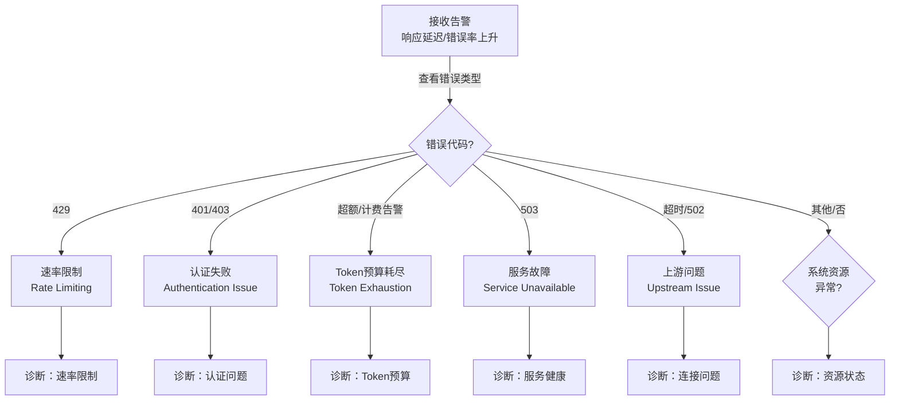

## 15.2 高并发故障诊断决策树与优化指南

在生产环境中，OpenClaw系统在高并发负载下可能面临多种故障模式。本章提供完整的诊断决策树和解决方案，帮助工程师快速定位和解决问题。

### 15.2.1 高并发场景中的常见故障类型与诊断概览

高并发环境中常见的故障类型包括：

| 故障类型 | 症状表现 | 根本原因 | 平均诊断时间 |
|---------|---------|---------|------------|
| Rate Limiting | 429 响应 | API 限速 | < 5 分钟 |
| Authentication Failure | 401/403 响应 | API 密钥过期或无效 | 5-10 分钟 |
| Token Exhaustion | 超额费用提示 / 429+计费 | Token 预算不足 | 10-15 分钟 |
| Queue Overflow | 超时 / 丢弃 | 消费速度慢 | 15-30 分钟 |
| Memory Leak | OOM 错误 | 内存未释放 | 30-60 分钟 |
| Connection Pool | 连接超时 | 连接泄漏 | 20-40 分钟 |
| Cascading Failure | 全系统故障 | 无故障转移 | 5-10 分钟 |

通过以下主诊断决策树可以快速定位具体的故障根因。

### 15.2.2 主诊断决策树

以下决策树是高并发故障诊断的首选入口，根据错误代码和症状快速路由到具体诊断路径。



图 15-8：高并发故障主诊断决策树

### 15.2.3 诊断路径与处理方案

> [!NOTE]
> 本节中的主机级命令与编排动作按常见 Linux/容器部署整理。若你运行在 macOS、Windows、WSL2 或托管平台，请优先使用对应平台的等价命令，并先确认相关 CLI 子命令在你的安装方式里可用。

#### 路径1：速率限制（429 错误）

**症状（Symptoms）**
- 客户端收到 HTTP 429 Too Many Requests
- 响应头包含 `X-RateLimit-Reset-After` 或 `Retry-After`
- 请求堆积，部分请求被拒绝

**证据收集（Evidence）**
```bash
# 查看最近日志中的 429 错误（建议优先用 JSON 视图）
openclaw logs --follow --json

# 检查网关速率限制状态
openclaw status --deep

# 查看当前整体状态与连接面
openclaw health --json
```
**处置动作（Actions）**
1. **即时**：启用自适应限速器
   - 减少请求发送速率到 API 配额的 80%
   - 实施指数退避重试：等待时间 = min(2^n + random(0, 2^n), 60) 秒，n 从 1 开始，加入随机抖动避免重试风暴

2. **短期**：流量管理
   - 分散高峰请求到非高峰时段
   - 如有多个 API 配额，进行负载均衡

3. **长期**：提升配额
   - 向 API 供应商申请更高的速率限制
   - 部署多区域分布策略

---

#### 路径2：认证失败（401/403 错误）

**症状（Symptoms）**
- 所有请求返回 401 Unauthorized 或 403 Forbidden
- 之前能正常工作的 API 突然拒绝认证
- 日志显示 “Invalid API key” 或 “Token expired”

**证据收集（Evidence）**
```bash
# 检查模型配置与认证探针
openclaw models status --check
openclaw models status --probe

# 查看最近的认证错误（建议优先用 JSON 视图）
openclaw logs --follow --json
```
**处置动作（Actions）**
1. **立即**：重新验证凭证
   - 检查 API 密钥是否过期或已轮换
   - 确认密钥对应的模型供应商仍然可用

2. **恢复**：更新认证
   ```bash
   # 通过 OAuth 重新登录
   openclaw models auth login --provider <供应商>

   # 或粘贴新的 API Token（不同 provider 可用方式以当前插件支持为准）
   openclaw models auth paste-token --provider <供应商>
   ```

3. **验证**：确认恢复
   ```bash
   openclaw models status --check
   openclaw doctor  # 全面健康检查
   ```

---

#### 路径3：Token 预算耗尽

**症状（Symptoms）**
- 收到计费警告或超额费用提示
- 成本报表显示已超预算
- 某些请求被限流（通常伴随 provider / 前置网关 / 外部预算控制返回的 429 或 “budget exceeded”）

**证据收集（Evidence）**
```bash
# 获取聊天侧、CLI 侧或 Dashboard `Control -> Usage` 页的使用量视图
# 聊天 / auto-reply 命令路径里可直接发送 /usage cost
openclaw status --usage

# 检查当前模型配置（高成本vs低成本）
openclaw models list
openclaw models status
```
**处置动作（Actions）**
1. **立即**：实施 Token 配给
   - 先区分“观测值”与“执行器”：`status --usage`、Dashboard Usage、`/usage cost` 都是证据面，不等于内建预算执行器
   - 如果已有 provider 配额、网关前置限流或外部预算控制，立即按该控制面做排队、拒绝或降级
   - 如果没有现成控制面，先暂停低优先级渠道、停掉非关键 cron / 后台任务、降低入口并发，并把高成本 Agent 临时切到低成本模型

2. **优化**：切换模型与提示
   ```bash
   # 切换到低成本模型
   openclaw models set <低成本模型>

   # 或在 Agent 配置中下调默认模型
   # 具体配置路径以当前 agent workspace / Control UI 为准
   ```

3. **防止**：实施预算监控
   - 每小时导出消耗报告
   - 在 provider 控制台、前置网关、外部监控或自定义插件中配置 80% 告警和 90% 限流 / 禁用策略
   - 如果暂时没有自动控制面，至少建立人工升级路径：告警后关闭低优先级入口，并暂停非关键定时任务

---

#### 路径4：队列堆积与级联故障

**症状（Symptoms）**
- 新请求响应时间超过预期（如从 50ms 跃升到 10s+）
- 队列深度持续增长，不减少
- 最终导致内存溢出或连接超时

**证据收集（Evidence）**
```bash
# 查看结构化日志中的队列/背压事件
openclaw logs --follow --json

# 检查系统整体状态与下游探针
openclaw status --deep
openclaw health --json

# 如需主机级资源视角，再结合宿主机工具补充观察
# 例如 top / htop / docker stats / kubectl top
```
**处置动作（Actions）**
1. **立即**：启动背压管理
   - 先降入口流量：暂停低优先级渠道、降低并发、延迟非关键任务
   - 临时拉长超时或重试间隔前，先确认瓶颈在下游而非本地资源耗尽

2. **隔离**：与故障部分解耦
   - 如下游数据库超时，使用缓存数据临时替代
   - 禁用某些可选功能，降低依赖调用

3. **恢复**：修复连接问题
   ```bash
   # 先重启网关；只有在你的部署明确存在对应运行时/监督器时，才继续重建相关组件
   openclaw gateway restart
   ```

4. **防止**：连接超时和健康检查
   - 设置连接超时（如 30s）
   - 定期健康检查（每 5 分钟）

---

#### 路径5：资源瓶颈（CPU/内存高）

**症状（Symptoms）**
- CPU 使用率或内存占用持续 > 85%
- 系统响应变慢，甚至冻结
- 日志中出现 GC 暂停或内存告警

**证据收集（Evidence）**
```bash
# 先看 OpenClaw 自身状态
openclaw status --deep
openclaw health --json

# 再看最近的资源与错误日志
openclaw logs --follow --json

# 若仍需资源细节，再结合宿主机或编排层工具
# 例如 top / htop / docker stats / kubectl top
```
**处置动作（Actions）**
1. 若 **CPU 高**：
   - 启用 Profiling 找出热点代码
   - 降低并发数或模型复杂度

2. 若 **内存高**：
   - 导出堆快照，检查是否泄漏
   - 清空缓存或重启服务

3. **长期优化**：
   - 代码优化与算法改进
   - 增加硬件资源或水平扩展

---

### 15.2.4 实际案例诊断

#### 案例 1：突发流量导致的限速

这个案例展示了当请求量突然增加导致触发 API 速率限制时的诊断和处理流程。

```text
症状：
- 客户端收到大量 429 错误
- 响应时间从 50ms 跃升到 5000ms
- 错误日志显示 "Rate limit exceeded"

诊断步骤：
1. 检查请求模式：`openclaw logs --follow --json`
2. 确认 API 配额：向供应商查询当前 RPS 限制
3. 检查其他消费者：是否有其他服务竞争同一配额

解决方案：
1. 立即：启动自适应限速器
   - 下调高峰请求速率
   - 延长退避和重试间隔
   - 必要时先切走低优先级流量

2. 短期：与其他消费者协商，重新分配配额
3. 长期：申请更高的 API 配额，实施多区域分布

恢复时间：15 分钟
```

#### 案例 2：API 密钥失效

这个案例展示了 API 密钥过期或轮换导致认证失败时的诊断流程。

```text
症状：
- 收到 401 Unauthorized 错误
- 之前能正常工作，突然开始失败
- 所有请求均被拒绝

诊断步骤：
1. 检查模型与认证探针：`openclaw models status --check`
2. 确认密钥是否过期或已轮换：检查供应商后台
3. 验证密钥对应的模型是否仍可用

解决方案：
1. 立即：重新验证或更新密钥
   openclaw models auth login --provider <供应商>
   或
   openclaw models auth paste-token --provider <供应商>

2. 验证修复：openclaw models status --check
3. 全面检查：openclaw doctor

恢复时间：5-10 分钟
```

#### 案例 3：Token 预算耗尽

这个案例展示了当累积成本超过预算限制时的诊断和优化流程。

```text
症状：
- 成本报表显示已超预算
- 新请求被限流或拒绝
- 收到计费告警邮件

诊断步骤：
1. 查看 Token 消耗趋势
2. 分析哪个 Agent 消耗了最多 Token
3. 检查是否切换了高成本模型
4. 确认是否存在 Token 浪费（如长对话未压缩）

解决方案：
1. 立即：切换到低成本模型或轻量级提示
   openclaw models set <低成本模型>

2. 优化：降低消耗面
   - 手动 `/compact` 长会话，必要时 `/reset`
   - 暂停低优先级渠道和非关键 cron / 后台任务
   - 在 Agent 配置或 Control UI 中下调默认模型
   - 注意：在 `USER.md` 写 `token_limit` 不是 OpenClaw 内置预算执行器

3. 防止：把配额执行放到真实控制面
   - 在 provider billing / quota 控制台设置硬预算
   - 在入口网关、调度器、外部监控或自定义插件中实现 80% 告警与 90% 限流

恢复时间：30 分钟
```

---

### 15.2.5 Agent 隔离与多代理 Token 协调

当多个独立 Agent 在同一系统中运行时，它们会竞争有限的 Token 资源。详细的多 Agent Token 配额协调机制请参考第 7.4 章《多代理协作模式》与第 14.3 章《OpenClaw 的用量观测与外部预算治理》。

关键要点：
- 为每个 Agent 设置优先级（CRITICAL、HIGH、NORMAL、LOW）
- 在 provider、入口网关、调度器或插件中分配日限额与小时限额
- 监控 80% 和 90% 两个告警阈值
- 使用优先级队列进行动态资源分配；如果没有控制面，先采用人工降级流程

---

### 关键要点

- **主动监控优于被动诊断**：提前发现问题，避免级联故障
- **快速定位**：使用错误代码（429/401/503）快速定位根因
- **分层限速策略**：在多个层次实施限速（API、Agent、Model）
- **优雅降级**：在资源受限时切换到轻量级模型和功能
- **自动恢复**：使用指数退避、自适应限速等机制自动恢复
- **可观测性至关重要**：完整的指标和日志对快速诊断至关重要
