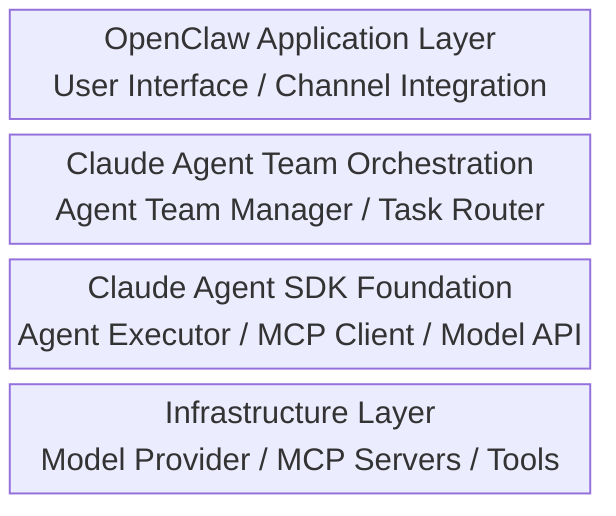

## 16.2 Claude Agent Team深度集成指南

截至2026年初，Claude Agent Team框架已成为构建协作智能体系统的最佳实践。本章深入讲解如何在OpenClaw中集成Claude Agent SDK，实现多Agent的协作编排和任务分解。

### 16.2.1 Claude Agent SDK核心概念

Claude Agent SDK是Anthropic官方提供的Agent开发框架，支持：
- 结构化的Agent定义与编排
- 原生的MCP工具集成
- 智能的任务分解与路由
- 完整的可观测性与监控

#### Agent SDK的三层架构



### 16.2.2 Agent Team架构设计

#### Team角色定义

一个高效的Agent Team包含以下核心角色：

```python
from dataclasses import dataclass
from typing import List, Dict, Any
from enum import Enum

class AgentRole(Enum):
    """Agent在Team中的角色定义"""
    COORDINATOR = "coordinator"      # 协调者：任务分解与流程管理
    SPECIALIST = "specialist"        # 专家：特定领域的深度处理
    ANALYST = "analyst"              # 分析员：数据分析与洞察
    EXECUTOR = "executor"            # 执行者：工具调用与工作流执行
    VALIDATOR = "validator"          # 校验者：结果质量检查

@dataclass
class AgentProfile:
    """Agent配置文件"""
    id: str
    name: str
    role: AgentRole
    system_prompt: str
    model: str                        # "claude-sonnet-4-6"
    tools: List[str]                  # MCP工具列表
    max_retries: int = 3
    timeout_seconds: int = 300
    context_window: int = 200000      # 默认200K，可通过beta header扩展至1M

    def to_dict(self) -> Dict[str, Any]:
        return {
            "id": self.id,
            "name": self.name,
            "role": self.role.value,
            "system_prompt": self.system_prompt,
            "model": self.model,
            "tools": self.tools,
            "max_retries": self.max_retries,
            "timeout_seconds": self.timeout_seconds,
            "context_window": self.context_window
        }

# 示例：定义一个完整的Agent Team配置
RESEARCH_TEAM_CONFIG = {
    "agents": [
        AgentProfile(
            id="research_coordinator",
            name="研究协调员",
            role=AgentRole.COORDINATOR,
            system_prompt="""你是一个研究项目协调员。你的职责是：
1. 理解用户的研究需求
2. 将复杂问题分解为可执行的子任务
3. 分配任务给专家Agent
4. 整合各专家的结果生成最终报告
5. 确保所有交付物符合质量标准

使用以下格式分配任务：
<task>
  <type>research|analysis|validation</type>
  <assignee>agent_id</assignee>
  <instructions>明确的执行指令</instructions>
</task>""",
            model="claude-sonnet-4-6",
            tools=["task_router", "result_aggregator"],
            timeout_seconds=600
        ),
        AgentProfile(
            id="data_analyst",
            name="数据分析专家",
            role=AgentRole.SPECIALIST,
            system_prompt="""你是数据分析专家。专长：
1. 数据清洗与预处理
2. 统计分析与可视化建议
3. 异常检测与根因分析
4. 趋势预测与模式识别

接收任务后：
1. 先理解数据来源和质量
2. 应用适当的分析方法
3. 生成结构化的发现报告""",
            model="claude-sonnet-4-6",
            tools=["data_processor", "statistical_analyzer", "visualization_helper"]
        ),
        AgentProfile(
            id="content_validator",
            name="质量校验员",
            role=AgentRole.VALIDATOR,
            system_prompt="""你是质量保证专家。职责：
1. 检查交付物的准确性
2. 验证逻辑的一致性
3. 确认数据引用的正确性
4. 评估可读性和专业性

使用以下标准进行评估：
- 准确性：信息是否真实正确
- 完整性：是否覆盖所有需求
- 清晰性：是否易于理解
- 专业性：是否符合行业标准""",
            model="claude-haiku-4-5",  # 验证任务用轻量模型
            tools=["quality_checker"]
        )
    ]
}
```

### 16.2.3 Agent Team创建与管理

#### Team生命周期管理

```python
import asyncio
from typing import Optional, List
from anthropic import Anthropic
import json

class AgentTeamManager:
    """Claude Agent Team的管理器"""

    def __init__(self, api_key: str):
        self.client = Anthropic(api_key=api_key)
        self.agents: Dict[str, AgentProfile] = {}
        self.active_tasks: Dict[str, Dict] = {}
        self.execution_history: List[Dict] = []

    def register_agent(self, profile: AgentProfile) -> None:
        """注册Agent到Team"""
        self.agents[profile.id] = profile
        print(f"✓ Agent '{profile.name}' registered as {profile.role.value}")

    def create_team(self, team_config: Dict[str, List[AgentProfile]]) -> None:
        """批量注册Team中的所有Agent"""
        for agent_profile in team_config.get("agents", []):
            self.register_agent(agent_profile)

    async def assign_task(self, task_id: str, agent_id: str,
                         instructions: str, context: Optional[Dict] = None) -> None:
        """分配任务给特定Agent"""
        if agent_id not in self.agents:
            raise ValueError(f"Agent {agent_id} not found in team")

        agent = self.agents[agent_id]

        task = {
            "id": task_id,
            "agent_id": agent_id,
            "agent_name": agent.name,
            "instructions": instructions,
            "context": context or {},
            "status": "pending",
            "created_at": self._get_timestamp(),
            "retries": 0,
            "max_retries": agent.max_retries
        }

        self.active_tasks[task_id] = task
        await self._execute_task(task)

    async def _execute_task(self, task: Dict) -> Dict:
        """执行单个任务"""
        agent_id = task["agent_id"]
        agent = self.agents[agent_id]

        print(f"→ Executing task {task['id']} on {agent.name}")

        try:
            # 构建完整的prompt
            full_prompt = f"""
{agent.system_prompt}

## Current Task
Task ID: {task['id']}
Instructions: {task['instructions']}

## Context
{json.dumps(task['context'], ensure_ascii=False, indent=2)}

## Requirements
1. Complete the task according to instructions
2. Provide clear reasoning and steps
3. Format output as structured JSON for further processing
4. If using tools, call them with appropriate parameters
"""

            # 调用Claude API
            response = await self._call_model(agent, full_prompt)

            # 处理响应
            task["result"] = response
            task["status"] = "completed"
            task["completed_at"] = self._get_timestamp()

            self.execution_history.append({
                "task_id": task["id"],
                "agent_id": agent_id,
                "status": "completed",
                "tokens_used": response.get("usage", {})
            })

            print(f"✓ Task {task['id']} completed successfully")
            return response

        except Exception as e:
            # 区分错误类型，采用不同的重试策略
            error_code = self._extract_error_code(e)

            # HTTP 429：限速错误，应该重试（使用指数退避）
            if error_code == 429:
                task["retries"] += 1
                if task["retries"] < task["max_retries"]:
                    backoff_time = 2 ** task["retries"]  # 指数退避
                    print(f"⚠ Rate limit (429) for task {task['id']}, retrying after {backoff_time}s ({task['retries']}/{task['max_retries']})")
                    await asyncio.sleep(backoff_time)
                    return await self._execute_task(task)
                else:
                    task["status"] = "failed"
                    task["error"] = str(e)
                    print(f"✗ Task {task['id']} failed after {task['max_retries']} retries due to rate limiting")
                    raise

            # HTTP 401：认证错误，不应该重试，立即抛出
            elif error_code == 401:
                task["status"] = "failed"
                task["error"] = f"Authentication error (401): {str(e)}"
                print(f"✗ Task {task['id']} failed with authentication error - not retrying")
                raise

            # 其他错误：尝试重试
            else:
                task["retries"] += 1
                if task["retries"] < task["max_retries"]:
                    print(f"⚠ Task {task['id']} failed with error code {error_code}, retrying ({task['retries']}/{task['max_retries']})")
                    await asyncio.sleep(2 ** task["retries"])
                    return await self._execute_task(task)
                else:
                    task["status"] = "failed"
                    task["error"] = str(e)
                    print(f"✗ Task {task['id']} failed after {task['max_retries']} retries")
                    raise

    def _extract_error_code(self, error: Exception) -> int:
        """从异常中提取HTTP错误码"""
        error_str = str(error)
        # 尝试从异常消息中提取HTTP状态码
        if "429" in error_str:
            return 429
        elif "401" in error_str:
            return 401
        elif hasattr(error, 'status_code'):
            return error.status_code
        return 500  # 默认为通用服务器错误

    async def _call_model(self, agent: AgentProfile, prompt: str) -> Dict:
        """调用Claude模型"""
        message = self.client.messages.create(
            model=agent.model,
            max_tokens=4096,
            system=agent.system_prompt,
            messages=[
                {"role": "user", "content": prompt}
            ]
        )

        return {
            "content": message.content[0].text,
            "usage": {
                "input_tokens": message.usage.input_tokens,
                "output_tokens": message.usage.output_tokens
            }
        }

    def get_team_status(self) -> Dict:
        """获取Team的当前状态"""
        return {
            "total_agents": len(self.agents),
            "active_agents": list(self.agents.keys()),
            "pending_tasks": sum(1 for t in self.active_tasks.values() if t["status"] == "pending"),
            "completed_tasks": sum(1 for t in self.active_tasks.values() if t["status"] == "completed"),
            "failed_tasks": sum(1 for t in self.active_tasks.values() if t["status"] == "failed"),
            "total_execution_time": len(self.execution_history)
        }

    def _get_timestamp(self) -> str:
        from datetime import datetime
        return datetime.utcnow().isoformat() + "Z"
```

### 16.2.4 多Agent协作模式

#### 1. 串联模式

适用于任务有明确前后依赖关系的场景。

```python
class SequentialWorkflow:
    """串联执行工作流"""

    async def execute(self, team_manager: AgentTeamManager,
                     initial_request: str) -> str:
        """顺序执行多个Agent任务"""

        # 步骤1：协调员分解任务
        decomposition = await team_manager.assign_task(
            task_id="task_1_decompose",
            agent_id="research_coordinator",
            instructions=f"""请分解以下研究请求为具体的子任务：
{initial_request}

返回JSON 格式，包含：
- 概述（overview）
- 子任务列表（subtasks）
- 优先级（priorities）
- 预计成本（estimated_tokens）"""
        )

        # 步骤2：数据分析
        analysis = await team_manager.assign_task(
            task_id="task_2_analyze",
            agent_id="data_analyst",
            instructions=f"""基于以下分解任务执行数据分析：
{decomposition['result']['content']}

专注于统计分析和模式识别。""",
            context={"previous_result": decomposition}
        )

        # 步骤3：质量验证
        validation = await team_manager.assign_task(
            task_id="task_3_validate",
            agent_id="content_validator",
            instructions=f"""检查以下分析结果的质量：
{analysis['result']['content']}

返回：
- 质量评分（1-10）
- 发现的问题（issues）
- 改进建议（suggestions）""",
            context={"analysis_result": analysis}
        )

        return validation['result']['content']
```

#### 2. 并联模式

适用于多个独立子任务可以同时执行的场景。

```python
class ParallelWorkflow:
    """并联执行工作流"""

    async def execute(self, team_manager: AgentTeamManager,
                     subtasks: List[Dict]) -> Dict:
        """并行执行多个独立任务"""

        tasks = []
        for i, subtask in enumerate(subtasks):
            task = team_manager.assign_task(
                task_id=f"parallel_task_{i}",
                agent_id=subtask["assigned_agent"],
                instructions=subtask["instructions"],
                context=subtask.get("context", {})
            )
            tasks.append(task)

        # 等待所有任务完成
        results = await asyncio.gather(*tasks, return_exceptions=True)

        # 聚合结果
        successful_results = []
        failed_results = []

        for i, result in enumerate(results):
            if isinstance(result, Exception):
                failed_results.append({
                    "task_id": f"parallel_task_{i}",
                    "error": str(result)
                })
            else:
                successful_results.append({
                    "task_id": f"parallel_task_{i}",
                    "result": result
                })

        return {
            "successful": successful_results,
            "failed": failed_results,
            "summary": f"Completed {len(successful_results)}/{len(subtasks)} tasks"
        }
```

#### 3. 扇形模式

适用于一个任务分发给多个Agent，再汇聚结果的场景。

```python
class FanOutFanInWorkflow:
    """扇出扇入工作流"""

    async def execute(self, team_manager: AgentTeamManager,
                     problem: str) -> str:
        """多个Agent分别分析同一问题，然后汇聚"""

        # 扇出：分发给多个分析Agent
        perspectives = [
            {
                "agent_id": "data_analyst",
                "perspective": "数据和量化分析角度"
            },
            {
                "agent_id": "content_validator",  # 这里用validator演示不同角度
                "perspective": "质量和风险评估角度"
            }
        ]

        analysis_tasks = []
        for perspective in perspectives:
            task = team_manager.assign_task(
                task_id=f"perspective_{perspective['agent_id']}",
                agent_id=perspective["agent_id"],
                instructions=f"""从{perspective['perspective']}分析以下问题：
{problem}

提供：
1. 关键发现（key findings）
2. 影响评估（impact assessment）
3. 建议行动（recommended actions）"""
            )
            analysis_tasks.append(task)

        # 等待所有分析完成
        analyses = await asyncio.gather(*analysis_tasks)

        # 扇入：协调员汇聚所有视角
        synthesis = await team_manager.assign_task(
            task_id="synthesis",
            agent_id="research_coordinator",
            instructions=f"""基于以下多个角度的分析，生成综合性结论：

{json.dumps([{'perspective': p, 'analysis': a}
            for p, a in zip(perspectives, analyses)],
           ensure_ascii=False, indent=2)}

请：
1. 识别各视角的共识点
2. 指出存在的分歧
3. 生成最终的综合建议
4. 评估风险和机遇""",
            context={"analyses": analyses}
        )

        return synthesis['result']['content']
```

### 16.2.5 MCP工具链集成

#### MCP服务器在Agent Team中的作用

```python
from typing import Protocol, runtime_checkable

@runtime_checkable
class MCPTool(Protocol):
    """MCP工具的标准接口"""

    async def __call__(self, *args, **kwargs) -> Dict[str, Any]:
        """执行工具"""
        ...

    def get_spec(self) -> Dict[str, Any]:
        """获取工具规范（供Agent理解用）"""
        ...

class MCPToolRegistry:
    """MCP工具注册表"""

    def __init__(self):
        self.tools: Dict[str, MCPTool] = {}
        self.specs: Dict[str, Dict] = {}

    def register_tool(self, tool_name: str, tool: MCPTool) -> None:
        """注册MCP工具"""
        self.tools[tool_name] = tool
        self.specs[tool_name] = tool.get_spec()
        print(f"✓ Registered MCP tool: {tool_name}")

    def get_tool_specs_for_agent(self, agent_tools: List[str]) -> str:
        """为Agent生成可用工具列表的描述"""
        specs_text = ""
        for tool_name in agent_tools:
            if tool_name in self.specs:
                spec = self.specs[tool_name]
                specs_text += f"""

## Tool: {tool_name}
Description: {spec.get('description', 'N/A')}
Input: {json.dumps(spec.get('input_schema', {}), ensure_ascii=False)}
Output: {spec.get('output_description', 'N/A')}
"""
        return specs_text

    async def execute_tool(self, tool_name: str, params: Dict) -> Dict:
        """执行工具调用"""
        if tool_name not in self.tools:
            raise ValueError(f"Tool {tool_name} not registered")

        try:
            result = await self.tools[tool_name](**params)
            return {
                "success": True,
                "tool": tool_name,
                "result": result
            }
        except Exception as e:
            return {
                "success": False,
                "tool": tool_name,
                "error": str(e)
            }

# 具体工具实现示例
class DataProcessorTool:
    """数据处理工具"""

    def get_spec(self) -> Dict[str, Any]:
        return {
            "description": "清洗和预处理数据",
            "input_schema": {
                "type": "object",
                "properties": {
                    "data": {"type": "array", "description": "输入数据"},
                    "operations": {"type": "array",
                                  "description": "处理操作列表"}
                }
            },
            "output_description": "处理后的数据"
        }

    async def __call__(self, data: List, operations: List[str]) -> Dict:
        """执行数据处理"""
        processed = data.copy()

        for op in operations:
            if op == "remove_duplicates":
                processed = list(set(processed))
            elif op == "normalize":
                # 简化的归一化
                if isinstance(processed[0], (int, float)):
                    min_val = min(processed)
                    max_val = max(processed)
                    processed = [(x - min_val) / (max_val - min_val)
                               for x in processed]

        return {
            "original_length": len(data),
            "processed_length": len(processed),
            "operations_applied": operations,
            "data": processed
        }

class StatisticalAnalyzerTool:
    """统计分析工具"""

    def get_spec(self) -> Dict[str, Any]:
        return {
            "description": "执行统计分析",
            "input_schema": {
                "type": "object",
                "properties": {
                    "data": {"type": "array", "description": "数值数据"},
                    "analysis_type": {"type": "string",
                                    "description": "分析类型：mean/median/std/correlation"}
                }
            },
            "output_description": "统计结果"
        }

    async def __call__(self, data: List[float], analysis_type: str) -> Dict:
        """执行统计分析"""
        import statistics

        results = {}

        if analysis_type in ["mean", "all"]:
            results["mean"] = statistics.mean(data)

        if analysis_type in ["median", "all"]:
            results["median"] = statistics.median(data)

        if analysis_type in ["std", "all"]:
            results["stdev"] = statistics.stdev(data) if len(data) > 1 else 0

        if analysis_type in ["correlation", "all"]:
            # 简化的自相关
            results["autocorrelation_info"] = "Correlation analysis requires paired data"

        return {
            "analysis_type": analysis_type,
            "sample_size": len(data),
            "results": results
        }
```

### 16.2.6 完整的Agent Team示例

```python
async def main():
    """完整的Agent Team使用示例"""

    # 初始化
    api_key = os.getenv("ANTHROPIC_API_KEY")
    team_manager = AgentTeamManager(api_key)
    tool_registry = MCPToolRegistry()

    # 注册工具
    tool_registry.register_tool("data_processor", DataProcessorTool())
    tool_registry.register_tool("statistical_analyzer", StatisticalAnalyzerTool())

    # 创建Team
    team_manager.create_team(RESEARCH_TEAM_CONFIG)

    # 打印Team状态
    print("Team Status:", team_manager.get_team_status())

    # 执行复杂分析任务
    user_request = """
    请分析过去6个月的销售数据，识别关键趋势，
    并提出优化建议。数据包括日销售额、客户数量和产品类别。
    """

    # 使用串联工作流
    workflow = SequentialWorkflow()
    result = await workflow.execute(team_manager, user_request)

    print("Final Result:")
    print(result)

    # 导出执行历史
    import json
    with open("execution_history.json", "w", encoding="utf-8") as f:
        json.dump(team_manager.execution_history, f, ensure_ascii=False, indent=2)

if __name__ == "__main__":
    import os
    asyncio.run(main())
```

### 16.2.7 生产部署配置

#### OpenClaw与Agent Team的集成配置

```json
{
  "openclaw": {
    "agents": {
      "enable_agent_team": true,
      "team_manager": {
        "type": "claude_agent_sdk",
        "api_key": "${ANTHROPIC_API_KEY}",
        "default_model": "claude-sonnet-4-6",
        "max_team_size": 10,
        "agent_timeout": 300,
        "enable_streaming": true
      },
      "mcp_integration": {
        "enabled": true,
        "server_endpoints": [
          {
            "name": "data_processor",
            "url": "sse://localhost:8001",
            "auth_token": "${MCP_AUTH_TOKEN}"
          },
          {
            "name": "statistical_analyzer",
            "url": "sse://localhost:8002"
          }
        ],
        "retry_policy": {
          "max_retries": 3,
          "backoff_multiplier": 2,
          "initial_delay_ms": 100
        }
      }
    },
    "workflows": {
      "research_workflow": {
        "type": "sequential",
        "agents": ["research_coordinator", "data_analyst", "content_validator"],
        "parallelizable_steps": [
          {
            "type": "fan_out",
            "agents": ["data_analyst"],
            "num_instances": 3
          }
        ]
      },
      "support_workflow": {
        "type": "parallel",
        "agents": ["support_agent_1", "support_agent_2"],
        "load_balancing": "round_robin"
      }
    }
  }
}
```

#### 监控与可观测性

```python
class AgentTeamMonitor:
    """Agent Team的监控模块"""

    def __init__(self, team_manager: AgentTeamManager):
        self.team = team_manager
        self.metrics = {
            "total_tasks": 0,
            "completed_tasks": 0,
            "failed_tasks": 0,
            "total_tokens": 0,
            "avg_execution_time": 0
        }

    def log_metrics(self) -> None:
        """输出性能指标"""
        status = self.team.get_team_status()
        print(f"""
=== Agent Team Metrics ===
Active Agents: {status['total_agents']}
Pending Tasks: {status['pending_tasks']}
Completed Tasks: {status['completed_tasks']}
Failed Tasks: {status['failed_tasks']}
Success Rate: {status['completed_tasks'] / (status['completed_tasks'] + status['failed_tasks'] + 0.001) * 100:.1f}%
Total Execution Records: {status['total_execution_time']}
        """)

    def export_metrics(self, format: str = "prometheus") -> str:
        """导出Prometheus格式的指标"""
        metrics_text = ""
        for key, value in self.metrics.items():
            metrics_text += f"agent_team_{key} {value}\n"
        return metrics_text
```

### 16.2.8 Agent隔离与Token配额协调

#### Agent隔离的核心原理

在高并发环境下，多个Agent竞争有限的Token资源时，需要建立有效的隔离和配额管理机制。Agent隔离与Token配额协调涉及以下关键方面：

```python
from typing import Dict, List
from dataclasses import dataclass
from datetime import datetime, timedelta
import asyncio

@dataclass
class TokenQuota:
    """Agent Token配额"""
    agent_id: str
    daily_limit: int          # 每日限额
    hourly_limit: int         # 每小时限额
    concurrent_limit: int     # 并发请求限额
    priority_level: int       # 优先级（1-10，数字越大优先级越高）
    burst_allowance: float    # 突发容限（超过hourly_limit的倍数）

class TokenQuotaManager:
    """Agent Token配额管理器"""

    def __init__(self):
        self.quotas: Dict[str, TokenQuota] = {}
        self.daily_consumption: Dict[str, int] = {}
        self.hourly_consumption: Dict[str, int] = {}
        self.concurrent_requests: Dict[str, int] = {}

    def register_agent_quota(self, quota: TokenQuota) -> None:
        """为Agent注册配额"""
        self.quotas[quota.agent_id] = quota
        self.daily_consumption[quota.agent_id] = 0
        self.hourly_consumption[quota.agent_id] = 0
        self.concurrent_requests[quota.agent_id] = 0

    async def acquire_tokens(self, agent_id: str, tokens_needed: int,
                            timeout: float = 5.0) -> bool:
        """尝试为Agent分配Token"""
        deadline = asyncio.get_event_loop().time() + timeout
        quota = self.quotas.get(agent_id)

        if not quota:
            raise ValueError(f"No quota registered for agent {agent_id}")

        while asyncio.get_event_loop().time() < deadline:
            today_key = datetime.now().date().isoformat()
            hour_key = datetime.now().isoformat()[:13]

            # 检查日限额
            daily_used = self.daily_consumption.get(f"{agent_id}:{today_key}", 0)
            if daily_used + tokens_needed > quota.daily_limit:
                print(f"⚠ Agent {agent_id}: Daily limit exceeded")
                await asyncio.sleep(0.1)
                continue

            # 检查小时限额（允许突发）
            hourly_used = self.hourly_consumption.get(f"{agent_id}:{hour_key}", 0)
            hourly_limit_with_burst = quota.hourly_limit * quota.burst_allowance
            if hourly_used + tokens_needed > hourly_limit_with_burst:
                print(f"⚠ Agent {agent_id}: Hourly limit (with burst) exceeded")
                await asyncio.sleep(0.1)
                continue

            # 检查并发限额
            current_concurrent = self.concurrent_requests.get(agent_id, 0)
            if current_concurrent >= quota.concurrent_limit:
                print(f"⚠ Agent {agent_id}: Concurrent request limit reached")
                await asyncio.sleep(0.1)
                continue

            # 分配成功
            self.daily_consumption[f"{agent_id}:{today_key}"] = daily_used + tokens_needed
            self.hourly_consumption[f"{agent_id}:{hour_key}"] = hourly_used + tokens_needed
            self.concurrent_requests[agent_id] = current_concurrent + 1

            return True

        return False

    async def release_tokens(self, agent_id: str) -> None:
        """释放Agent的并发请求计数"""
        current = self.concurrent_requests.get(agent_id, 0)
        self.concurrent_requests[agent_id] = max(0, current - 1)

class AgentIsolationManager:
    """Agent隔离管理器"""

    def __init__(self, quota_manager: TokenQuotaManager):
        self.quota_manager = quota_manager
        self.agent_pools: Dict[str, asyncio.Queue] = {}
        self.resource_monitors: Dict[str, Dict] = {}

    async def execute_isolated_task(self, agent_id: str,
                                   task: Dict,
                                   execute_fn) -> Dict:
        """在隔离的资源池中执行Agent任务"""

        # 根据agent优先级和当前负载分配资源
        quota = self.quota_manager.quotas[agent_id]
        tokens_needed = self._estimate_tokens(task)

        # 尝试获取Token配额
        acquired = await self.quota_manager.acquire_tokens(
            agent_id, tokens_needed
        )

        if not acquired:
            return {
                "status": "quota_exceeded",
                "agent_id": agent_id,
                "message": f"Failed to acquire {tokens_needed} tokens"
            }

        try:
            # 在隔离的环境中执行任务
            result = await execute_fn(task)
            return {
                "status": "completed",
                "agent_id": agent_id,
                "result": result
            }

        except Exception as e:
            return {
                "status": "error",
                "agent_id": agent_id,
                "error": str(e)
            }

        finally:
            # 释放并发计数
            await self.quota_manager.release_tokens(agent_id)

    def _estimate_tokens(self, task: Dict) -> int:
        """估算任务所需的Token数"""
        # 简单估算：英文约 4 字符/token，中文约 1.5 字符/token
        content = str(task.get("instructions", "")) + str(task.get("context", ""))
        cjk_chars = sum(1 for c in content if '\u4e00' <= c <= '\u9fff')
        ascii_chars = len(content) - cjk_chars
        return int(cjk_chars / 1.5 + ascii_chars / 4) + 500  # 加上 system prompt 的估算

class PriorityBasedTokenRouter:
    """基于优先级的Token路由器"""

    def __init__(self, quota_manager: TokenQuotaManager):
        self.quota_manager = quota_manager
        self.waiting_queue: asyncio.PriorityQueue = asyncio.PriorityQueue()

    async def route_with_priority(self, agent_id: str,
                                 tokens_needed: int,
                                 task: Dict) -> bool:
        """根据优先级路由Token请求"""

        quota = self.quota_manager.quotas[agent_id]

        # 将请求加入优先级队列（负数以获得Max Heap效果）
        priority = -quota.priority_level
        await self.waiting_queue.put((priority, agent_id, tokens_needed, task))

        # 处理队列中优先级最高的请求
        return await self._process_high_priority_requests()

    async def _process_high_priority_requests(self) -> bool:
        """处理高优先级请求"""
        while not self.waiting_queue.empty():
            try:
                priority, agent_id, tokens_needed, task = \
                    self.waiting_queue.get_nowait()

                # 尝试分配Token
                if await self.quota_manager.acquire_tokens(agent_id, tokens_needed):
                    return True
                else:
                    # 重新加入队列
                    await self.waiting_queue.put(
                        (priority, agent_id, tokens_needed, task)
                    )
                    return False

            except asyncio.QueueEmpty:
                break

        return False

    def get_quota_status(self) -> Dict:
        """获取所有Agent的配额状态"""
        status = {}

        for agent_id, quota in self.quota_manager.quotas.items():
            today_key = datetime.now().date().isoformat()
            hour_key = datetime.now().isoformat()[:13]

            daily_used = self.quota_manager.daily_consumption.get(
                f"{agent_id}:{today_key}", 0
            )
            hourly_used = self.quota_manager.hourly_consumption.get(
                f"{agent_id}:{hour_key}", 0
            )
            concurrent = self.quota_manager.concurrent_requests.get(agent_id, 0)

            status[agent_id] = {
                "priority": quota.priority_level,
                "daily": {
                    "limit": quota.daily_limit,
                    "used": daily_used,
                    "remaining": quota.daily_limit - daily_used,
                    "utilization": f"{(daily_used / quota.daily_limit * 100):.1f}%"
                },
                "hourly": {
                    "limit": quota.hourly_limit,
                    "used": hourly_used,
                    "remaining": quota.hourly_limit - hourly_used,
                    "utilization": f"{(hourly_used / quota.hourly_limit * 100):.1f}%"
                },
                "concurrent": {
                    "limit": quota.concurrent_limit,
                    "current": concurrent,
                    "available": quota.concurrent_limit - concurrent
                }
            }

        return status
```

#### Agent隔离与Token配额协调的最佳实践

```text
协调策略：
1. 静态分配：根据Agent角色和重要性预分配固定配额
2. 动态调整：根据实时负载情况动态调整分配
3. 优先级队列：高优先级Agent优先获得Token资源
4. 突发容限：允许短期超过hourly_limit但不能超过daily_limit
5. 可视化监控：实时展示每个Agent的配额使用情况

配置示例：
- COORDINATOR Agent：优先级10，日限额200万Token（系统协调者）
- SPECIALIST Agent：优先级7，日限额100万Token（专家执行）
- VALIDATOR Agent：优先级5，日限额50万Token（质量检查）
```

本章详细介绍了如何在OpenClaw中深度集成Claude Agent Team框架，包括Agent定义、Team管理、协作模式、MCP工具链集成和资源隔离。通过合理的Agent设计和工作流编排，可以实现高效的多Agent协作系统，应对复杂的业务需求。

### 关键要点

- **Agent Team是多Agent协作的标准方案**：支持灵活的角色定义和任务分配
- **工作流模式多样**：串联、并联、扇形等模式适应不同场景
- **MCP工具深度集成**：使Agent能够访问外部服务和数据源
- **可观测性至关重要**：完整的监控和指标导出支持生产运维
- **Agent隔离与配额管理**：多Agent竞争资源时必须建立有效的隔离和配额协调机制
- **在OpenClaw中无缝集成**：充分利用OpenClaw的配置、路由和管理能力
