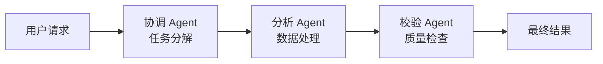
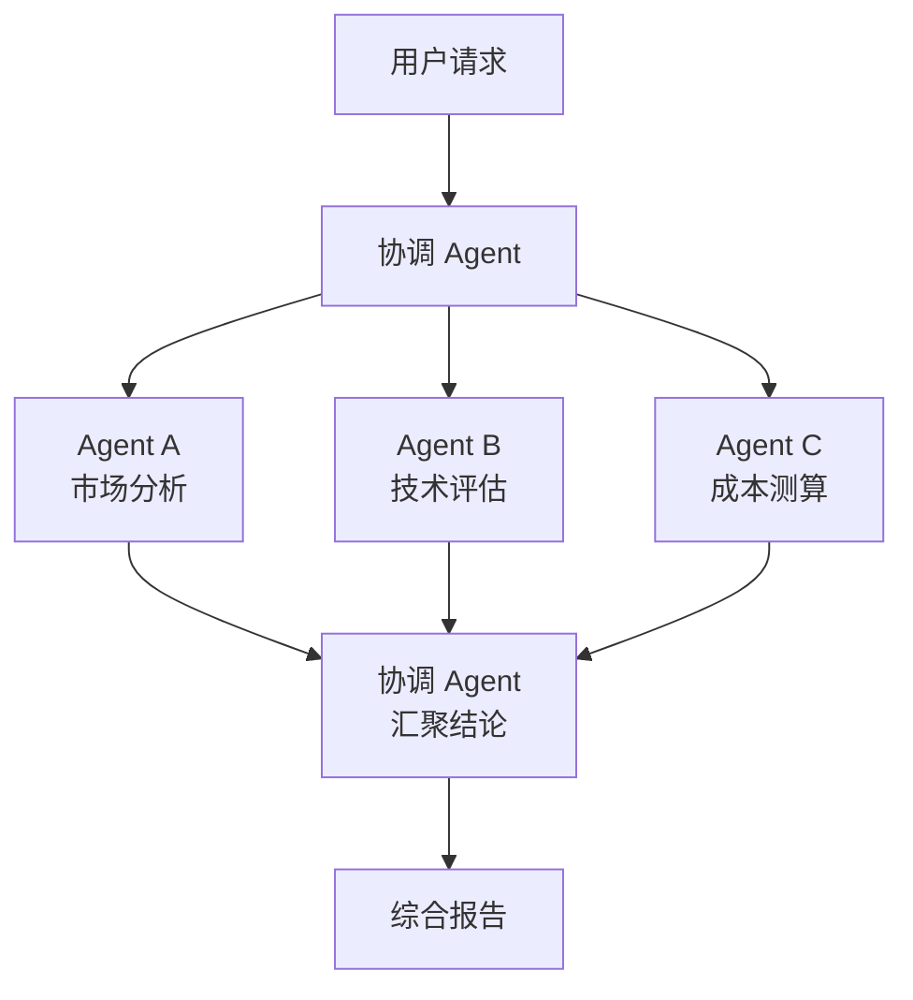

## 16.2 多智能体协作与编排模式

本节讲清在 OpenClaw 中如何用多个智能体协同完成复杂任务。OpenClaw 的多智能体能力建立在 Node 路由隔离（见 [9.1](../09_gateway_protocol/9.1_architecture_overview.md)）和 Agent 配置体系（见 [4.3](../04_config_models/4.3_model_selection.md)）之上——每个 Agent 有独立的模型选择、工具策略和系统提示词，通过路由规则决定哪个 Agent 处理哪类请求。

> **澄清**：Anthropic 提供了 Agent SDK（原 Claude Code SDK），用于构建自定义智能体应用。本节不讨论 Agent SDK 本身的用法，而是聚焦 OpenClaw 原生的多智能体配置与协作模式。如需了解 Agent SDK，请参见 [Anthropic 官方文档](https://docs.anthropic.com/en/docs/agents-and-tools/claude-code/sdk)。

---

### 16.2.1 多智能体的架构选择

在 OpenClaw 中实现多智能体协作，有两种架构路径：

| 路径 | 机制 | 适用场景 |
|------|------|----------|
| **Node 级隔离** | 不同 Node 挂载不同 Agent，Gateway 按路由规则分发 | 业务域隔离（客服 vs 运维），权限隔离 |
| **Agent 级委托** | 主 Agent 通过工具调用触发子 Agent 执行 | 任务分解，专家协作，质量校验 |

两者可以组合使用：Gateway 先按 Node 路由到业务域，域内的主 Agent 再委托子 Agent 完成细分任务。

### 16.2.2 Node 路由实现的多智能体分工

最简单的多智能体模式是通过 Node 配置实现业务分工。每个 Node 绑定一个专属 Agent，Gateway 根据消息来源或内容特征路由到对应 Node：

```javascript
{
  agents: {
    // 客服智能体：使用快速模型，挂载 CRM 工具
    "customer-support": {
      model: { primary: "anthropic/claude-haiku-4-5" },
      systemPrompt: "你是客服助手，回答用户关于产品和订单的问题。",
      tools: { allow: ["crm.query", "order.lookup"] },
    },
    // 技术运维智能体：使用强推理模型，挂载系统工具
    "ops-assistant": {
      model: { primary: "anthropic/claude-sonnet-4-6" },
      systemPrompt: "你是运维助手，帮助排查系统故障和执行运维操作。",
      tools: { allow: ["system.exec", "logs.search", "health.check"] },
    },
    // 数据分析智能体：使用最强模型，挂载数据库 MCP
    "data-analyst": {
      model: { primary: "anthropic/claude-opus-4-6" },
      systemPrompt: "你是数据分析师，执行数据查询和生成分析报告。",
      mcpServers: {
        database: {
          command: "python",
          args: ["-m", "mcp.servers.database"],
          env: { DATABASE_URL: "${DB_CONNECTION_STRING}" },
        },
      },
    },
  },
}
```

> **注意**：以上配置仅为结构示意，实际字段名和嵌套层级以 OpenClaw 官方文档为准。核心思路是每个 Agent 有独立的模型、提示词和工具权限。

路由规则在 Gateway 配置中定义，根据渠道来源、消息关键词或用户属性分发到对应 Agent。路由配置详见 [第七章多渠道分发](../07_multi_agent/README.md)。

### 16.2.3 三种协作编排模式

当任务复杂到单个 Agent 无法独立完成时，需要多 Agent 协作。以下三种模式覆盖了大多数生产场景：

#### 模式一：串联（顺序委托）

前一个 Agent 的输出作为后一个 Agent 的输入，适用于有明确前后依赖的流水线。



**图 16-1：串联协作模式**

典型场景：用户提交研究请求 → 协调 Agent 分解为子任务 → 分析 Agent 执行数据分析 → 校验 Agent 检查结果质量 → 返回最终报告。

实现方式：协调 Agent 的工具列表中包含一个"委托"工具（如 `agent.delegate`），通过该工具向指定 Agent 发送子任务并等待结果。

#### 模式二：并联（同步扇出）

多个 Agent 同时处理独立的子任务，最后汇聚结果。适用于子任务之间没有依赖的场景。



**图 16-2：并联协作模式（扇出-汇聚）**

典型场景：评估一个技术方案 → 同时从市场、技术、成本三个角度分析 → 汇总为综合评估报告。

#### 模式三：路由分发（动态选择）

根据请求内容动态选择最合适的专家 Agent 处理，类似于"智能前台"。这是 Node 路由的增强版——路由逻辑由 AI 模型判断而非固定规则。

实现方式：入口 Agent 使用轻量模型（如 Haiku）快速分类请求意图，然后委托给对应的专家 Agent。这种模式的好处是路由策略可以随对话上下文动态调整，而不受静态路由规则的限制。

### 16.2.4 Agent 委托的工程约束

多 Agent 协作在工程上需要注意以下约束：

**Token 预算控制**：每次 Agent 委托都会消耗额外的 token（子 Agent 需要接收完整的上下文）。深层嵌套委托会导致 token 成本指数增长。建议委托深度不超过 2 层，并在协调 Agent 的提示词中明确指定"不要进一步委托"。

**超时与中断**：子 Agent 的执行时间可能较长（特别是涉及工具调用时）。需要为委托设置合理的超时，并处理超时后的降级策略（如返回部分结果或提示用户稍后查看）。超时配置与 Agent Loop 的工具执行机制相关，详见 [10.5](../10_agent_loop/10.5_tool_execution.md)。

**上下文传递**：委托时传递给子 Agent 的上下文应精简到必要信息，避免将完整对话历史传入。过大的上下文不仅浪费 token，还可能导致子 Agent 偏离指定任务。

**审计追溯**：每次 Agent 委托应在审计日志中记录委托链路（谁委托了谁、传入什么任务、返回什么结果），便于故障排查和成本归因。这与 [9.2.3](../09_gateway_protocol/9.2_control_plane.md) 的证据链要求一致。

### 16.2.5 与 Claude Agent SDK 的互补关系

Anthropic 的 Agent SDK 和 OpenClaw 的多智能体机制解决的是不同层面的问题：

| 维度 | OpenClaw 多智能体 | Claude Agent SDK |
|------|-------------------|------------------|
| **定位** | 运行平台：管理 Agent 的生命周期、路由、连接、安全 | 开发框架：定义 Agent 的行为逻辑和编排规则 |
| **模型绑定** | 多供应商（Anthropic、OpenAI、Moonshot 等） | 仅 Claude 模型 |
| **部署形态** | Gateway + Agent Runtime 长驻进程 | 嵌入应用代码，按需启动 |
| **工具管理** | Tool Policy + 沙箱 + MCP | MCP 原生支持 |
| **适用场景** | 需要多渠道接入、安全管控、持久会话的生产系统 | 需要精细编排逻辑的独立应用 |

在实际项目中，两者可以互补：用 Agent SDK 开发复杂的编排逻辑，然后将其作为 OpenClaw 的一个 Agent 或 MCP 服务器接入，借助 OpenClaw 的渠道接入、安全审批和会话管理能力服务终端用户。

---

> **延伸阅读**：关于多智能体系统的设计模式与工程实践，参见 [《Claude 技术指南》](https://github.com/yeasy/claude_guide) 中的 Agent 编排章节。
