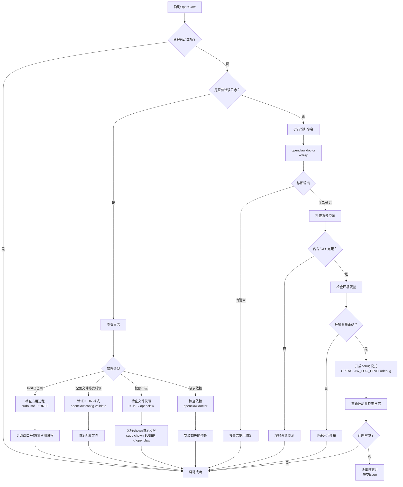
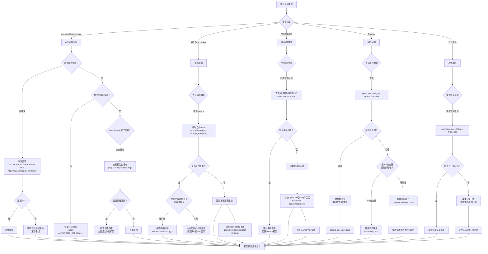

## 17.1 常见故障的诊断决策树

本章以Mermaid决策树的形式展现OpenClaw常见故障的排查流程，帮助工程师快速定位和解决问题。

### 17.1.1 启动失败诊断流程



### 17.1.2 消息无法接收诊断流程

```mermaid
graph TD
    A["消息无法接收"] --> B{"是哪个渠道？"}
    B -->|Lark/飞书| C["飞书渠道诊断"]
    B -->|Slack| D["Slack渠道诊断"]
    B -->|Email| E["邮件渠道诊断"]
    B -->|其他| F["通用渠道诊断"]

    C --> C1{"飞书应用已发布？"}
    C1 -->|否| C2["前往飞书开放平台<br/>创建版本并发布"]
    C1 -->|是| C3{"事件订阅已启用？"}
    C3 -->|否| C4["在飞书平台启用事件订阅<br/>选择长连接方式"]
    C3 -->|是| C5{"Webhook URL正确？"}
    C5 -->|否| C6["更新飞书平台中的<br/>Webhook URL"]
    C5 -->|是| C7{"检查OpenClaw日志"]
    C7 -->|有连接错误| C8["检查网络连接<br/>ping 飞书服务"]
    C7 -->|无错误但无消息| C9["检查消息路由规则<br/>是否启用了该群聊?"]

    D --> D1{"Bot Token有效？"}
    D1 -->|否| D2["更新Token<br/>kubectl patch secret openclaw-slack ..."]
    D1 -->|是| D3{"Event订阅URL正确？"}
    D3 -->|否| D4["在Slack应用配置中<br/>更新Event URL"]
    D3 -->|是| D5{"Bot已加入目标channel？"}
    D5 -->|否| D6["在Slack中邀请Bot进入Channel"]
    D5 -->|是| D7["检查OpenClaw日志<br/>grep 'slack.*message' logs"]

    E --> E1{"邮件服务已配置？"}
    E1 -->|否| E2["配置邮件webhook<br/>endpoints"]
    E1 -->|是| E3{"邮件Webhook已在邮件系统中配置？"}
    E3 -->|否| E4["前往邮件系统<br/>配置Webhook指向OpenClaw"]
    E3 -->|是| E5["检查邮件日志"]

    F --> F1{"Webhook URL可访问？"}
    F1 -->|否| F2["检查Gateway是否在线<br/>curl http://gateway:18789/health"]
    F1 -->|是| F3{"消息格式正确？"}
    F3 -->|否| F4["按照Schema验证消息格式<br/>openclaw schema validate"]
    F3 -->|是| F5["检查消息路由规则"]

    C9 --> C10{"消息应该被发送到哪个Agent？"}
    C10 -->|未指定| C11["在群聊配置中设置<br/>defaultAgent"]
    C10 -->|已指定| C12["检查Agent是否启用<br/>openclaw agents list"]
    C9 --> Z
    D7 --> Z
    E5 --> Z
    F5 --> Z
    C2 --> Z
    C4 --> Z
    C6 --> Z
    C8 --> Z
    D2 --> Z
    D4 --> Z
    D6 --> Z
    E2 --> Z
    E4 --> Z
    F2 --> Z
    F4 --> Z
    C11 --> Z
    C12 --> Z

    Z["消息应该开始进入系统"]
```

### 17.1.3 模型调用异常诊断流程



### 17.1.4 工具执行失败诊断流程

```mermaid
graph TD
    A["工具执行失败"] --> B{"失败时机"}
    B -->|Tool前置检查失败| C["权限检查"}
    B -->|Tool执行出错| D["执行错误"]
    B -->|Tool返回空| E["无结果"]

    C --> C1{"用户权限等级"}
    C1 -->|查看| C2["openclaw permission show --user USER"]
    C2 --> C3{"权限等级 < 要求等级？"}
    C3 -->|是| C4["检查Profile配置<br/>profiles.{profileId}.clearanceLevel"]
    C4 --> C5["增加用户权限等级"]
    C3 -->|否| C6{"工具在黑名单中？"}
    C6 -->|是| C7["将工具从黑名单中删除<br/>profiles.*.deniedTools"]
    C6 -->|否| C8{"工具启用状态"}
    C8 -->|disabled| C9["启用工具<br/>tools.{toolId}.enabled = true"]
    C8 -->|enabled| C10["检查工具参数"]
    C10 -->|参数类型错误| C11["验证参数schema<br/>openclaw schema show github_pr"]
    C10 -->|参数值无效| C12["修正参数值"]

    D --> D1{"错误信息"}
    D1 -->|Connection refused| D2["工具服务不可达<br/>例：GitHub API, Jira Server"]
    D2 --> D3["检查服务状态<br/>curl https://api.github.com/status"]
    D3 -->|在线| D4["检查网络连接<br/>telnet api.github.com 443"]
    D3 -->|离线| D5["等待服务恢复"]
    D1 -->|Authentication failed| D6["工具认证信息错误"]
    D6 -->|Token过期| D7["更新Token<br/>kubectl patch secret openclaw-github ..."]
    D6 -->|权限不足| D8["检查Token权限范围<br/>重新生成高权限Token"]
    D1 -->|Timeout| D9["工具执行超时"]
    D9 -->|API响应慢| D10["增加超时配置<br/>tools.*.timeout: 60000"]
    D9 -->|网络慢| D11["检查网络性能"]
    D1 -->|业务逻辑错误| D12["阅读错误详情"]
    D12 -->|资源不存在| D13["检查传入的ID/Key<br/>如PR ID, Issue Key等"]
    D12 -->|权限限制| D14["检查OAuth范围<br/>需要仓库写权限?"]

    E --> E1{"无结果原因"}
    E1 -->|查询条件过严| E2["尝试放宽条件<br/>如日期范围、过滤器"]
    E1 -->|数据库为空| E3["检查数据源<br/>是否有相关数据"]
    E1 -->|缓存过期| E4["清除缓存<br/>redis-cli DEL cache:*"]
    E1 -->|工具未返回| E5["检查工具输出格式"]
    E5 -->|格式错误| E6["查看工具文档<br/>验证输出schema"]

    C5 --> Z["权限问题解决"]
    C7 --> Z
    C9 --> Z
    C12 --> Z
    D5 --> Z
    D7 --> Z
    D8 --> Z
    D10 --> Z
    D11 --> Z
    D13 --> Z
    D14 --> Z
    E2 --> Z
    E3 --> Z
    E4 --> Z
    E6 --> Z

    Z["工具应该成功执行"]
```

### 17.1.5 会话与内存异常诊断流程

```mermaid
graph TD
    A["会话/内存异常"] --> B{"症状"}
    B -->|上下文丢失| C["消息历史丢失"]
    B -->|重复回答| D["记忆混乱"]
    B -->|内存溢出| E["OOM错误"]

    C --> C1{"什么时间点丢失？"}
    C1 -->|启动后立即丢失| C2["会话初始化问题"]
    C2 --> C3{"会话存储配置"]
    C3 -->|检查| C4["openclaw config get memory"]
    C4 --> C5{"strategy为？"}
    C5 -->|session_only| C6["无法跨会话持久化<br/>需要session_with_storage"]
    C5 -->|session_with_storage| C7["检查存储后端"]
    C7 -->|Database| C8["检查DB连接<br/>openclaw doctor database"]
    C7 -->|Redis| C9["检查Redis连接<br/>redis-cli ping"]
    C1 -->|多轮对话中丢失| C10["上下文压缩过度"]
    C10 --> C11{"当前压缩策略"}
    C11 -->|查看| C12["openclaw config get memory.compactionMode"]
    C12 -->|aggressive| C13["改为balanced或conservative<br/>memory.compactionMode: balanced"]
    C12 -->|balanced/conservative| C14["检查最大token限制<br/>memory.maxContextTokens"]
    C14 -->|过低| C15["增加token预算"]
    C14 -->|合理| C16["查看压缩日志<br/>grep 'compression' logs"]

    D --> D1{"何时开始重复？"}
    D1 -->|新会话重复old答案| D2["会话隔离失败"]
    D2 -->|检查sessionId生成| D3["openclaw logs --filter session"]
    D3 -->|ID重复| D4["修复sessionId生成逻辑"]
    D3 -->|ID不同| D5["检查记忆存储隔离"]
    D5 -->|存储混淆| D6["检查memory.strategy配置"]
    D1 -->|同一会话中重复| D7["摘要生成过度"]
    D7 --> D8["检查summarize配置<br/>memory.summarizeAfterTurns"]
    D8 -->|过低| D9["增加轮数再摘要<br/>summarizeAfterTurns: 20"]

    E --> E1{"内存占用情况"}
    E1 -->|检查| E2["top -p $(pgrep openclaw)"]
    E2 --> E3{"内存使用趋势"}
    E3 -->|持续增长| E4["内存泄漏"]
    E3 -->|峰值突增后降低| E5["GC正常工作"]
    E3 -->|峰值后无降低| E6["内存泄漏"]

    E4 --> E7["排查泄漏源"]
    E7 -->|缓存未清理| E8["检查缓存TTL<br/>tools.*.cache.ttl"]
    E7 -->|连接池未释放| E9["检查连接池配置<br/>database.maxConnections"]
    E7 -->|内存表数据太多| E10["检查内存表大小<br/>sessions.maxInMemory"]

    E6 --> E11["编查已知泄漏<br/>或升级补丁版本"]

    C6 --> Z["内存问题解决"]
    C13 --> Z
    C15 --> Z
    C16 --> Z
    D4 --> Z
    D6 --> Z
    D9 --> Z
    E5 --> Z
    E8 --> Z
    E9 --> Z
    E10 --> Z
    E11 --> Z

    Z["会话和内存正常"]
```

### 17.1.6 性能退化诊断流程

```mermaid
graph TD
    A["响应时间变慢"] --> B["收集性能指标"]
    B --> C{"使用什么监控工具？"}
    C -->|Prometheus| C1["prometheus query<br/>histogram_quantile(0.95, rate(request_duration_seconds[5m]))"]
    C -->|自定义| C2["查看应用日志中的延迟数据"]
    C1 --> D{"P95延迟变化"}
    C2 --> D

    D --> E{"对比基线"}
    E -->|上升10-30%| F["轻微退化，寻找最近变化"]
    E -->|上升>30%| G["严重退化，可能有故障"]

    F --> F1["最近有什么变化？"}
    F1 -->|新增特性/配置| F2["回滚变化<br/>git revert / config restore"]
    F1 -->|无明显变化| F3["检查流量变化<br/>QPS是否增加？"}
    F3 -->|QPS增加| F4["业务增长导致<br/>需要扩容"]
    F3 -->|QPS无变化| F5["诊断具体环节"]

    G --> G1["立即诊断"]
    G1 --> G2{"首先检查"}
    G2 -->|CPU使用率| G3["top -p $(pgrep openclaw)"]
    G2 -->|内存使用率| G4["free -h"]
    G2 -->|磁盘I/O| G5["iostat -x 1"]

    G3 --> G6{"CPU > 80%?"}
    G6 -->|是| G7["CPU成瓶颈"]
    G6 -->|否| G8["继续排查"]

    G4 --> G9{"内存 > 85%?"}
    G9 -->|是| G10["内存成瓶颈<br/>或有内存泄漏"]
    G9 -->|否| G8

    G5 --> G11{"%util > 90%?"}
    G11 -->|是| G12["磁盘I/O成瓶颈"]
    G11 -->|否| G8

    G7 --> G13["CPU密集点分析"]
    G13 -->|CPU用于LLM推理| G14["模型推理变慢<br/>可能是API问题"]
    G13 -->|CPU用于应用逻辑| G15["应用逻辑变慢<br/>profile代码找热点"]

    G10 --> G16["检查内存使用<br/>见内存异常诊断"]

    G12 --> G17["磁断诊断"]
    G17 -->|日志写入速率高| G18["减少日志级别<br/>logging.level: warn"]
    G17 -->|数据库查询慢| G19["检查DB连接<br/>或执行explain plan"]
    G17 -->|缓存命中低| G20["增加缓存大小"]

    G8 --> G21["网络延迟诊断"]
    G21 -->|到API延迟高| G22["检查网络质量<br/>mtr api.anthropic.com"]
    G21 -->|到数据库延迟高| G23["检查数据库网络<br/>或迁移到同AZ"]
    G21 -->|本地处理慢| G24["具体环节分析"]

    G24 --> G25["追踪各环节时间"]
    G25 -->|准备请求: 慢| G26["检查context assembly<br/>消息过多或token过多？"]
    G25 -->|API调用: 慢| G27["见模型调用诊断"]
    G25 -->|工具调用: 慢| G28["见工具执行诊断"]
    G25 -->|返回答案: 慢| G29["流式输出是否启用？"]

    F4 --> Z["扩容部署"]
    F2 --> Z
    F5 --> Z
    G14 --> Z
    G15 --> Z
    G18 --> Z
    G19 --> Z
    G20 --> Z
    G22 --> Z
    G23 --> Z
    G26 --> Z
    G28 --> Z
    G29 --> Z

    Z["性能恢复正常"]
```

### 17.1.7 快速诊断命令参考

```bash
# 完整系统诊断
openclaw doctor --deep

# 检查特定组件
openclaw doctor gateway      # 检查Gateway
openclaw doctor models       # 检查模型配置与连接
openclaw doctor channels     # 检查所有渠道状态
openclaw doctor tools        # 检查工具配置与权限
openclaw doctor database     # 检查数据库连接

# 实时日志跟踪（按等级）
openclaw logs --follow --level error
openclaw logs --follow --filter "model.*failed"
openclaw logs --follow --filter "tool.*execution"

# 性能监控
openclaw metrics --period 5m
openclaw metrics --metric latency
openclaw metrics --metric throughput

# 配置验证
openclaw config validate
openclaw config get agents.work-assistant
openclaw config schema show tool github_pr_analyzer

# 权限检查
openclaw permission show --user user123
openclaw permission test --user user123 --tool github_pr_analyzer

# 会话诊断
openclaw session list
openclaw session dump --id session-xxx
openclaw session clear-cache

# 一键收集诊断包（用于上报）
openclaw diag export --output openclaw-diag-$(date +%s).zip
```

这套决策树和诊断工具可以帮助工程师快速定位和解决OpenClaw运行中的常见问题，同时提供了逐步深入的诊断方法。
