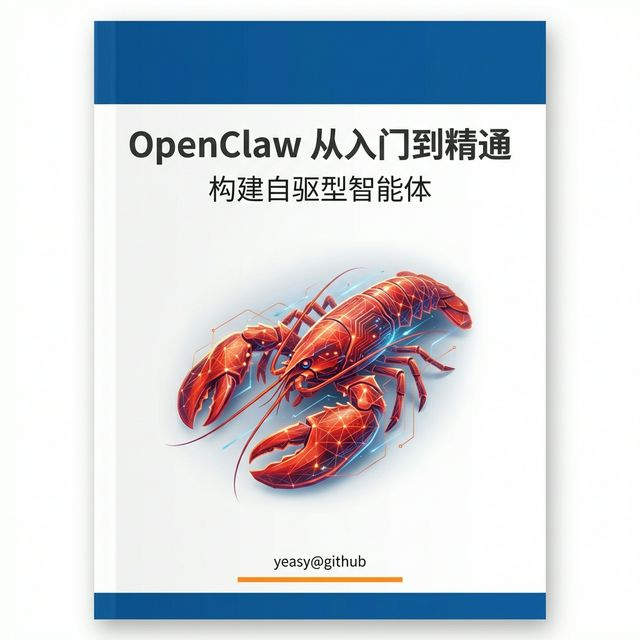

# 《OpenClaw 从入门到精通》

[](https://github.com/yeasy/openclaw_guide)
[](https://github.com/yeasy/openclaw_guide/pulls)
[](https://creativecommons.org/licenses/by/4.0/)

**OpenClaw 是一款开源自驱型智能体。** 本书结合最佳实践，提供从入门到应用的全流程指南，并深度解构其底层的运行机制和实现原理。

<div align="center">
  
</div>

## 本书特色

- **实战导向** ：从零到一搭建最小闭环，提供可直接复用的配置模板
- **机制剖析** ：深入解析 Gateway、Agent Loop、工具系统、会话与记忆等核心机制
- **生产就绪** ：聚焦可靠性、安全加固、运行监控与故障排查

## 目标读者与前置要求

- **目标读者**：AI 应用开发者、大模型落地工程师、系统架构师等。
- **前置基础**：阅读本书需要了解基本的后端开发常识（如 Node.js 或 Python 基础），并对大语言模型 (LLM) 和 AI 智能体有初步概念。

## 全书结构

| 部分 | 章节 | 内容概要 |
|------|------|----------|
| 第一部分：基础入门 | 第 1–4 章 | 全景概览、环境搭建、首次会话、配置与模型接入 |
| 第二部分：进阶使用 | 第 5–8 章 | 工具与技能、上下文记忆、多智能体协作、自动化运维 |
| 第三部分：实现原理与工程落地 | 第 9–12 章 | Gateway 协议、Agent Loop 内核、可靠性机制、插件扩展 |
| 附录 | — | 术语表、配置模板与样例、故障排查检查单、API 与 SDK 参考、延伸阅读 |


## 阅读方式

### 在线阅读

- [Gitbook 在线版本](https://yeasy.gitbook.io/openclaw_guide/)
- [Github 本地目录](SUMMARY.md)

### 本地预览

依赖 Node.js。

```bash
npm install -g honkit
honkit serve
```

## 阅读建议

- 建议先通读概念与架构，再动手实践命令与配置。
- 遇到版本差异时，以 [官方文档](https://docs.openclaw.ai/) 与上游仓库为准。
- **快速上手** ：第 2–3 章 → 即刻可用。
- **深入原理** ：第 9–12 章 → 理解底层实现。
- **运维安全** ：第 8、11 章 → 生产环境加固。

## 贡献与反馈

欢迎提交 [Issue](https://github.com/yeasy/openclaw_guide/issues) 或 [PR](https://github.com/yeasy/openclaw_guide/pulls)，尤其欢迎：错别字修正、失效链接修复、实践案例补充与可复用模板。

## 许可证

本书采用 [CC BY 4.0](https://creativecommons.org/licenses/by/4.0/) 授权。
