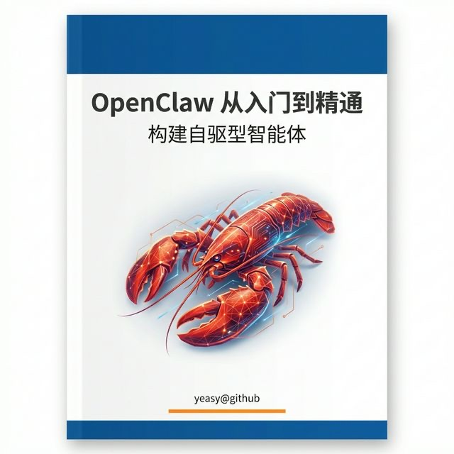
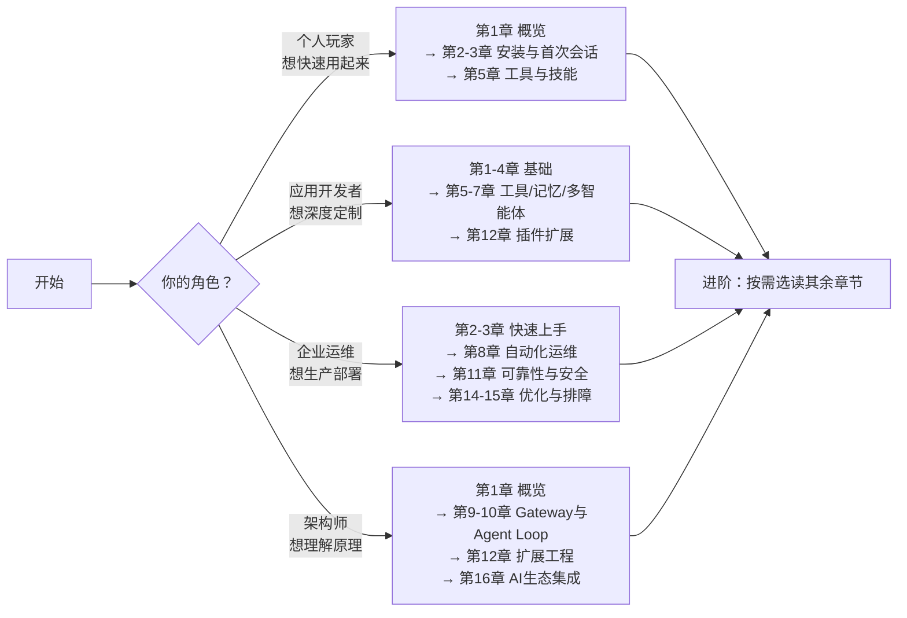

[English overview](README_en.md)

<div align="center">

# 《OpenClaw 入门到精通》

[](https://creativecommons.org/licenses/by/4.0/)
[](https://github.com/yeasy/openclaw_guide)
[](https://github.com/yeasy/openclaw_guide/releases)
[](https://yeasy.gitbook.io/openclaw_guide)
[](https://github.com/yeasy/openclaw_guide/releases/latest)

> **[OpenClaw](https://github.com/openclaw/openclaw) 是一款开源、本地优先的 personal AI assistant / 自托管智能助手网关**，由 Peter Steinberger 与社区共同构建。本书结合最佳实践，提供从入门到应用的全流程指南，并深度解构其底层的运行机制和实现原理。



</div>

## 本书特色

- **实战导向**：从零到一搭建最小闭环，提供可直接复用的配置模板
- **机制剖析**：深入解析 Gateway、Agent Loop、工具系统、会话与记忆等核心机制
- **生产就绪**：聚焦可靠性、安全加固、运行监控与故障排查

## 目标读者与前置要求

- **目标读者**：对 AI 智能体感兴趣的个人用户、AI 应用开发者、大模型落地工程师、系统架构师等。
- **前置基础**：阅读本书需要了解基本的后端开发常识（如 Node.js 或 Python 基础），并对大语言模型 (LLM) 和 AI 智能体有初步概念。可参考 [《零基础学 AI》](https://yeasy.gitbook.io/ai_beginner_guide) 和 [《智能体 AI 权威指南》](https://yeasy.gitbook.io/agentic_ai_guide) 建立基础。

## 全书结构

| 部分 | 章节 | 内容概要 |
|------|------|----------|
| 第一部分：基础入门 | 第 1–4 章 | 全景概览、环境搭建、首次会话、配置与模型接入 |
| 第二部分：进阶使用 | 第 5–8 章 | 工具与技能、上下文记忆、多智能体协作、自动化运维 |
| 第三部分：实现原理与工程落地 | 第 9–12 章 | Gateway 协议、Agent Loop 内核、可靠性机制、插件扩展 |
| 第四部分：实战与优化深度指南 | 第 13–16 章 | 实战案例、性能与成本优化、故障排查决策树、主流 AI 生态集成 |
| 附录 | — | 术语表、配置模板与样例、故障排查检查单、API 与 SDK 参考、命令速查手册、版本映射与升级指南、延伸阅读与参考资料 |

## 阅读方式

### 在线阅读

- [GitBook 在线版本](https://yeasy.gitbook.io/openclaw_guide/)
- [从第一章开始阅读](01_overview/README.md)

## 下载离线版本

本书提供 PDF 版本供离线阅读，可前往 [GitHub Releases](https://github.com/yeasy/openclaw_guide/releases/latest) 页面下载最新版本。

### 本地预览

本仓库当前使用 mdPress 构建，本地预览建议直接使用仓库脚本：

```bash
brew tap yeasy/tap && brew install --cask mdpress
mdpress serve
```

如果你偏好其他 Markdown 预览器，也可以作为辅助工具使用，但它们并不是本仓库的标准构建链。

## 五分钟快速上手

还没用过 OpenClaw？只需三步即可体验：

1. **安装**（1分钟）：macOS / Linux / WSL 运行 `curl -fsSL https://openclaw.ai/install.sh | bash`；Windows PowerShell 运行 `iwr -useb https://openclaw.ai/install.ps1 | iex`
2. **初始化**（2分钟）：`openclaw onboard --install-daemon` → 按向导完成首次配置并安装后台服务
3. **对话**（2分钟）：运行 `openclaw dashboard`，在 WebChat 输入“你好”，收到 AI 回复即成功 🎉

详见 [第二章：环境搭建](02_setup/README.md) 和 [第三章：首次会话](03_minimal_loop/README.md)。

## 学习路线图

不同角色的读者可以按需选择阅读路径：


```mermaid
graph LR
    START["开始"] --> Q{"你的角色？"}
    Q -->|"个人玩家<br/>想快速用起来"| P1["第1章 概览<br/>→ 第2-3章 安装与首次会话<br/>→ 第5章 工具与技能"]
    Q -->|"应用开发者<br/>想深度定制"| P2["第1-4章 基础<br/>→ 第5-7章 工具/记忆/多智能体<br/>→ 第12章 插件扩展"]
    Q -->|"企业运维<br/>想生产部署"| P3["第2-3章 快速上手<br/>→ 第8章 自动化运维<br/>→ 第11章 可靠性与安全<br/>→ 第14-15章 优化与排障"]
    Q -->|"架构师<br/>想理解原理"| P4["第1章 概览<br/>→ 第9-10章 Gateway与Agent Loop<br/>→ 第12章 扩展工程<br/>→ 第16章 AI生态集成"]
    P1 --> ADV["进阶：按需选读其余章节"]
    P2 --> ADV
    P3 --> ADV
    P4 --> ADV
```

| 角色 | 核心章节 | 预计用时 | 学完能做什么 |
|------|---------|---------|------------|
| 个人玩家 | 1→2→3→5 | 2-3 小时 | 搭建个人 WhatsApp/Telegram AI 助手 |
| 应用开发者 | 1-7→12 | 8-10 小时 | 开发自定义工具、技能和多智能体系统 |
| 企业运维 | 2→3→8→11→14→15 | 6-8 小时 | 生产环境部署、安全加固与故障排查 |
| 架构师 | 1→9→10→12→16 | 6-8 小时 | 理解底层原理，设计企业级智能体架构 |

## 推荐阅读

本书是 AI 技术丛书的一部分。以下书籍与本书形成互补：

| 书名 | 与本书的关系 |
|------|------------|
| [《零基础学 AI》](https://yeasy.gitbook.io/ai_beginner_guide) | AI 零基础入门，适合缺乏 AI 背景的读者 |
| [《大模型提示词工程指南》](https://yeasy.gitbook.io/prompt_engineering_guide) | 智能体提示词设计的理论基础 |
| [《大模型上下文工程权威指南》](https://yeasy.gitbook.io/context_engineering_guide) | 智能体的上下文管理与记忆架构设计 |
| [《Claude 技术指南》](https://yeasy.gitbook.io/claude_guide) | Claude 的 MCP 协议、工具使用与 Agentic Coding |
| [《智能体 AI 权威指南》](https://yeasy.gitbook.io/agentic_ai_guide) | 智能体的通用架构与多智能体协作模式 |
| [《大模型安全权威指南》](https://yeasy.gitbook.io/ai_security_guide) | 智能体系统的安全设计与攻防实践 |
| [《大模型原理与架构》](https://yeasy.gitbook.io/llm_internals) | 深入理解大语言模型底层逻辑与架构 |

## 贡献与反馈

欢迎提交 [Issue](https://github.com/yeasy/openclaw_guide/issues) 或 [PR](https://github.com/yeasy/openclaw_guide/pulls)，尤其欢迎：错别字修正、失效链接修复、实践案例补充与可复用模板。

## 许可证

本书采用 [CC BY 4.0](https://creativecommons.org/licenses/by/4.0/) 授权。
